# EP01-EP21 Concept Figure Gallery

Current image-gen figures for EP01-EP21. These are study-design schematics,
not experimental results.

Each episode below links to its design and full caption, generation prompt, and
current image. Scientific scope, prior work, and claim limits live in the
episode's Goal and paper plan.

## Index

| Episode | Scientific focus | Image |
| --- | --- | --- |
| [EP01](#ep01) | Loss-aversion maps and cognitive specification | [Open PNG](episode01_narps_deep_search/outputs/ep01_conceptual_question-imagegen-v3.png) |
| [EP02](#ep02) | Dopamine protocols and learning rules | [Open PNG](episode02_dopamine_learning_rate_causality/outputs/ep02_conceptual_question.png) |
| [EP03](#ep03) | Contrast semantics beyond task family | [Open PNG](episode03_condition_semantics_effect_maps/outputs/ep03_conceptual_question.png) |
| [EP04](#ep04) | Native VLM-brain alignment under stimulus shift | [Open PNG](episode04_shared_scene_geometry/outputs/ep04_conceptual_question-v2.png) |
| [EP05](#ep05) | Trial-specific LFP and reach deviations | [Open PNG](episode05_sensorimotor_lfp/outputs/ep05_question_imagegen.png) |
| [EP06](#ep06) | Regional LFP rules and population components | [Open PNG](episode06_lfp_regional_fingerprints/outputs/ep06_question_imagegen-v2.png) |
| [EP07](#ep07) | History-dependent transfer across sessions | [Open PNG](episode07_lfp_session_transfer/outputs/ep07_question_imagegen-v2.png) |
| [EP08](#ep08) | Conditional value of electrodes and trials | [Open PNG](episode08_lfp_electrode_trial_policy/outputs/figures/ep08_episode_series-v6.png) |
| [EP09](#ep09) | Own-dendrite versus matched-donor information | [Open PNG](episode09_local_global_projection/outputs/ep09_conceptual_question-v3.png) |
| [EP10](#ep10) | Terminal layout within a shared target | [Open PNG](episode10_single_cell_coprojection/outputs/ep10_within_target_implementation-v2.png) |
| [EP11](#ep11) | Reusable allocation patterns versus a continuum | [Open PNG](episode11_projection_types_vs_gradients/outputs/ep11_conceptual_question-v2.png) |
| [EP12](#ep12) | Information lost through cell-type averaging | [Open PNG](episode12_malecns_type_sufficiency/outputs/ep12_conceptual_main_figure-v2.png) |
| [EP13](#ep13) | Identifiability of a latent scalar target | [Open PNG](episode13_bold_target_identifiability/outputs/ep13_conceptual_question-v2.png) |
| [EP14](#ep14) | Anatomical ROI representations across sites | [Open PNG](episode14_openbhb_roi_site_generalization/outputs/ep14_conceptual_question-v4.png) |
| [EP15](#ep15) | Individual topography versus condition geometry | [Open PNG](episode15_mdtb_topography_vs_geometry/outputs/ep15_conceptual_question-v2.png) |
| [EP16](#ep16) | Cross-session decoder failure signatures | [Open PNG](episode16_braingate_cross_session_failure_modes/outputs/ep16_question_imagegen-v2.png) |
| [EP17](#ep17) | Model rankings under measurement changes | [Open PNG](episode17_cneuromod_model_ranking_stability/outputs/ep17_conceptual_question-v3.png) |
| [EP18](#ep18) | Concept sharing across unseen image exemplars | [Open PNG](episode18_things_eeg_concept_stability/outputs/ep18_conceptual_question-v2.png) |
| [EP19](#ep19) | Prospective motor-onset information in EEG | [Open PNG](episode19_causal_motor_forecasting_benchmark/outputs/ep19_question_imagegen-v2.png) |
| [EP20](#ep20) | Measurement-guided virtual device design | [Open PNG](episode20_neurocam_prior_guided_codesign/outputs/ep20_question_imagegen-v2.png) |
| [EP21](#ep21) | Neural-code conversion without shared training images | [Open PNG](episode21_wang_neural_code_conversion_reproduction/outputs/ep21_neural_code_conversion_design-v3.png) |

## EP01

Choices and response times distinguish cognitive specifications. The same data and technical pipeline test whether conditional gain/loss maps shift reproducibly; analyst-team maps remain a dependent descriptive layer.

[Design and caption](episode01_narps_deep_search/GOAL.md) | [Image-gen prompt](episode01_narps_deep_search/outputs/ep01_conceptual_question-imagegen-v3-prompt.md)

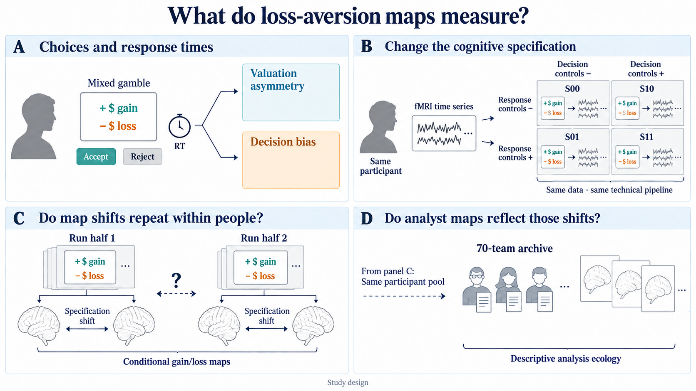

## EP02

The protocol contrast is separate from learning-rule discrimination. Reward-time stimulation depends on preceding licking; a protocol effect does not uniquely identify a learning-rate mechanism.

[Design and caption](episode02_dopamine_learning_rate_causality/GOAL.md) | [Image-gen prompt](episode02_dopamine_learning_rate_causality/outputs/ep02_conceptual_question.prompt.md)

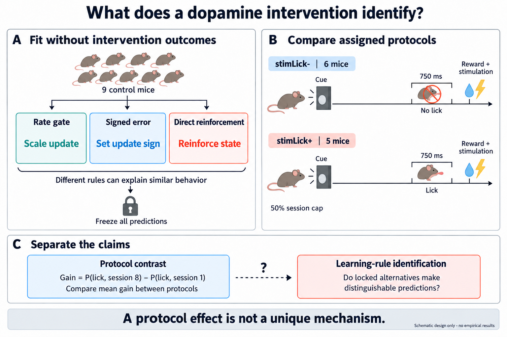

## EP03

Methods-only text is tested beyond the task-family prototype. Polarity applies to the entire prototype-plus-residual prediction; sign reversal is an implementation constraint, not semantic evidence.

[Design and caption](episode03_condition_semantics_effect_maps/GOAL.md) | [Image-gen prompt](episode03_condition_semantics_effect_maps/outputs/ep03_conceptual_question.prompt.md)

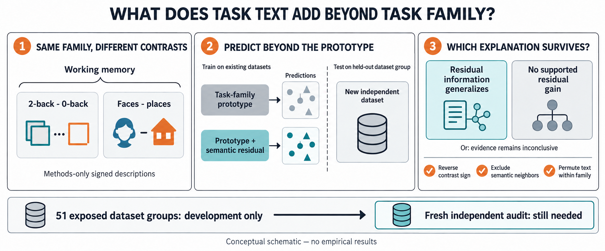

## EP04

Native VLM and DINOv2 image embeddings are compared directly with fMRI geometry. The focal test is whether the alignment advantage repeats within out-of-distribution categories.

[Design and caption](episode04_shared_scene_geometry/GOAL.md) | [Image-gen prompt](episode04_shared_scene_geometry/outputs/ep04_conceptual_question-v2-prompt.md)

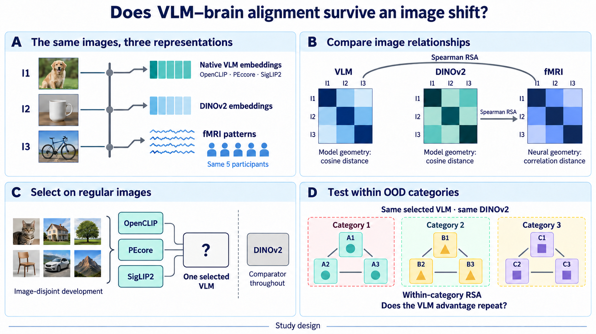

## EP05

Correct versus mismatched trials test whether LFP predicts unusual reaches within a direction. A conditional spike-population follow-up examines the proposed LFP-neural-behavior relationship.

[Design and caption](episode05_sensorimotor_lfp/GOAL.md) | [Image-gen prompt](episode05_sensorimotor_lfp/outputs/ep05_question_imagegen_prompt.md)

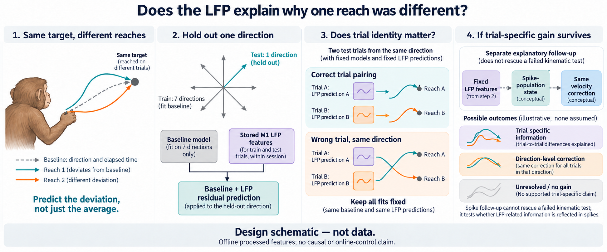

## EP06

Common-time, direction-contrast and trial-residual components are evaluated with correct-region, pooled and swapped frequency rules transferred across animals. Region and recording-array effects remain coupled.

[Design and caption](episode06_lfp_regional_fingerprints/GOAL.md) | [Image-gen prompt](episode06_lfp_regional_fingerprints/outputs/ep06_question_imagegen-v2-prompt.md)

## EP07

History must add trial-specific pairing value beyond matched today-only fitting. Failure to detect that increment does not identify a mean-only or geometry-only explanation.

[Design and caption](episode07_lfp_session_transfer/GOAL.md) | [Image-gen prompt](episode07_lfp_session_transfer/outputs/ep07_question_imagegen-v2-prompt.md)

## EP08

Electrode and trial value depend on the retained observations. The schematic uses equal observation counts and a genuine electrode swap; exploration remains open without a fixed pilot-trial requirement.

[Design and caption](episode08_lfp_electrode_trial_policy/GOAL.md) | [Image-gen prompt](episode08_lfp_electrode_trial_policy/outputs/figures/ep08_episode_series-v6-prompt.md)

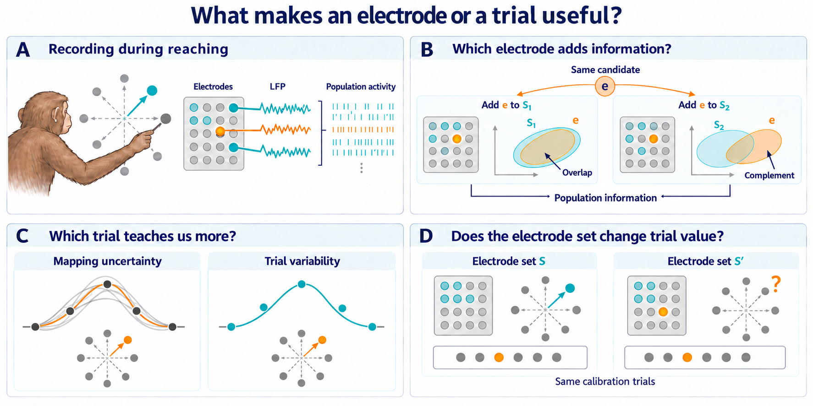

## EP09

With the recipient's target vector fixed, compare its own dendritic residual with a matched donor's. Neither an advantage nor equivalence uniquely identifies the underlying biological explanation.

[Design and caption](episode09_local_global_projection/GOAL.md) | [Image-gen prompt](episode09_local_global_projection/outputs/ep09_conceptual_question-v3-prompt.md)

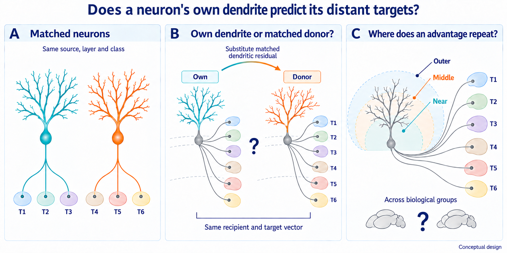

## EP10

Within a shared target, test terminal layout across positively observed co-target contexts that may overlap. Compare context-specific profiles with their pooled view; terminal arbors are not synapses.

[Design and caption](episode10_single_cell_coprojection/GOAL.md) | [Image-gen prompt](episode10_single_cell_coprojection/outputs/ep10_within_target_implementation-v2-prompt.md)

## EP11

Reusable axon-allocation patterns compete with a flexible continuous description. The endpoint is prediction of distributions in held-out replicate units, not declaration of new cell types.

[Design and caption](episode11_projection_types_vs_gradients/GOAL.md) | [Image-gen prompt](episode11_projection_types_vs_gradients/outputs/ep11_conceptual_question-v2-prompt.md)

## EP12

Cell-type averaging can discard same-cell input-output pairing. The diagram illustrates structural associations, not measured signal flow.

[Design and caption](episode12_malecns_type_sufficiency/GOAL.md) | [Image-gen prompt](episode12_malecns_type_sufficiency/outputs/ep12_conceptual_main_figure-v2-prompt.md)

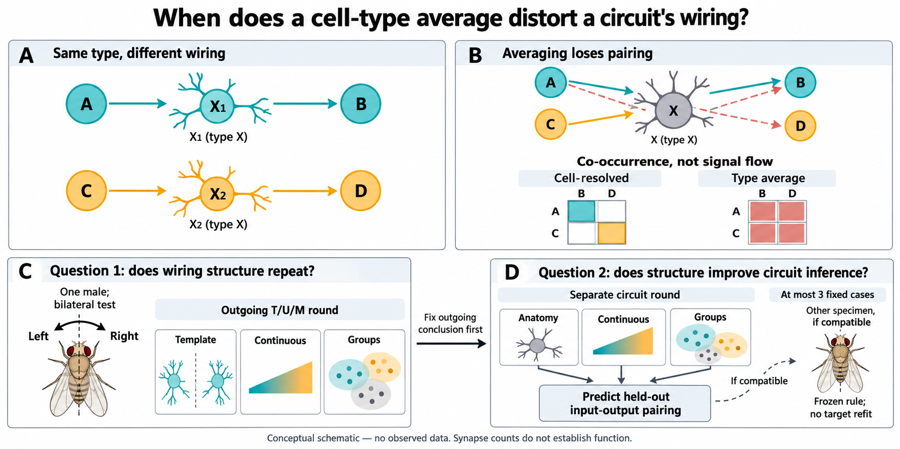

## EP13

A compressed observation may identify a particular latent scalar without identifying the full latent state. The figure illustrates classical linear estimability, not a new theorem.

[Design and caption](episode13_bold_target_identifiability/GOAL.md) | [Image-gen prompt](episode13_bold_target_identifiability/outputs/ep13_conceptual_question-v2-prompt.md)

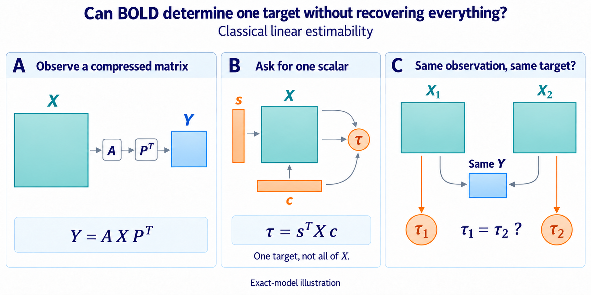

## EP14

Anatomical ROI representations are compared for age prediction at unseen sites. Site defines the generalization setting; it is not simply an effect to remove.

[Design and caption](episode14_openbhb_roi_site_generalization/GOAL.md) | [Image-gen prompt](episode14_openbhb_roi_site_generalization/outputs/ep14_conceptual_question-v4-prompt.md)

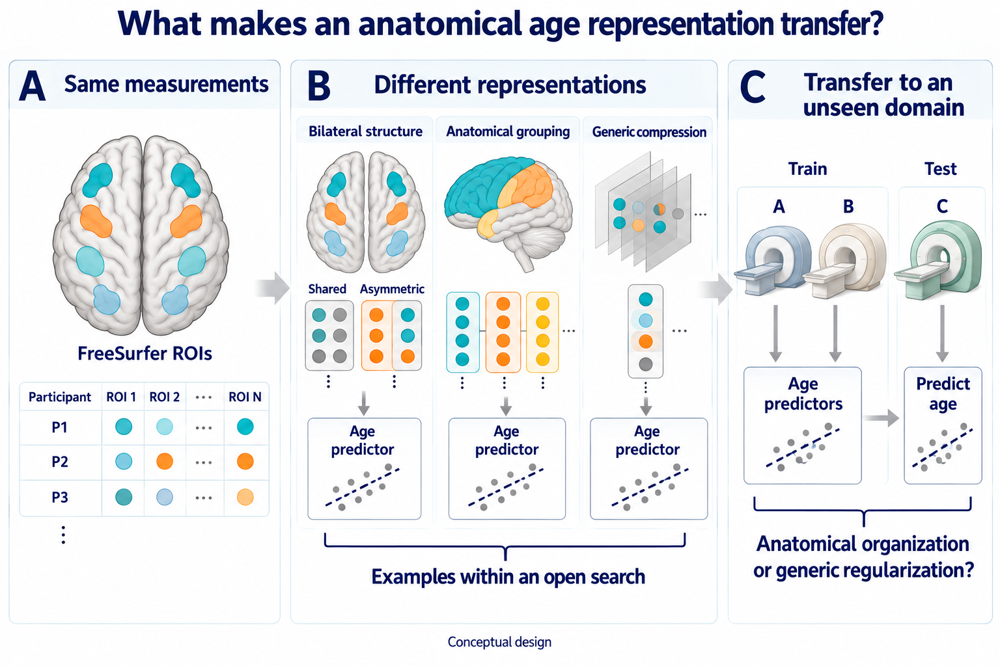

## EP15

Four statistical accounts predict individual topography and geometry for 18 unseen Task B conditions. Multiple adequate accounts remain non-identification rather than a predetermined biological winner.

[Design and caption](episode15_mdtb_topography_vs_geometry/GOAL.md) | [Image-gen prompt](episode15_mdtb_topography_vs_geometry/outputs/ep15_conceptual_question-v2-prompt.md)

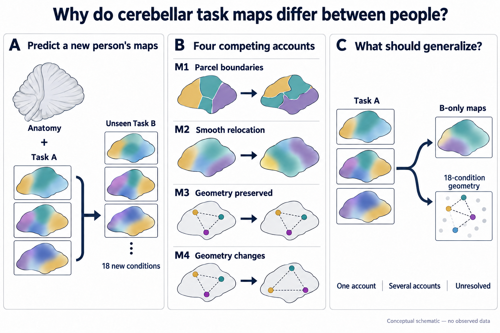

## EP16

Target-local signal, transported loss, a recording-change emulator and 32-label repair provide potentially coexisting operational signatures of decoder failure.

[Design and caption](episode16_braingate_cross_session_failure_modes/GOAL.md) | [Image-gen prompt](episode16_braingate_cross_session_failure_modes/outputs/ep16_question_imagegen-v2-prompt.md)

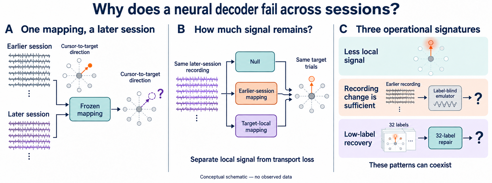

## EP17

Response estimation, voxel support and positive weighting are separate measurement operations. Changes in fixed-model rankings do not identify causal effects of training.

[Design and caption](episode17_cneuromod_model_ranking_stability/GOAL.md) | [Image-gen prompt](episode17_cneuromod_model_ranking_stability/outputs/ep17_conceptual_question-v3-prompt.md)

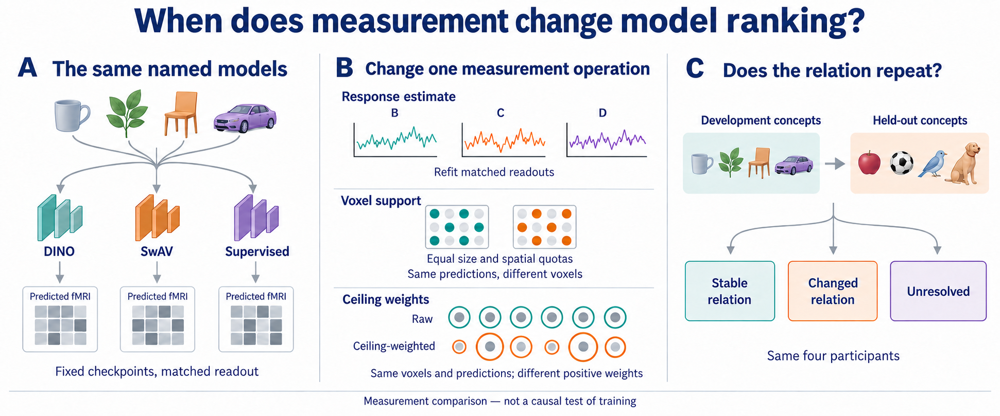

## EP18

Images are presented at 10 Hz. All three added-slot comparisons share image features and the linear-label baseline; nonlinear-label, concept and false-group slots test alternative ways of sharing information.

[Design and caption](episode18_things_eeg_concept_stability/GOAL.md) | [Image-gen prompt](episode18_things_eeg_concept_stability/outputs/ep18_conceptual_question-v2-prompt.md)

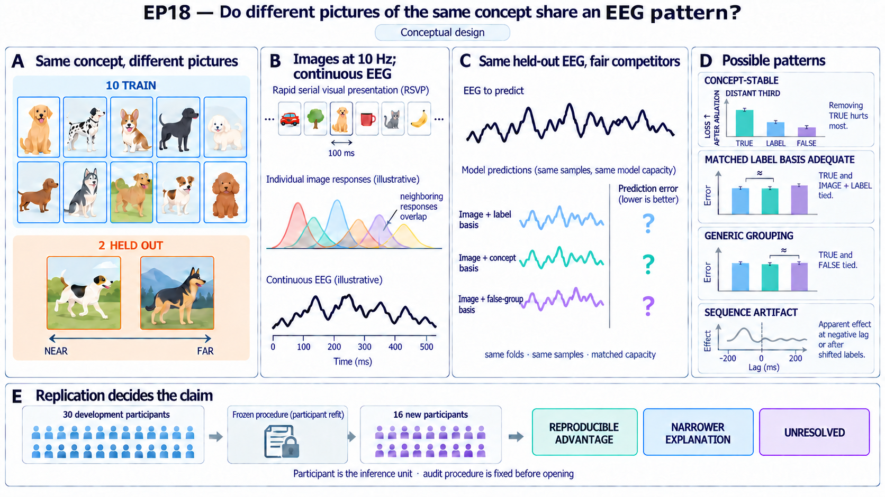

## EP19

Past EEG must add motor-onset forecasting information 300-600 ms ahead beyond sensors and context. Recent and older input windows are disjoint, and the older complement remains in every comparison.

[Design and caption](episode19_causal_motor_forecasting_benchmark/GOAL.md) | [Image-gen prompt](episode19_causal_motor_forecasting_benchmark/outputs/ep19_question_imagegen-v2-prompt.md)

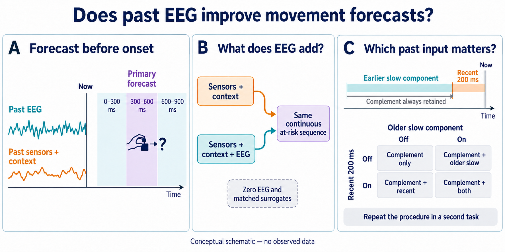

## EP20

Resource-matched virtual designs combine pad geometry, scanning and reconstruction. The D0-D3 comparison separates reference, geometry, scan-plus-software and joint designs; model disagreement motivates another measurement.

[Design and caption](episode20_neurocam_prior_guided_codesign/GOAL.md) | [Image-gen prompt](episode20_neurocam_prior_guided_codesign/outputs/ep20_question_imagegen-v2-prompt.md)

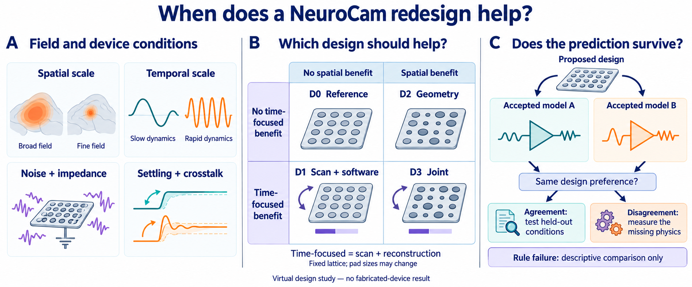

## EP21

Target-decoder and source-converter training use disjoint image sets, followed by common test images and readouts. Content loss updates only the converter; accepted upstream measurement dependence remains disclosed.

[Design and caption](episode21_wang_neural_code_conversion_reproduction/GOAL.md) | [Image-gen prompt](episode21_wang_neural_code_conversion_reproduction/outputs/ep21_neural_code_conversion_design-v3-prompt.md)

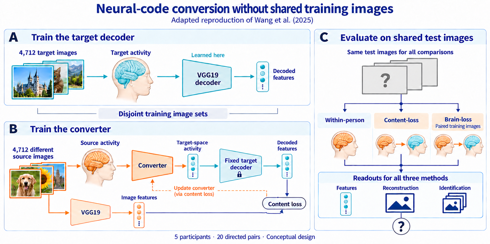
