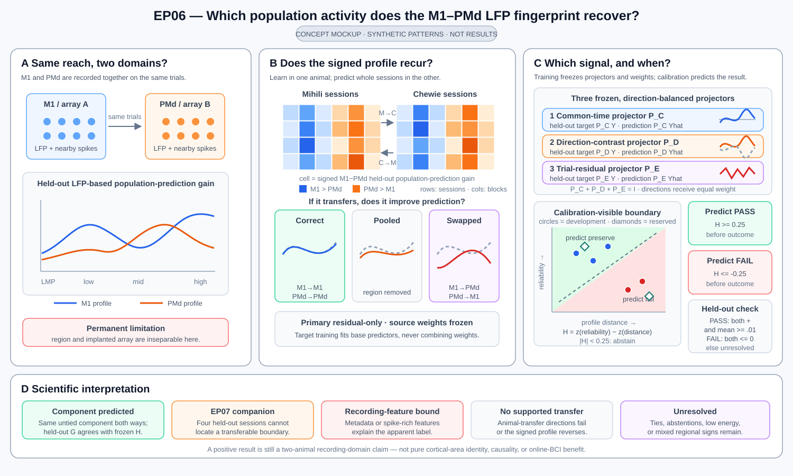

# Is the M1–PMd LFP fingerprint reusable, or just an array label?

M1 and PMd were recorded at the same time while each animal performed the same
reaching task. In each region we have two views of local activity: LFP features
and spikes from nearby neurons. EP06 asks whether the relationship between those
two signals differs between M1 and PMd in a way that repeats across animals.

For each session and region, we build one frequency profile: how well does LMP
or each registered LFP band predict held-out spike-population activity after
accounting for reach direction and elapsed time? We learn the M1-versus-PMd
difference from Mihili and test whole sessions from Chewie, then reverse the
animals. Both directions must work; a strong average cannot hide failure in one
animal.

A classifier score is only the first result. Because each region is tied to a
different implanted array, a model might recognize missing channels, recording
quality, or spike leakage rather than a reusable neural relationship. The study
must therefore show the signed frequency difference, test the strongest array
and recording alternatives, and ask whether the difference improves prediction
of held-out population activity.

## The scientific logic

Like the EP12 concept figure, this mockup makes the scientific alternatives
visible with synthetic patterns. It shows the M1 and PMd frequency profiles,
their reciprocal cross-animal transfer, and how correct, pooled, and swapped
weights distinguish a useful fingerprint from a transferable label alone.
The competing-explanation panel gives the recording-artifact alternative equal
visual status. These are illustrative patterns, not EP06 results; session
roles and numerical decision rules remain in the study text.

Even the strongest positive result would remain a **recording-domain** result.
This dataset cannot separate cortical region from its implanted array. A third
animal can test whether the rule repeats again, but a design that breaks the
region–array link would be needed to claim a pure cortical-area effect.

No real EP06 analysis, reserved-session test, or third-animal test has run under this
plan.

## At a glance

| Question | EP06 design |
| --- | --- |
| What varies? | How well LMP and each registered LFP band predict local spike-population activity in M1 and PMd. |
| What is the first comparison? | Learn the complete M1–PMd profile difference in one animal and classify whole sessions from the other animal, in both directions. |
| What is held out? | Whole sessions from the other animal, followed by two separately reserved sessions per animal for one final test. |
| What must repeat? | The signed profile difference and classification must agree in both animal-transfer directions. |
| What could mislead us? | Region is tied to array, so hardware, missing channels, reliability, or high-frequency spike leakage may reveal the label. |
| What makes the result useful? | M1- and PMd-specific frequency weights must predict held-out population activity better than one pooled rule; swapping the regional weights should hurt. |
| What remains unproven? | Pure cortical identity, causality, online BCI value, and generalization beyond these animals and this recording pipeline. |

## The first result: does the fingerprint transfer?

For each session, region, and registered LFP feature block, fit a model on
training trials that predicts a training-derived spike-population summary.
Evaluate untouched whole trials and subtract what reach direction and elapsed
time already explain. Then reduce all trials, time bins, electrodes, and latent
coordinates to one profile for each region in each session.

The primary test has two equal parts:

1. learn the M1–PMd rule from Mihili's development sessions and classify
   Chewie's development sessions; and
2. learn the rule from Chewie and classify Mihili.

Report the two balanced accuracies separately and their equal-weight mean above
chance. Also show the signed M1-minus-PMd profile in every session. A result is
not convincing if the classifier transfers but the apparent frequency
difference changes sign between animals.

## The deeper result: does the fingerprint help prediction?

After the first result is fixed, turn the two source-animal profiles into three
fixed ways of combining the same bandwise predictions in the other animal:

| Rule | What it asks |
| --- | --- |
| Correct region | Do source-learned M1 weights help target M1, and source-learned PMd weights help target PMd? |
| Pooled | Is one common frequency rule sufficient for both regions? |
| Swapped region | Does deliberately giving M1 the PMd rule and PMd the M1 rule make prediction worse? |

All three rules use the same target trials, electrodes, latent dimensions, and
bandwise predictions. Only the fixed frequency weights differ. The proposed
explanation predicts that the correct-region rule beats the pooled rule by a
meaningful amount in both transfer directions and that the swapped rule performs
worse. If the regional weights are nearly identical, or the bandwise predictions
are too similar for the rules to differ, the follow-up is inconclusive rather
than evidence for or against a regional effect.

This follow-up explains the first result; it is not a new animal replication
and cannot change whether the original classifier transferred.

## Evidence roles and the session split

The current release reports six simultaneous M1/PMd sessions for Mihili and six
for Chewie-L. After structural eligibility is checked, order each animal's six
sessions by acquisition date, using the provider session name only to break a
tie. The roles are fixed by position:

| Animal | Development and model selection | Reserved final test |
| --- | --- | --- |
| Mihili | positions 1, 2, 4, and 5 | positions 3 and 6 |
| Chewie-L | positions 1, 2, 4, and 5 | positions 3 and 6 |

Record the resulting session names in `DATASETS.md` before any regional score is
inspected. Do not move a session because its result is inconvenient. If either
animal has fewer than six structurally eligible paired sessions, stop for a
scientific review of sample size instead of reallocating sessions after looking
at outcomes.

The eight development sessions support model comparison. The four reserved
sessions are opened together once after one analysis is final. Because related
historical work already exposed this release, that reserved-session test checks a fixed procedure
within the same corpus; it is not independent confirmation.

Chewie-R is another implant in the same animal, not a third animal. Han and
Lando contain area-2 recordings under a confounded animal/task design and may be
used only for a clearly labelled recording-domain sensitivity analysis. A true
external transfer test requires a separately sealed third animal with
simultaneous M1 and PMd recordings.

## Models we will compare

Every trial uses one rule for all sessions. The bounded choices are:

1. **Time window:** the primary execution window is 150–450 ms after movement
   onset; a small behavior-defined preparation/execution set may be compared.
2. **LFP features:** LMP and the registered 0.5–4, 4–8, 8–12, 12–25, 25–50,
   50–100, 100–200, and 200–400 Hz bands, either alone, in registered contiguous
   groups, or as the full profile.
3. **Electrode summary:** the same 15-electrode budget in both regions, using a
   mean, median, training-only reliability weighting, or training-only PCA.
4. **Spike-population summary:** training-only PCA or reduced-rank summaries
   with a finite dimension schedule supported in both regions.
5. **LFP-to-population model:** ridge, reduced-rank regression, PLS, or
   regularized CCA, always evaluated on held-out whole trials.
6. **Profile comparison:** centered shape, reliability-adjusted shape, or a
   fixed combination of shape and overall magnitude.
7. **Across-session alignment:** none, training-session robust scaling, or a
   training-only orthogonal alignment.
8. **Region classifier:** nearest prototype, shrinkage Mahalanobis, or
   regularized logistic classification.
9. **Ensemble:** at most two already evaluated complementary rules.

Band edges, reserved-session-specific alignment, separate winners for each animal,
unpaired M1/PMd trials, electrodes chosen from held-out outcomes, raw-phase
analyses, and arbitrary new model families are outside this study.

## What a convincing result must survive

- classification above the complete-analysis label-shuffle reference in both
  animal-transfer directions;
- the same signed M1–PMd profile direction in both animals;
- leave-one-session analysis showing that no single session determines the
  result;
- paired trials and equal trial, electrode, spike-rank, reliability, and model
  capacity in the two regions;
- a model using recording metadata alone;
- low-frequency-only, high-frequency-exclusion, and same-electrode/unit checks;
- a whole-trial LFP-to-spike pairing shuffle;
- direction-and-time behavioral baselines;
- band-label shuffles and smoothness/dimensionality-matched surrogate
  population activity; and
- the area-2 sensitivity reported without claiming a three-region hierarchy.

Failure of a required control blocks the neural regional interpretation even if
the headline classifier accuracy is high.

## Study sequence

1. Confirm the source, the paired M1/PMd trials, events, electrodes, units, and
   frequency labels. Run small known-answer tests for indexing, held-out
   prediction, and the planned shuffles.
2. Write the session-role table from the predeclared acquisition-order rule.
3. Run the fixed low-frequency, full-profile, ridge, CCA, prototype, and
   regularized-classifier starting comparisons.
4. Change one scientific choice at a time. Every trial records its question,
   full analysis choices, per-session results, controls, runtime, and failure
   reason. The current best model is provisional.
5. Retest each finalist on all eight development sessions, both transfer
   directions, and all required controls.
6. Challenge the best model and at most three alternatives with session
   influence, matching, frequency, spike-contamination, time-window, mapping,
   and profile ablations.
7. Choose one final analysis and record its source sessions, features, models,
   thresholds, and required outputs before opening the reserved sessions.
8. Open all four reserved sessions together and run that analysis once. No
   candidate, exclusion, or threshold may change after a reserved result is
   visible.
9. If a suitable third animal later becomes available, test the unchanged rule
   in a separately planned study.

At least 40% of valid trials after the starting comparisons must be controls,
ablations, influence checks, known-answer recovery tests, or direct repeats.
At least two evidence-led successor trials and two explicit best-model versus
challenger decisions are required before the final analysis is chosen.

## Budget and stopping

- minimum valid scientific trials: **20**;
- maximum valid scientific trials: **48**;
- after the minimum, stop after **10** valid trials without a meaningful
  improvement that also passes the controls;
- CPU ceiling: **1,200 core-hours**;
- GPU ceiling: **0 GPU-hours**;
- wall-clock ceiling: **96 hours** from the first scientific trial;
- finalists: at most **4**;
- reserved-session evaluations: **1**;
- maximum parallel CPU cores: **32**;
- memory ceiling per trial: **128 GB**; and
- scratch-storage ceiling: **750 GB**.

Source checks, role assignment, small known-answer tests, and a retry after a
proven technical failure do not count as scientific trials, but they still use
the resource budget.

## How the study can end

| Result | Meaning |
| --- | --- |
| One final rule passes development, every required control, and the reserved-session test | Supports only the bounded two-animal, within-corpus recording-domain claim. |
| A valid search finds no rule that passes, or the final rule fails on the reserved sessions | No supported candidate under this design. |
| Development finishes but the reserved sessions cannot be opened | Report the development result only; do not imply confirmation. |
| The source, pairing, feature meanings, or scoring cannot be established | The scientific question was not tested. |
| Outcomes influenced the split, model choices, or later adaptation | Treat the comparison as invalid, not as scientific evidence. |

## Claim boundary

A successful reserved-session test supports a reproducible recording-domain
fingerprint across Mihili and Chewie in this task and feature pipeline. The
correct-versus-pooled-versus-swapped comparison is additionally required to say
that the fingerprint has a useful population-prediction consequence.

Neither result establishes that cortical area caused the difference, that a
particular band has a unique biological origin, that the relationship works
online, or that it generalizes to raw LFP, other behaviors, species, or
recording technologies. A separately sealed third-animal test is required for
any claim beyond these two animals, and even that would not by itself separate
region from array hardware.
