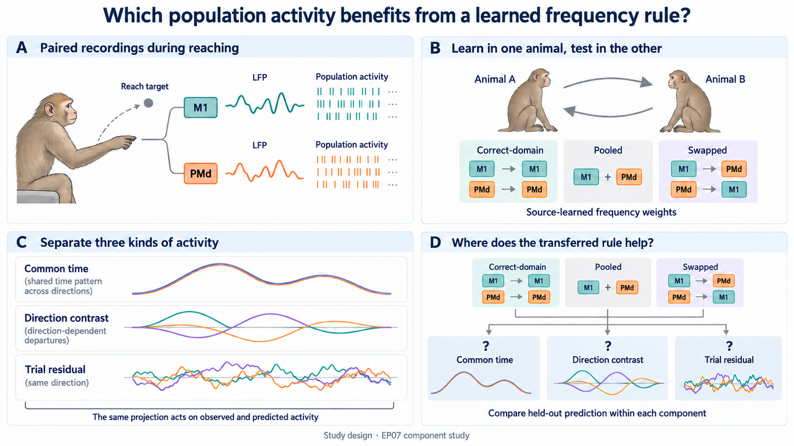

# EP06 component plan: what does a recording-domain frequency rule recover?

Status: integrated manuscript role, 2026-09-30. EP06 is a component of EP07's
history-and-population-components paper. No real-data result, reserved-session
test, or third-animal test is claimed; this decision does not authorize execution.

The [2026-10-02 scope review](scope_novelty_review_20261002.md) retains this
manuscript role. Its explicit pre-analysis amendment distinguishes unscoreable
rivals from measurable rivals lacking a joint-region consequence; the three
components and numerical margins are unchanged.

All three rules are compared within every component. Curves illustrate
task-defined projections, not measured fits or frequency bands; M1/PMd remains
a recording-domain comparison confounded with arrays. The primary residual
fingerprint and nomination rules remain in the contract.
[Imagegen prompts](ep06_question_imagegen-v2-prompt.md).

## The job this component does

EP07 owns whether earlier days add value over equally tuned today-only fitting,
then whether the increment requires the correct LFP--spike trial pairing.
EP06 asks a different question: can source-animal M1/PMd frequency rules recover
a specified projected population component better than pooled or swapped
rules? A regional classifier is only the entry analysis. The useful consequence,
its recording-support boundary, and its failure are the potential contribution
to the combined paper.

For example, an advantage for a direction-invariant time course would locate
the useful frequency rule in common task structure; an advantage for `P_E`
would locate it in the declared trial-residual projection. **Neither result
by itself proves EP07's history-specific coupling.** EP06's projectors separate
activity components, while EP07's capacity-matched residual refit and paired
mismatch increment test what historical information adds beyond today-only.

## The question in plain language

For each recording session, the primary analysis asks how well LMP and each
registered LFP band predict the nearby spike population's single-trial
residual, after a direction-by-time mean learned on training trials has been
removed. This produces one residual frequency profile for M1 and one for PMd.

The first question is whether the M1–PMd difference learned in Mihili labels
whole Chewie sessions, and whether the reverse direction also works. The second
question is whether the difference is useful: do frequency weights learned for
the correct region improve prediction of held-out population activity compared
with one pooled rule, while deliberately swapping the region labels makes
prediction worse?

The explanatory question is more specific: in a separate projection of the
unresidualized response, does the advantage belong to the common time course,
the direction-specific departure from that course, or the trial residual? Can
a rule fixed on development sessions predict the outcome of sessions held out
across acquisition dates? This follow-up cannot redefine the residual primary
result.

With only four reserved sessions, the present release cannot estimate a
transferable support boundary precisely and may not sample both sides of it.
EP06 is therefore assigned to the EP07 manuscript. A separate paper would need
newly specified evidence with additional sealed sessions and useful precision;
it is not the current workstream.

The array is different in M1 and PMd, so the paper must always distinguish a
reusable recording-domain result from a pure cortical-area claim.

## What would be new?

| Prior work | What is already known | What EP06 must add |
| --- | --- | --- |
| Gallego-Carracedo et al., eLife 2022, [doi:10.7554/eLife.73155](https://doi.org/10.7554/eLife.73155) | LFP-to-population relationships in these recordings depend on frequency and differ across M1, PMd, and area 2. | Do not present the basic regional difference as new. Predict which prespecified projected population component benefits from the regional rule and whether calibration-visible support predicts held-out session outcomes. |
| Ince et al., PLOS ONE 2010, [doi:10.1371/journal.pone.0014384](https://doi.org/10.1371/journal.pone.0014384) | Frequency-dependent spatial LFP patterns in motor cortex carried reach-direction information. | Test a region-linked LFP-to-population profile rather than target direction, using whole-session cross-animal transfer. |
| Hall et al., Nature Communications 2014, [doi:10.1038/ncomms6462](https://doi.org/10.1038/ncomms6462) | Multichannel motor-cortical LFPs estimated neuronal firing and supported real-time biofeedback. | Ask whether the useful frequency rule differs reproducibly between the two recording domains; EP06 does not test online control. |
| Gallego et al., Nature Neuroscience 2020, [doi:10.1038/s41593-019-0555-4](https://doi.org/10.1038/s41593-019-0555-4) | Low-dimensional population dynamics can remain stable over long periods. | Directly test whether a region-linked LFP rule transfers across animals rather than inferring it from latent stability. |
| Safaie et al., Nature 2023, [preserved dynamics across animals](https://www.nature.com/articles/s41586-023-06714-0) | Aligned motor population dynamics and behavior decoding already transfer across animals performing similar behavior. | Generic cross-animal latent transfer is not new. The candidate contribution is the consequence of a frozen source frequency rule for a prespecified activity component. |
| Hacker et al., bioRxiv 2026, [July 31 revision](https://www.biorxiv.org/content/10.64898/2026.01.03.697516v2) | Spike--high-gamma alignment in inferotemporal cortex depends on population-magnitude versus distributed-pattern coding; this is a preprint. | Do not claim first component-dependent spike/LFP agreement. EP06 tests task-defined projections and a recording-domain weighting consequence in this motor release. |

Reproducing the source paper's regional plot, finding one good band, or
classifying folds from the same session would not be enough. Before scored
analysis, compare the exact component-and-cross-day prediction with the source
paper, its supplements and code, and later reports using the same dataset.
The publication-role decision is already EP06 within EP07. Exact source/code
overlap can still narrow or remove a claimed component advance; this writing
decision neither certifies novelty nor creates a new independent study.

## Separate manuscript ownership from outcome permission

Keep EP06's acquisition-position split (development 1, 2, 4, 5; reserved 3, 6)
and its whole-trial training/calibration/evaluation roles. EP07's chronological
and within-target roles differ. An EP06 fit or score can therefore reveal
spikes still closed in EP07, even if its own EP06 role is legitimate.

On the shared corpus, EP06 neural fitting/scoring follows EP07's full analysis
freeze and single primary opening, unless a scientist approves compatible
prospective joint roles before relevant scores. No EP06 outcome, fitted weight,
or candidate feedback enters EP07 development; no sibling output becomes an
EP06 run input. EP06 still freezes its own final procedure before its own
reserved-session opening. This is sequencing of existing roles, not silently
merging splits, granting execution authority, or making exposed data fresh.

If EP07's primary result fails, EP06 may report its bounded domain/component
result but cannot turn the combined history claim positive. Likewise an EP06
component failure does not erase a supported EP07 primary result. Publish each
effect with its own fitting roles, score denominator, uncertainty, and evidence
status rather than treating two analyses of the same trials as replication.

## Study sequence

### 1. Test whole-session transfer in both directions

Use four development sessions from each animal. Learn one complete M1–PMd
profile rule from Mihili and test all four Chewie sessions, then reverse. Fit
all scaling, population summaries, LFP-to-population models, reliability
weights, alignment, and classifier parameters on the permitted training side.

The primary target is always the single-trial spike residual after subtracting
a training-only direction-by-time mean. No component family is selected for the
primary profile.

Report both balanced accuracies separately, their equal-weight mean, and every
session. Trials, time bins, electrodes, bands, and population coordinates are
measurements within a session; they do not increase the number of animals.

### 2. Show what the classifier recognized

Plot the signed M1-minus-PMd difference for every registered feature block and
every session. Any highlighted band must be chosen by a development-only rule,
not because it looks clean in reserved sessions.

The figure should let a reader answer:

- Does the same part of the profile have the same sign in both animals?
- Does the difference survive equal trial, electrode, population-rank,
  reliability, and model-capacity budgets?
- Does it remain without 100–400 Hz power and on matched electrodes and units?
- Can recording metadata or missing channels classify the sessions just as
  well?
- Does one session or one profile component control the result?

If only the final classifier score is stable, the biological interpretation is
unknown.

### 3. Ask whether the difference improves prediction

After the first result is fixed, use the source animal's M1 and PMd profiles to
create three fixed ways of combining frequency-specific predictions in the
other animal:

| Rule | Scientific question |
| --- | --- |
| Correct region | Do source-learned M1 weights help target M1 and source-learned PMd weights help target PMd? |
| Pooled | Would one common frequency rule work just as well for both regions? |
| Swapped region | Does deliberately giving each region the other region's weights hurt? |

For the residual consequence in this section, source-animal development
sessions alone fit the M1, PMd, and pooled frequency weights. Section 4 repeats
the same source-only rule separately for each projector. Swapped is exactly the
M1/PMd permutation. A target session may fit its population axes, scaling, and
each band's base predictor on target training trials, but it cannot refit a
combining weight.
Calibration trials only provide the support index; evaluation trials only
provide the component score. Correct, pooled, and swapped therefore combine the
same held-out bandwise predictions. No rule receives extra coefficients,
different trials, extra electrodes, or a different population dimension.

The proposed explanation predicts a meaningful correct-minus-pooled advantage
in both animal directions and worse performance after the weights are swapped.
If the regional weights are almost identical, or the bandwise predictions are
too similar for the mixtures to differ, call the test inconclusive. That is not
evidence that a pooled biological rule is sufficient.

### 4. Project the unresidualized response, then predict a session outcome

This follow-up starts again from the unresidualized spike response. Training
freezes the population axes and three trial-space projectors:

| Component | Projector |
| --- | --- |
| Common time | `P_C`: direction-invariant time effects |
| Direction × time | `P_D`: sum-to-zero direction-by-time contrasts after removing `P_C` |
| Trial residual | `P_E`: the remaining within-direction, within-time trial activity |

The [detailed component specification](component_details.md) expands each
family without changing its endpoint:

- **Common time:** the equally direction-averaged trajectory, including any
  level already present in the frozen coordinates. A useful source-domain
  rule here helps common task structure, not which individual trial fluctuates.
- **Direction × time:** the average direction-specific departure from that
  common trajectory. Static direction offsets remain included; this is not
  a newly centered pure interaction or an isolated movement-intention signal.
- **Trial residual:** each trial's departure from its evaluation direction/time
  average. It can contain unmodeled behavior, state, recording variation and
  noise; a useful rule here is not by itself a causal coupling mechanism.

All three must be measured with the same correct/pooled/swapped consequence
test, not ranked by component energy or absolute prediction score. Keep the
nomination cross-fit and unscorable cases unchanged. This added detail leaves
model combinations searchable within the current grammar and budget; it does
not preselect a preferred component, band or decoder.

The inner product gives equal total weight to every reach direction, equal
weight to trials within a direction, and equal weight to analyzed time bins.
With this direction balance, `P_C` and `P_D` are orthogonal and
`P_E = I - P_C - P_D`. Thus `P_C + P_D + P_E = I` on the frozen-axis analysis
space. The projectors use the frozen direction/time design and training-defined
population axes, never an
evaluation spike value. Training fixes the direction set, time grid, contrast
coding, and axes; evaluation contributes only its preassigned direction labels
and time bins when the operators are applied.

Observed evaluation cell means enter only `P_k Y_eval`; a rule's prediction
uses `P_k Yhat_eval` formed from its own predicted means. `P_E` is not the
primary residual: the latter subtracts a training-only template and therefore
also retains evaluation-versus-training cell-mean shifts. A component score
cannot replace the residual-only profile. Common-time utility does not imply
trial identity, and trial-residual utility does not imply EP07 history benefit.

For component `k`, compare the genuine held-out target `P_k Y_eval` with the
held-out prediction `P_k Yhat_eval`. The score is
`1 - sum||P_k Y_eval - P_k Yhat_eval||^2 / sum||P_k Y_eval||^2` under the same
direction-balanced norm. Correct, pooled, and swapped share this target and
denominator. This measures fraction of component energy predicted, not
explained variance, and may be negative.

A positive minimum component-energy gate is fixed from development and
known-answer synthetic tests before final evaluation. Apply it to the target
denominator divided by total direction-balanced evaluation weight, so extra
trials cannot make a weak component appear scoreable. A nonfinite result or
normalized target energy below that gate is unscorable and unresolved. It is
never called a failure. For each component, report
`G_region = score(correct) - max(score(pooled), score(swapped))` separately for
M1 and PMd before any average. Preserve the component only when both gains are
positive and their equal-region mean is at least 0.01. Two nonpositive gains are
a failure. Opposite signs, an unscorable region, or a mean between 0 and 0.01
are unresolved.

For each transfer direction, use an outer four-fold session loop. The other
three target development sessions establish numerical scoreability of all
three components in both regions. An unscoreable rival leaves the complete
comparison unresolved, with no nominee. Eligibility is then candidate-specific:
regional gains must agree in sign in every nomination session. A measured
mixed-sign rival remains visible but does not veto another eligible candidate.
Nominate the largest median equal-region gain among eligible candidates;
top medians within 0.01 are tied, and no eligible component gives no nominee.
This is the best eligible joint-region account, not a global numerical winner
over mixed-sign rivals. Only a valid prefold nominee receives
a frozen support prediction and evaluation regional gains; the other two
evaluation components remain unopened in that fold. After the prospective
four-fold assessment is recorded, the previously unopened development
components may be scored for a final selection using all four sessions; they
cannot alter the outer-fold
record. Final medians use common numerically scoreable sessions for all three
components in both regions, with at least three of four required. Sign
consistency applies to each eligible candidate across that set, not every
rival. A component claim requires the same nominee in at
least three folds, no fold tied within
the 0.01 margin, and no M1/PMd sign contradiction. Otherwise selection is
unstable. Both transfer directions must then make the same final untied
nomination before any reserved outcome is opened.

The frozen prediction uses only calibration-visible quantities:

- reliability: the Spearman–Brown-corrected correlation between component
  frequency profiles from two fixed, direction-balanced calibration halves;
- profile distance: the root-mean-square bandwise distance from the applicable
  source-animal regional prototype, divided by development between-session
  variation; a zero or nonfinite bandwise scale forces an abstention; and
- support index: standardized reliability minus standardized profile distance.

For a cross-fitted development prediction, the other seven development sessions
set the reference median and scale; all eight set them for a reserved
prediction. Standardization subtracts that median and divides by 1.4826 times
the median absolute deviation; a zero scale or nonfinite split-half reliability
forces an abstention. The support index has equal fixed weights and no
outcome-fitted coefficient. An index at or above 0.25 predicts preservation; an
index at or below -0.25 predicts failure; the middle is an abstention. Write the
prediction for every reserved session before any of its evaluation trials are
scored.

A generic-quality explanation predicts parallel gains for all three components
and equal or better prediction from recording metadata. A calendar gap noticed
after failure is not an explanation. Positions 3 and 6 are held out across the
acquisition dates; they are not both later sessions.

Report both regional gains, the resulting session status, every prediction,
and every abstention. Whole-trial resampling quantifies within-session
measurement error. Session resampling stays within animal, the two transfer
directions receive equal weight, and each animal direction and leave-one-session
result is shown separately. The support summary gives exact correct, wrong, and
abstained counts with an interval over sessions. A within-corpus prediction
needs at least three non-abstaining reserved sessions and no wrong prediction.
Even four correct predictions from only one outcome class do not establish the
boundary. With four reserved sessions, wide uncertainty is expected and cannot
support a stand-alone boundary claim.

### 5. Use the reserved sessions once

The two reserved sessions from each animal can test the final classifier and
the prediction consequence only if both results are specified before they are
opened. Reveal all four sessions together. The fixed recipe may fit its planned
session-specific base models on training trials, but it cannot change feature
support, model family, weights, thresholds, or exclusions after any reserved
result is visible.

Because related work has already exposed the release, this is a procedural
within-corpus test rather than independent confirmation.

### 6. Carry the unchanged rule to a third animal

A later third-animal study must use the same profile construction, classifier,
frequency rules, thresholds, and support. It is a separately planned study and
must report every compatible session. If no suitable simultaneous M1/PMd source
exists, the paper must retain its two-animal scope.

## Rival explanations and decisive checks

| Rival explanation | Direct check | If it wins |
| --- | --- | --- |
| Ordinary reach direction explains the result | Direction-and-time baseline and whole-trial LFP-to-population pairing shuffle | No evidence for the proposed regional population relationship |
| Array quality reveals the region label | Metadata-only classifier and matched trial, channel, rank, reliability, and missingness support | Recording or hardware fingerprint; no neural regional interpretation |
| High-frequency spike leakage creates the profile | Low-frequency-only analysis, high-frequency exclusion, and matched electrode/unit checks | Limit the result to a spike-rich recording feature |
| Flexible population summaries or models create separability | Capacity-matched alternatives and smoothness/dimensionality-matched surrogate activity | No profile-specific evidence |
| Frequency labels leak the answer | Verify feature guides and shuffle band labels through the full analysis | Invalid regional interpretation |
| One animal or session drives the score | Both transfer directions and leave-one-session analysis | Narrow or reject the transfer claim |
| Correct-region weighting has more freedom | Apply all three fixed weight sets to the same bandwise predictions | No benefit attributable to the regional rule |
| Evaluation outcomes alter a projector or fitted weight | Verify projector idempotence, orthogonality, sum-to-identity, direction-imbalance invariance, and identical application to observed and predicted activity | Invalid component explanation |
| Target data silently adapt the regional weights | Trace every weight to source development and verify swapped is the exact M1/PMd permutation | Invalid cross-animal consequence |
| A nearly empty component produces an unstable ratio | Apply the development- and synthetic-fixed positive energy gate before computing regional gains | Unscorable and unresolved component |
| The three mixtures cannot meaningfully differ | Check weight separation and diversity of the bandwise predictions | Consequence is inconclusive |
| Generic recording quality, not component organization, drives the benefit | Ask whether all three components' regional gains move together and compare the frozen support index with a fixed metadata-only rule | No component-level population-organization claim |
| Calendar drift explains every failure | Ask whether the pre-fixed calibration-visible support index predicts held-out failures beyond elapsed days | Treat unexplained loss across acquisition dates as a failed prediction, not a discovered mechanism |

Matching measured hardware features does not remove unmeasured array effects.
The strongest wording remains about the two recording domains unless a future
design breaks the region–array link.

## When to deepen, narrow, or stop

| Evidence | Next action and permitted claim |
| --- | --- |
| Both classification directions pass, the correct-region rule beats pooled, and the same component and frozen support prediction work on reserved sessions | Report the component result within EP07; a stand-alone boundary claim still needs additional sealed sessions on both sides of the boundary. |
| Classification and average prediction transfer, but the component family or support prediction does not | Keep the useful result as part of EP07; do not force a separate EP06 paper. |
| Classification transfers but correct-region does not beat pooled | Report a stable label with no demonstrated prediction benefit; stop the stronger interpretation. |
| The regional rules or bandwise predictions cannot be distinguished | Call the consequence inconclusive and seek a better-powered prespecified test. |
| The two animal directions disagree | Treat the result as animal-specific; do not average away the disagreement. |
| Recording metadata or matching explains the result | Reframe as a hardware or recording-quality result, or stop. |
| Only high-frequency or spike-rich features survive | State that boundary and stop the broad LFP claim. |
| The reserved sessions fail | Preserve the development result and the failed transfer; do not switch candidates. |
| No third-animal source exists | End with a two-animal scope and a concrete future-data requirement. |
| Precision is too low to distinguish meaningful effects | Call the result unresolved; a wide interval is not evidence for equivalence. |

## Figure ownership in the EP07 manuscript

| Figure | Scientific judgment | Evidence shown |
| --- | --- | --- |
| Main figures 1--2, owned by EP07 | Does history help, and does its increment depend on correct trial pairing? | EP07's two-comparator primary, frozen bridge, residual refit, and incremental pairing endpoint; no EP06 score substitution. |
| Main figure 3, EP06 component | Which projected activity benefits from a recording-domain frequency rule? | Frozen common-time, direction-contrast, and trial-residual projections; correct/pooled/swapped predictions; both regional gains and animal directions; low/high-frequency scope and array limitation. |
| Figure 3 supporting diagnostics | Is the component consequence identified and measurable? | Signed all-band profiles, classification directions, equal-support and metadata controls, session influence, uncertainty, and indistinguishable-rule failures. |
| Figure 3 support prediction | Did the calibration-visible rule predict the four reserved outcomes? | Cross-fitted reliability/distance, every prediction and abstention, component energy, failures and uncertainty. Four sessions do not establish a transferable boundary. |
| Future main figure 4, owned by a separately frozen EP07 forward study | Does the chosen explanation work on genuinely new days? | Only if compatible new data become available; no current third animal/day is claimed. |

EP05's behavioral reach-deviation figure and EP08's acquisition-value figure
belong to distinct questions, not duplicate population-decoder papers. Figure
placement does not reduce EP06's existing required controls or invent a figure
quota. The current concept PNG is retained; the older SVG is historical.

The abstract should state that the primary score was residual-only, name the
nominated projected component, say whether the frozen support prediction worked,
report both animal-transfer directions, and state the hardware and sample-size
limits. “M1 and PMd differ” is already too broad and too close to the source
publication to be the conclusion.
