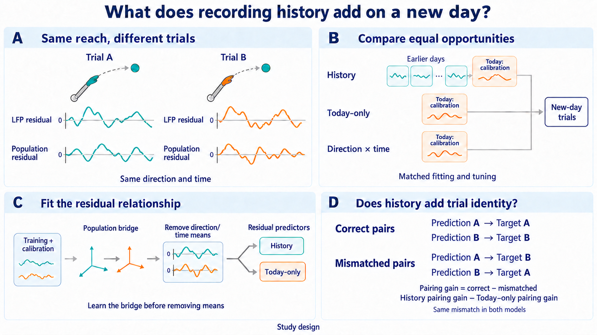

# What do earlier recording days preserve: task structure or trial-specific coupling?

Imagine two reaches in the same direction on a new recording day. At the same
moment after movement onset, their usual direction-and-time response is the
same. Yet their LFPs and population spike counts may rise or fall together in
different ways. EP07 asks whether earlier recording days help predict those
new-day differences after the new day has supplied only a small calibration
sample.

The decisive comparison is not merely whether a cross-day model beats an
average response. It must also beat an equally tuned model that sees the same
new-day calibration trials but no earlier-day data. Only then can we say that
history added information beyond what could be learned from today's sample.



The traces are schematic residuals around zero, not observations. History
uses three earlier days plus today's calibration; today-only uses the same
calibration without earlier-day data. Matched tuning refers to those two
streams; the direction/time template remains a comparator. Panels C/D show
the separately fitted residual and shared-mismatch comparison, not a closed
model menu: development search stays broad. A failed pairing increment leaves
the mechanism unresolved. The primary test and exact decision rules remain
below. Earlier PNG/SVG assets are historical.
[Exact imagegen prompts](outputs/ep07_question_imagegen-v2-prompt.md).

## One paper, with distinct scientific jobs

EP07 owns the proposed **history-and-population-components paper**. Its primary
question stays fixed: do earlier days help after limited same-day calibration?
Its explanatory question is whether that benefit preserves average task
structure or an aligned, same-trial LFP--population residual relationship.
EP06 supplies a separately specified recording-domain component analysis, not
a second paper whose main claim is that LFP predicts spikes.

| Study | Scientific job | What it cannot substitute for |
| --- | --- | --- |
| EP07 | Earlier-day added value, then mean/geometry versus incremental same-trial residual coupling | EP06 classification or a favorable frequency profile cannot rescue a failed EP07 primary test. |
| EP06 component | Ask whether source-animal recording-domain frequency rules recover common-time, direction-by-time, or trial-residual activity better than pooled or swapped rules | This is not EP07's history-minus-today-only estimand and is not an independent animal/day replication. |
| EP05 | Does LFP add information about the deviation of a particular reach from its usual direction/time pattern? | A behavior target is distinct from EP07's spike-population target; the shared release does not make the studies independent. |
| EP08 | Which acquisition-visible measurements predict the value of another electrode or trial under a fixed budget? | A selection-policy win is neither evidence for day-stable coupling nor a causal population mechanism. |

Integration concerns paper ownership, not shared model fits or outcome access.
EP06 and EP07 have different session/trial roles. EP06 scoring on this corpus
must therefore wait until EP07's full analysis choices are frozen and its
single primary opening is complete, or until a scientist approves a compatible
prospective joint-role design before scores are seen. Reading EP06 outcomes or
using sibling fitted state during EP07 development is not permitted. Later
EP06 analyses remain same-corpus component evidence, never fresh confirmation
of an explanation selected from the EP07 result.

## The exact prediction that could add something

LFP--population association, stable latent trajectories, and use of historical
recordings for robust decoding are already established. The candidate advance
is narrower: **earlier days add trial-identity information beyond what today's
small calibration sample already provides**. A shared average trajectory, a
good alignment, or the history model's absolute residual score cannot establish
that claim. The current primary papers and overlap boundaries are in the
[paper plan](outputs/paper_plan.md); this is a candidate contribution, not a
claim of first discovery.

The [2026-10-02 scope review](outputs/scope_novelty_review_20261002.md)
keeps this question and the broad search intact, while distinguishing a
supported prediction gain from an identified explanation of that gain.

Consider two rightward reaches at the same native time bin. The mean-structure
explanation predicts the same usual population response for both. The coupling
explanation additionally predicts which reach has above- or below-usual
population activity from its own LFP residual. With all predictions fixed,
swapping the two complete LFP-derived trajectories within direction should
remove more predictive gain from history than from today-only. The registered
incremental pairing endpoint below makes those explanations distinguishable.
A residual increment without that pairing increment is unresolved between
shared mean error and aligned geometry, not proof that only the mean transfers.

## The scientific question

Within one animal, implant, and cortical region, can three earlier recording
days improve prediction of population spiking on a later day after the model
has seen only a nominal 20% of that later day's trials?

The study is run separately for:

- M1 activity from 150 to 450 ms after movement onset; and
- PMd activity from 450 ms before the go cue up to the go cue.

The same analysis choices are used for every day and both settings. Model
parameters are fitted separately within animal, implant, and region; neural
signals are never pooled across those boundaries.

## What would count as a useful answer?

The first result answers whether earlier days add predictive value. A positive
result then leads to a second question: what information survived the change
of day?

There are three scientifically different possibilities:

1. **Average reach structure.** Earlier days improve the expected response for
   a reach direction and time point.
2. **Shared population geometry.** A low-dimensional population pattern can be
   aligned across days even though the recorded neurons differ.
3. **Trial-specific coupling.** After the expected direction-and-time response
   is removed, LFP fluctuations still predict whether population spiking on a
   particular trial is above or below expectation. This claim additionally
   requires the correct held-out LFP trial to predict the correct spike trial
   better than a different held-out trial in the same reach direction.

The third possibility is the strongest claim, but it also requires the
strongest controls. A result carried only by 100--400 Hz power or by
spike-rich electrodes will be reported as that narrower signal boundary, not
as general field-potential coupling.

## Recording days and trial roles

The primary study uses twelve simultaneous M1/PMd recording days from two
animals. Earlier and later days are assigned chronologically.

| Animal | Earlier days used for model fitting | Later days used for calibration and evaluation |
| --- | --- | --- |
| Mihili | 2014-02-17, 2014-02-18, 2014-03-03 | 2014-03-04, 2014-03-06, 2014-03-07 |
| Chewie-L | 2016-09-29, 2016-10-05, 2016-10-06 | 2016-10-07, 2016-10-14, 2016-10-21 |

M1 and PMd from the same recording day always receive the same role. No trial
from a later day may be used as an earlier-day training example. Chewie-R is
reserved for an implant-sensitivity analysis in the same animal; it is not a
third-animal replication and cannot determine the primary result.

Within each later day and reach direction, complete trials are placed in one
fixed order using the predeclared seed `ep07-target-role-split-v1`. The order
is saved before any model comparison. A nominal 20% of trials are used for
calibration; the remainder is divided as evenly as possible between model
development and held-out evaluation:

```text
n_calibration = floor(0.2*n + 0.5)
n_development = floor((n - n_calibration)/2)
n_held_out    = n - n_calibration - n_development
```

Each direction must have at least 15 complete trials, giving at least 3
calibration, 6 development, and 6 held-out trials. A whole behavioral trial
keeps the same role across every time bin, neuron, feature, M1, and PMd.
Trial order is never searched, and no trial is reassigned because of its neural
value or prediction error.

## Signals and eligibility

The prediction target is the provider-released spike count in native 30-ms
bins. Predictions are scored on that original count scale. The analysis does
not smooth, transform, or selectively remove neurons according to their
outcomes.

A trial is included only when it is a successful reach, its animal, implant,
day, direction, M1 and PMd records agree, both time windows are present, and
the required LFP and spike values are finite. Spike counts must be nonnegative
integers. Eligibility is determined from identities and data availability,
never from neural magnitude, variability, model score, or residual.

Each later day keeps the neurons that are consistently present across all
eligible trials for that day and region. Earlier days keep their own neuron
sets. Neuron identities are not matched across days; cross-day models may
align only population coordinates learned from permitted training and
calibration data. For the residual follow-up, the coordinate map is learned
from the **unresidualized** training and calibration responses while their
direction-by-time averages are still present. It is then frozen before any
residual predictor is fit. Held-out spike outcomes never help define the map.

The public release contains preprocessed LFP features rather than raw voltage.
Those released features are used unchanged for every model. Any conclusion is
therefore about this offline representation, not about raw-voltage processing
or an online system.

## Open development search

Keep the scientific comparison explicit without choosing the winning model
or mechanism in advance. Development search should explore diverse feature,
alignment, source-weighting, regularization and mapping combinations within
the declared model families. Starting models seed that search; they are not
a fixed shortlist of final architectures. Adaptive successors can follow
development evidence, including evidence against the preferred coupling story.

The model families and structural limits for the current round are:

- LMP and the eight released power-band classes, summarized across electrodes
  without matching electrode numbers between days;
- population ranks of 4, 8, 12, or 16 when the data support them;
- no alignment, behavior-guided orthogonal alignment, or regularized
  correlation-based alignment;
- direction-and-time adjustment, explicit direction/time predictors, or both;
- equal, reliability-based, calibration-similarity, shrinkage, or
  leave-one-day source weighting;
- ridge, elastic-net, reduced-rank ridge, or a shallow two-layer network with
  width at most 64; and
- an ensemble of at most two already evaluated models.

Raw-waveform networks, cross-animal or cross-region inputs, matching numeric
channel IDs across days, choosing a different winner for each session, and
using held-out outcomes to choose preprocessing or model structure are not
allowed.

Matched tuning means equal development opportunities and permitted target-day
information, not one preselected residual architecture or shared fitted
parameters. Residual-model choices remain searchable before their applicable
evaluation; the residual estimand, frozen bridge and trial-identity comparison
do not. Explore calibration-visible mechanism indicators broadly rather than
preselecting two. Their eventual forecasting rule must be chosen using allowed
development feedback, with no held-out-day benefit used to predict itself.
Six target days limit the evidence for that rule, not the number of hypotheses
that can be explored. Any result-driven discovery remains development evidence
until tested on genuinely new days.

The existing numerical budgets below still bound this round; this writing
clarification grants neither extra resources nor an experiment launch.

## The two comparisons

Every history-assisted model is judged against both:

1. a direction-by-time mean estimated from that later day's calibration
   trials; and
2. an equally tuned today-only model that receives the same calibration data
   and development opportunities but no earlier-day observations or fitted
   state.

Performance is measured with one joint `R2_SSE` across all held-out trials,
native time bins, and eligible neurons within a day and region. Negative scores
remain visible. Differences are first calculated for each later day, then
averaged across the three days within each animal, and finally averaged equally
across the two animals. M1 and PMd remain separate. Both comparators are always
reported; a favorable comparison with only one is insufficient.

## Search size and stopping

The history-assisted and today-only model streams receive exactly the same
number of development evaluations:

1. 16 diverse starting models in each stream;
2. between 2 and 14 paired adaptive successors, one new model per stream in
   each pair; and
3. exactly 10 paired alternative-explanation checks on the two selected
   finalists.

Each stream therefore receives 28--40 outcome-contacting evaluations, or
56--80 jointly. At least 41.67% of post-starting-model evaluations are devoted
to alternative explanations. After at least two valid successor pairs, the
adaptive stage stops when it reaches 14 pairs, exhausts the allowed model
space, or seven consecutive valid pairs improve neither stream by at least
`0.002 R2`. That value controls search patience only; it is not the scientific
effect threshold.

The resource limit is CPU only: at most 800 aggregate CPU-hours, 96 wall-clock
hours, 32 concurrent cores, and 500 GB temporary storage. Running out of
resources means the search is incomplete; it is not evidence for or against
the scientific hypothesis.

## Alternative explanations that must be checked

Before held-out evaluation, the selected models must survive the ten planned
checks:

1. shuffle earlier-day labels;
2. break earlier-day trial correspondence;
3. break calibration-trial correspondence;
4. remove earlier-day information entirely;
5. reduce the model to a direction-and-time template;
6. replace learned source weights with equal weights;
7. omit the first earlier day;
8. omit the second earlier day;
9. omit the third earlier day; and
10. remove the first active component among alignment, whitening, feature
    scope, aggregation, nuisance adjustment, and source-coordinate structure.

Stable, drifting, null, and scale-shift simulations must also recover their
known answers. These checks test whether an apparent gain depends on a broken
correspondence, one influential day, generic regularization, or one optional
component. A failed scientific check makes that finalist ineligible; it does
not trigger a search for a more convenient runner-up.

## Held-out decision

All analysis choices are made from the permitted earlier-day, calibration, and
development data before held-out outcomes are viewed. The selected
history-assisted model and today-only model are then evaluated once on the
held-out trials.

For each region/epoch setting, the history-assisted model must exceed both
comparators by more than `0.01 R2`. Uncertainty is estimated with 9,999 paired
whole-trial bootstrap samples within day and reach direction. M1 and PMd are
the two prespecified tests and use one-sided Holm control at familywise
`alpha = 0.05`.

A setting is supported only when all of the following hold:

- the `0.01 R2` margin is cleared against both comparators after multiplicity
  control;
- the mean improvement is positive in both Mihili and Chewie-L;
- at least two of three later days improve within each animal;
- the conclusion remains positive after omitting each later day in turn; and
- all required alternative-explanation and data-separation checks pass.

The final report distinguishes support in M1 only, PMd only, both, an
ambiguous result, a clean failure to clear the rule, an incomplete search, and
a technical failure. An incomplete or technically invalid run is never
interpreted as evidence that transfer is absent. Once held-out results have
been examined, they cannot be used to revise the same study and try again.

## From prediction gain to explanation

Residual candidates may be explored during matched development search; the
primary-success condition governs the final explanatory interpretation, not
when diverse candidates can be proposed. The conditional follow-up uses a
genuine residual-only prediction problem. Direction-and-time means are
estimated only from the
permitted earlier-day and calibration trials and removed from both LFP inputs
and spike-count targets before either model is fit. Predictions are scored
directly against held-out spike residuals. This distinguishes a reusable
trial-specific relationship from a better estimate of the average reach
trajectory.

The changing neuron sets require a separate, earlier step. Within each fitting
fold, use unresidualized spike responses from earlier-day training trials and
new-day calibration trials to learn the population bases and their mapping.
Common direction-by-time response averages supply the behavioral anchors;
subtracting those averages first would erase the anchors. Freeze the bases,
the cross-day map, and the new-day reconstruction loading separately for each
candidate/fitting fold; this is not a permanent preselected bridge for the
whole search. Only then remove
the direction-by-time means, project spike residuals through the frozen map,
and fit the LFP-to-residual predictor. The residual predictor receives LFP
residuals, not an uncentered response, direction/time mean, or mean template.

The bridge is used only when its coordinates are actually identified. For a
new day and region, candidate ranks are checked in the order 16, 12, 8, and 4.
The largest usable rank must have all eight directions, at least eight native
time bins (64 common anchors), at least four anchors per dimension, full
centered anchor rank, anchor condition number no greater than 30, and a
cross-day smallest-to-largest anchor singular-value ratio of at least 0.05 for
all three source-day links. Specifically, if `K` is the number of common
direction-by-time cells (`K >= 64`), `A_d` is the `K`-by-rank matrix of
unresidualized mean anchors projected into day `d`'s training/calibration
population basis and centered across anchors. Write its
thin QR factorization as `A_d = Q_d R_d`; the cross-day ratio is
`sigma_min(Q_source' Q_target) / sigma_max(Q_source' Q_target)`. These checks
use training and calibration responses only. If no rank passes, that day has
no aligned residual result; a source day is not discarded merely because it
makes the map inconvenient.

A second held-out comparison asks whether **history's added value** depends on
trial identity. Keep both frozen prediction sets fixed. Let `H_correct` and
`T_correct` be the history-assisted and today-only residual scores with each
LFP trial paired to its own spike trial, and define
`Delta_correct = H_correct - T_correct`. For every within-direction whole-trial
derangement `p`, apply the same `p` to both prediction sets and define
`Delta_mismatch(p) = H_mismatch(p) - T_mismatch(p)`. The decisive effect is

`trial-identity gain = Delta_correct - mean_p Delta_mismatch(p)`.

Equivalently, history's correct-versus-mismatch pairing gain must exceed the
today-only model's pairing gain. The absolute history correct-versus-mismatch
score remains a diagnostic, but cannot establish history-specific coupling on
its own. Because every term uses the same calibration means and the same
derangement, shared mean-estimation error and any pairing signal already
available to today-only are retained on both sides. A supported residual gain
without a supported incremental pairing advantage establishes residual
predictive benefit, not its mechanism. Shared mean-estimation error or aligned
population geometry remain possible explanations, not identified results.
Imprecise pairing evidence stays unresolved; failure to clear its margin is
not evidence that only the mean transfers.

The comparison uses 9,999 fixed-seed, within-direction whole-trial
derangements. Its center is the mean of the 9,999 `Delta_mismatch` values, and
its practical margin is `0.01 R2`. A trial-specific claim requires simultaneous
lower bounds above `0.01 R2` for both history versus today-only residual
prediction and the incremental trial-identity gain. Within every whole-trial
bootstrap draw, recompute `Delta_correct` and the mismatch center using the same
paired derangement bank for both models. A bootstrap draw with no self-free
derangement is nonestimable and contributes the adverse infinite tail rather
than being redrawn. Effects are computed by day, averaged
equally across the three days within each animal, and then equally across the
two animals; M1 and PMd use the same one-sided Holm control as the primary
test. Every direction must retain at least six held-out trials or that day's
explanatory result is unavailable.

The follow-up then asks which LFP bands and population dimensions carry the
gain, whether it remains when 100--400 Hz features are excluded, whether it is
robust to electrode proximity and spike-quality differences, and whether a
small rule based only on source data plus new-day calibration can predict
which later days will benefit.

This test requires simultaneous trial identities for LFP and spikes, complete
direction/time cells in the fitting and calibration data, and multiple
held-out trials per direction. The selected release is described as containing
the needed simultaneous signals, and the primary minimum gives at least six
held-out trials per direction, but the prepared episode data views do not yet
exist. Trial correspondence and usable condition cells must therefore be
confirmed before scoring. If they cannot be confirmed, the residual-coupling
claim is unavailable even if the primary history comparison can still run.

That explanation is developed on the already exposed corpus. Its first real
confirmation must use newly sequestered recording days. The current held-out
trials cannot become fresh confirmation of an explanation chosen after their
results were seen.

## Claim boundary

A successful primary result would show that earlier days add predictive
information after limited same-day calibration for the supported M1/PMd
setting in these two animals and six fixed later days. It would not show that
the same neurons or electrode weights remain stable, that LFP causes spiking,
that the method transfers to a new session or animal, or that an online BCI
would improve.

M1 and PMd use different arrays, and the primary settings also use different
behavioral epochs. Neither EP06's recording-domain pattern nor an EP07
M1--PMd contrast isolates a pure cortical-area or preparation-versus-execution
effect. Two animals remain two animals; trials, days, bands, and population
coordinates do not create independent animal replication.

The [paper plan](outputs/paper_plan.md) describes the explanatory tests and
their result-dependent branches. No follow-up analysis may turn a failed or
ambiguous primary result into a positive one.
