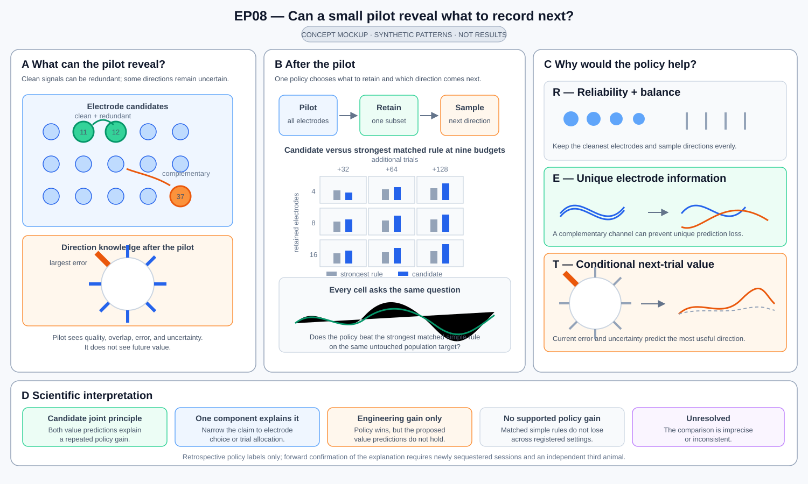

# Can a short pilot tell us what to record next?

At the start of a recording session, all electrodes may be available, but it
may be impractical to keep every channel active or collect a large calibration
set. EP08 asks a concrete question: after only 16 pilot reaches recorded on all
eligible electrodes, can we choose which 4, 8, or 16 electrodes to retain and
which reach direction to sample next, then predict untouched neural activity
better than simple rules with exactly the same electrode and trial budget?

Every method begins with the same pilot: two reaches in each of eight
directions. It then chooses a whole-electrode subset and allocates 32, 64, or
128 additional calibration trials by reach direction. The final decoder is the
same for every method. The alternatives are random selection, broad spatial
coverage, and ranking electrodes only by signal quality.



Like the EP12 concept figure, this mockup uses synthetic patterns to make the
scientific alternatives visible. It starts with clean-but-redundant and
complementary electrodes plus an uncertain reach direction, then shows the
joint post-pilot decision and three explanations for any gain: simple
reliability and balance, unique electrode information, or conditional
next-trial value. The final strip separates a candidate explanatory acquisition
principle from a policy gain alone. The 3 × 3 paired-bar matrix shows the actual
4/8/16-electrode by +32/+64/+128-trial grid, but its bar heights are
illustrative, not EP08 results; decision rules remain in the text.

## The scientific question

Can information visible in a 16-trial pilot reveal two kinds of future value?

1. **Nonredundant electrode value:** an electrode is useful because it adds
   population information not already present on the other retained
   electrodes, not merely because its signal is clean.
2. **Next-trial value:** the current calibration state predicts which reach
   direction will benefit most from one additional trial.

The first study asks whether one pilot-guided acquisition rule improves neural
prediction at matched budgets. The explanatory follow-up asks whether the
rule's pilot scores actually predict these two forms of value.

## At a glance

| Question | EP08 design |
| --- | --- |
| What does every method see first? | The same 16 trials: two from each of eight reach directions, recorded on all eligible electrodes. |
| What is chosen? | Which 4, 8, or 16 whole electrodes to retain, then the direction of each additional calibration trial. |
| How many additional trials? | 32, 64, or 128, giving a complete 3-by-3 electrode-by-trial grid. |
| What is predicted? | Motor-population spike activity on untouched trials from the same session. |
| What is the fair comparison? | Random, broad spatial coverage, and signal-quality selection with the same pilot, electrode count, trial count, decoder, and evaluation trials. |
| What must repeat? | Improvement in both animals, at least three of four held-out sessions, and the two scarce-resource settings `(4,32)` and `(8,64)`. Every grid cell remains visible. |
| What would explain a win? | Pilot-only measurements predict later electrode-removal loss and the benefit of the next reach-direction sample. |
| What would confirm the explanation? | The same predictions and acquisition rule work in newly sequestered sessions from a third animal. |

## Why a winning policy is not yet an explanation

Two electrodes can be equally clean yet carry nearly identical information.
Keeping both may waste a scarce channel. A slightly noisier electrode may be
more useful if it captures population variation missing from the first one.
The explanatory test therefore asks how much prediction worsens when each
retained electrode is removed from an otherwise unchanged set.

The same distinction applies to trial selection. If seven directions are
already predicted well but upward reaches have large calibration errors, an
adaptive method should predict that another upward trial will help more than
another trial from an already well-estimated direction. That prediction must
be made before the additional trial or its later evaluation benefit is known.

Electrode count and trial count have different physical meanings. EP08 reports
performance changes along each axis of the 3-by-3 grid. It does not claim that
one electrode is worth a particular number of trials or a measured amount of
power without a separate cost study.

## Data and session roles

The primary corpus is six Mihili and six Chewie-L M1 execution sessions from
the public Foundation LFP source. If the sessions meet the structural
requirements, four sessions per animal are used to develop one global policy
and two per animal remain untouched until the policy and analysis are final.
Whole sessions, not trials from the same session, separate development from
the final test.

The public outcomes have been used before. This study can therefore provide a
careful internal held-session test, but not an independent animal-level
replication. Chewie-R is another implant in Chewie and may be used only as an
implant-sensitivity analysis. A genuinely independent third animal is needed
for an external generalization claim.

Within every session, evaluation trials are set aside and never used to choose
electrodes, train the acquisition rule, or fit the decoder. The 16 pilot trials
and the later calibration trials come from a separate pool. Within each reach
direction, that pool is placed in one ordinary seeded order before any policy
score is known. Asking for a direction reveals only the next trial in that
direction's order.

## What happens after the pilot

The electrode decision comes first and is permanent for that session. A method
may retain 4, 8, or 16 physical electrodes, each carrying LMP, 100--200 Hz
power, and 200--400 Hz power. It may not add an electrode later or retroactively
use a discarded electrode on a previously collected non-pilot trial.

After electrode selection, each trial decision chooses one of the eight reach
directions. The analysis then advances to the next prespecified recorded trial
from that direction. This retrospective walk-through preserves what would have
been known at each choice, but it does not show how an animal would respond to
a real-time request.

Every method uses the same reduced-rank ridge decoder, population target,
movement window from 150 to 450 ms after movement onset, and untouched
evaluation trials. Decoder flexibility therefore cannot masquerade as an
acquisition advantage.

## Acquisition rules considered

Candidate methods may combine one electrode selector with one trial allocator.

Electrode selectors may use:

- signal reliability, artifact fraction, missingness, line noise,
  stationarity, and repeatability from data already acquired;
- spatial diversity or array coverage, with a stated fallback when geometry is
  unavailable;
- redundancy measures such as correlation, conditional variance, or
  log-determinant gain; or
- a simple learned ranking rule trained across development sessions from
  pilot-visible features.

Trial allocators may use:

- balanced direction counts;
- current calibration uncertainty;
- residual diversity;
- information gain; or
- a bounded upper-confidence rule.

Lookahead is limited to two acquisition steps. One global method is selected
for all sessions and animals; choosing a different winner for each session is
not allowed. Learned value labels for one development session must be produced
without using that session to train the ranker.

## Fair comparisons and primary measure

At every `(electrodes, additional trials)` point, compare the pilot-guided
method with:

- repeated uniform-random electrode selection plus balanced-random trials;
- geometry-only farthest-first electrode selection;
- reliability-only electrode ranking;
- the full-resource decoder as a ceiling check; and
- a development-only hindsight best case, reported only as an upper bound.

For each session and grid cell, compute the difference in held-out `R2_SSE`
between the candidate and the strongest simple rule chosen from development
evidence. Give all nine grid cells equal weight within a session, average
sessions within each animal, and give Mihili and Chewie-L equal weight. The
prespecified meaningful improvement is `0.005 R2_SSE`.

The complete nine-cell surface, every session, both animals, and negative
effects are reported even when the overall average is favorable.

## Search plan and budget

The study proceeds in five scientific stages:

1. Confirm the animals, sessions, physical electrodes, reach directions,
   pilot support, trial pools, LFP features, and population targets.
2. Establish repeated random, spatial, reliability, and fixed trial-allocation
   comparisons using common seeds and identical budgets.
3. Evaluate at least 20 diverse methods spanning every selector and allocator
   family.
4. Use development results to propose bounded combinations and parameters.
5. Stress-test the best method across subset seeds, budget settings, animals,
   and alternative explanations, then choose one global policy for the
   untouched sessions.

Run at least 40 and at most 112 valid method evaluations. After the minimum,
stop when 20 consecutive valid evaluations improve neither the primary score
by at least `0.005` nor the feasible utility/robustness/cost frontier. Coverage
of every selector and allocator family, the simple comparisons, and all
required alternative-explanation checks must be complete before patience can
stop the study. At least 40% of post-coverage work is reserved for those
checks. Up to 16 failed runs caused by engineering problems may be retried
without counting as scientific patience.

The resource limit is CPU only: at most 1,200 aggregate CPU-hours, 120
wall-clock hours, 48 concurrent cores, 256 GB memory, and 750 GB temporary
storage. Reaching a resource limit makes the study incomplete; it is not a
positive or negative scientific result.

## Alternative explanations that must remain visible

The selected method must be compared with:

- many random selections with identical action counts and compute;
- learned electrode rankings after their development value labels are
  permuted;
- spatial selection after electrode locations are shuffled;
- versions with reliability, diversity, learned score, or adaptive trial
  allocation removed;
- subsets matched for redundancy or signal quality;
- transfer in the reverse animal direction and omission of each development
  session;
- training on one animal and applying the rule to the other;
- a step-by-step check that every decision used only information available at
  that time;
- low-frequency-only and spike-contamination sensitivities; and
- simulated worlds that are saturating, spatially clustered, redundant,
  trial-limited, or null.

These comparisons distinguish a genuine pilot-guided acquisition principle
from signal quality alone, spatial spread alone, direction balancing, one
favorable session, or information that would not have been available at the
time of the decision.

## Held-session decision

Before the four untouched sessions are scored, choose one global acquisition
method, its fitted development state, the common decoder, pilot and trial
ordering, all grid cells, comparisons, effect margins, uncertainty method,
missing-geometry behavior, and result table. The method sees only the common
pilot and the calibration information available after each permitted choice.

A positive primary result requires all of the following:

- mean improvement of at least `0.005 R2_SSE` over the strongest
  cost-matched simple rule across the nine-cell grid;
- positive mean improvement in both Mihili and Chewie-L;
- improvement in at least three of the four untouched sessions;
- success at both `(4 electrodes, 32 trials)` and `(8 electrodes, 64 trials)`
  in both animals;
- no material loss relative to the full-resource ceiling under the
  prespecified equivalence margin;
- robustness when one animal or influential development session is omitted;
  and
- all required alternative-explanation and information-timing checks pass.

Possible study outcomes are: a reproducible joint policy, a positive but
ambiguous result, no policy clearing the prespecified rule, an incomplete
study, or an invalid analysis caused by broken data separation or scoring.
Once untouched-session results are visible, they cannot guide another search
within the same study.

## Tests that explain why the policy works

### Does the pilot predict unique electrode value?

For a retained set `S`, define an electrode's conditional value as:

```text
V_e = evaluation loss without electrode e - evaluation loss with the full set S
```

Both losses use the same calibration trials, untouched evaluation trials, and
decoder procedure. Before seeing these removal losses for a session, predict
their ordering from pilot-only reliability, geometry, redundancy, and the
selected pilot score. A useful explanation must outperform reliability alone
and repeat in both animals.

### Does the current state predict next-trial value?

At one acquisition step, separately evaluate what would have happened after
adding the next available trial from each reach direction:

```text
V_direction = loss before the trial - loss after adding that direction's next trial
```

The method must predict this ordering before receiving those trials or their
evaluation benefits. Candidate predictors are current direction counts,
cross-validated calibration error, uncertainty, and residual diversity. The
chosen direction is compared with balanced and random choices at the same
point in the recorded trial order.

These are predictive labels, not causal effects. Electrode-removal loss does
not prove that an electrode is biologically special, and the recorded-trial
analysis does not establish that real-time trial requests would have the same
effect.

### Which resource is limiting?

Report changes along the electrode and trial axes separately, for example:

```text
electrode step at N trials = R2(8,N) - R2(4,N)
trial step at E electrodes = R2(E,64) - R2(E,32)
```

Also test whether the benefit of more electrodes depends on trial count and
vice versa. Do not convert these axes into a common cost without direct
measurements of power, bandwidth, recording time, or participant burden.

## External confirmation and claim boundary

The four current untouched sessions test the acquisition policy itself. The
electrode-removal and next-direction explanations are developed afterward and
therefore require newly sequestered sessions for confirmation. The preferred
test is a third animal with compatible M1 LFP, population spiking, physical
electrode geometry, eight reach directions, and enough trials for the same
pilot and grid.

A successful internal result would show that, in these recordings, a common
16-trial pilot can guide post-pilot electrode retention and calibration-trial
allocation better than cost-matched simple rules. It would not establish
from-scratch electrode placement, causal electrode importance, measured power
savings, online behavioral control, a universal electrode count, or
generalization to a new animal. The [paper plan](outputs/paper_plan.md)
specifies how each result branch changes the final claim.
