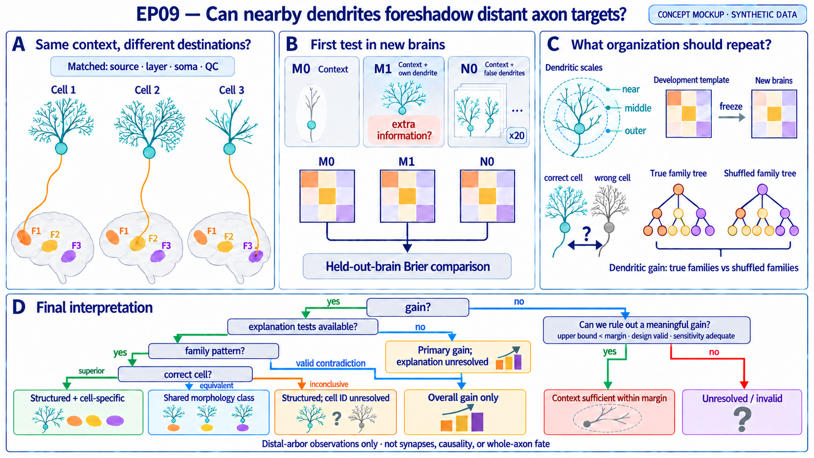

# Can nearby dendrites foreshadow a neuron’s distant axon targets?

## The question in plain language

Two neurons can sit in the same source region, occupy the same cortical layer, and
look equally well reconstructed. Yet their axons may reach different parts of the
brain.

EP09 asks whether the dendritic tree close to each soma contains reproducible
information about those distant axonal destinations. The comparison is deliberately
strict: first predict each neuron’s distal target-family detections from anatomical
context and measurement quality alone, then ask whether adding that neuron’s own
native dendrites improves prediction in entirely new brains.

The episode is not asking whether dendrites and axons can be classified separately,
or whether a flexible model can memorize cell types. It asks whether local input-side
structure carries information about long-range output organization after the obvious
anatomical and technical explanations have been held fixed.

## What would make the result scientifically useful?

A small improvement in a prediction score would establish only that dendrites add
some information. A stronger paper must also explain the organization of that
information:

1. Which part of the dendritic tree matters: near-soma branches, more distal branches,
   branch order, orientation, or a distributed combination?
2. Does the relevant dendritic scale depend on the independently defined family of
   axonal targets?
3. Does the same scale-by-target pattern recur in held-out brains?
4. Does the result survive controls for position, morphology size, reconstruction
   quality, batch, model capacity, and shared estimation error?

The intended contribution is therefore a reproducible rule linking local dendritic
organization to distal target-family organization—not merely a leaderboard win for a
larger feature set.

## Why this is not already answered

Large whole-brain morphology studies have already described variation in dendrites,
distal axonal arbors, and projection motifs in the SEU-A1876 resource
([Peng et al., 2024](https://doi.org/10.1038/s41467-024-54745-6)). Other single-neuron
studies have reported associations—and important exceptions—between dendritic subtype
and projection pattern
([Gao et al., 2023](https://doi.org/10.1038/s41593-023-01339-y)). A newer atlas also
links dendritic microenvironments to long-range projections
([Muñoz-Castañeda et al., 2025](https://doi.org/10.1038/s41593-025-02119-6)).

EP09 must therefore not claim that dendrites and axons are related for the first time.
Its narrower opening is a prospective, same-cell test that separates four questions
usually mixed together:

- information already supplied by source anatomy and measurement quality;
- extra information in the neuron’s own native dendritic tree;
- whether that extra information has a stable dendritic-scale × target-family
  structure;
- whether the structure repeats in brains that played no role in model or hypothesis
  selection.

A focused literature check must be completed before launch. If the exact prospective
scale-by-family prediction has already been established in comparable whole-neuron
data, the episode should narrow its claim or join a broader morphology paper rather
than relabel an existing result.

## Explanations that the experiment must separate

| Explanation | What we should observe | What would count against it |
|---|---|---|
| **Structured cell-wide organization** | A neuron’s own dendrites improve distal-target prediction, particular dendritic scales matter for particular target families, and that pattern repeats in held-out brains. | Only a weak overall gain appears, the scale-by-family pattern changes across brains, or shuffled target families work equally well. |
| **Residual context or measurement proxy** | Apparent dendritic value disappears when position, source, layer, total size, batch, and reconstruction quality are matched or when nuisance features receive the same modeling opportunity. | The own-cell dendritic advantage survives all matched controls and is not concentrated in one group. |
| **Shared morphology-class organization** | Dendritic information and the scale-by-family pattern repeat, but a tightly matched neuron’s dendrite predicts about as well as the correct cell’s dendrite. | The correct-cell dendrite has a reproducible advantage over matched swaps. |
| **Diffuse dendritic information** | Native dendrites improve prediction, but no stable scale-by-family organization can be recovered. | A prespecified scale-by-family pattern and ontology advantage repeat in the audit groups. |
| **Context is sufficient** | The uncertainty interval rules out a scientifically meaningful dendritic improvement, while synthetic-signal checks show the pipeline could have detected one. | Native dendrites clear the frozen improvement margin in new brains. |

These are prospective alternatives. Explanatory follow-ups may refine the scientific
interpretation, but they may not rewrite the result of the primary comparison.

## Data and unit of analysis

The primary resource is the SEU-A1876 collection of whole-neuron reconstructions in
Allen CCFv3 space. Each eligible neuron contributes:

- one native dendritic reconstruction near the soma;
- source-region, cortical-layer, soma-location, batch, and dendrite/acquisition-quality
  descriptors that do not depend on axonal geometry;
- a distal axonal-arbor outcome for each frozen target region;
- a biological group identifier, preferably animal or brain and otherwise the most
  conservative documented specimen unit.

The basic observation is a **cell–target pair**, but splitting and uncertainty are at
the biological-group level. Neurons from one brain may never be divided between
development and audit merely to increase sample size.

For each cell and target, the outcome is:

- `detected`: the frozen arbor rule finds qualifying distal axon in the target;
- `not_detected`: the target is observable and no qualifying arbor is found;
- `uncertain`: coverage or reconstruction quality does not support either conclusion.

`uncertain` is missing, never a negative label. The endpoint is reconstructed distal
arbor detection, not synaptic connectivity, transmission strength, or causal influence.

## The first paired test

Every eligible cell and every frozen target enters the comparison. There is no
post-hoc selection of targets with favorable results.

### M0: anatomical context only

M0 predicts distal target detections using information available without seeing the
cell’s dendritic tree:

- source region and cortical layer;
- soma coordinates and prespecified spatial transforms;
- batch or specimen descriptors;
- acquisition and dendrite-reconstruction quality known without measuring axonal
  extent, target breadth, or target detections.

Axon-derived coverage or completeness may decide whether a target is observable and
may stratify a sensitivity analysis. It never enters M0 because even a target-blind
axon summary can reveal projection extent or breadth.

### M1: the same context plus the neuron’s own dendrites

M1 receives every M0 variable plus outcome-blind summaries of the native dendritic
tree. Candidate summaries may cover topology, Sholl-like radial profiles, path length,
branch order, tortuosity, orientation, and prespecified topological descriptors. All
feature definitions, transformations, and missingness rules are learned or frozen
using development data only.

M0 and M1 must use the same cells, targets, outer folds, prediction family, tuning
opportunity, calibration opportunity, and adaptive-search exposure. The comparison is
about the information source, not unequal model capacity.

### N0: capacity-matched nuisance dendrites

A larger feature block can improve prediction even when its entries are biologically
meaningless. N0 is therefore a bank of 20 deterministic false-dendrite blocks, not one
convenient random baseline. Inside each outer split, an outcome-free conditional
location-and-scale model is fit separately for each prespecified dendritic block using
M0 context. It produces standardized multivariate residual rows for topology, radial,
path-geometry, orientation, and topological-summary blocks.

For each seed, residual rows are deranged without fixed points **independently for each
block** within a biological group, then transformed back using the recipient cell’s
context-specific location and scale. This preserves within-block dimension and
covariance while breaking the cross-block coherence of a real dendritic tree. Training,
calibration, and held-out groups are generated separately, and outcomes are never used.
Training-only imputation supplies a donor value before the recipient’s original
missingness mask is reapplied.

The development search selects one M1 representation, learner, calibrator, and set of
hyperparameters. Each nuisance member then receives that locked pipeline and is refit
on its own false features; nuisance members do not run 20 additional searches. Thus
they match the chosen model’s capacity without pretending to have search exposure that
the resource budget does not provide.

For nuisance member \(j\), define

\[
R_{gj}=B_g(N_j)-B_g(M1).
\]

Positive values favor the real dendrite. M1 must have a positive simultaneous lower
bound against every frozen nuisance member. The 20 generation seeds and conditional
model freeze after development morphology validation. Diagnostics must show overlap
and balance across source, layer, soma position, batch, and axon-independent QC, and
must test conditional covariance, heteroscedasticity, multimodality, missingness, and
joint support. Every participating group needs at least four eligible cells. Failed
diagnostics or inadequate group size make the nuisance gate unresolved rather than
triggering outcome-dependent cell removal. If the complete nuisance workload cannot
fit within the resource ceiling, the episode is not ready to launch.

## Exactly how the primary score is computed

First define an anatomy-based candidate vocabulary without reading detections. Then
freeze an integer \(n_{\mathrm{coverage}}\geq3\) using outcome-blind coverage counts and
development-only precision simulations. The audit score set \(T\) is the intersection
of candidate targets that:

- have at least \(n_{\mathrm{coverage}}\) observable cells in every assigned
  development and audit group; and
- have detections in at least four independent development groups and valid
  nondetections in at least four independent development groups.

Audit coverage may determine whether a pair is observable but cannot reveal whether it
is detected. If any frozen target later has fewer than \(n_{\mathrm{coverage}}\) valid
pairs because of a data error, the run is technically invalid; the target is not
dropped and the endpoint is not renormalized.

Within biological group \(g\), model \(m\)'s Brier score is calculated in three steps:

1. average squared probability error across observable cells for each target;
2. average those target scores with equal target weight;
3. compare models within the same group.

In notation,

\[
B_g(m)=\frac{1}{|T|}\sum_{t\in T}
\frac{1}{n_{gt}}\sum_{i\in O_{gt}}
\left(y_{git}-\hat p_{git}^{(m)}\right)^2,
\]

where \(O_{gt}\) contains only observable cell–target pairs and
\(n_{gt}=|O_{gt}|\geq n_{\mathrm{coverage}}\). For target family \(f\), define the
corresponding score

\[
B_{gf}(m)=\frac{1}{|T_f|}\sum_{t\in T_f}
\frac{1}{n_{gt}}\sum_{i\in O_{gt}}
\left(y_{git}-\hat p_{git}^{(m)}\right)^2,
\]

where \(T_f\) is the frozen subset of scored targets in family \(f\). The group-level
dendritic gain is

\[
D_g=B_g(M0)-B_g(M1),
\]

so positive values favor M1. The primary estimate gives every biological group equal
weight:

\[
\Delta_{\mathrm{Brier}}=\frac{1}{G}\sum_g D_g.
\]

This order prevents a large brain, a common target, or a target with unusually complete
coverage from dominating the result.

For development fold \(k\), \(T_k\) contains only candidate targets with the frozen
coverage in every group participating in that fold and at least three positive and
three negative independent outer-training groups. All candidates in that fold are
compared on the same \(T_k\), and the development objective weights outer folds
equally. The held-out fold never decides its own prevalence eligibility. Requiring four
positive and four negative groups in full development ensures that a final target can
retain three of each when any one development group is held out. The final audit set
\(T\) is frozen from full development prevalence plus outcome-blind audit coverage;
audit detections remain sealed.

## What counts as a positive primary result

The primary success rule is frozen before any shared audit outcome is opened. It must
require all of the following:

1. the group-level uncertainty interval for \(\Delta_{\mathrm{Brier}}\) clears a positive
   scientific margin, `delta_morph`;
2. simultaneous lower bounds for \(R_{gj}\) clear zero against all 20 frozen
   nuisance members;
3. the conclusion survives every leave-one-group-out summary and is not driven by one
   brain;
4. probability calibration and score support pass their prespecified checks;
5. synthetic-signal tests show that the locked pipeline could recover an effect at the
   scientific margin under the available group structure.

Because the audit may contain only eight biological groups, inference must be designed
for small \(G\). Let \(\bar D\) and \(s_D\) be the equal-group mean and standard
deviation of \(D_g\). Use separate one-sided 95% critical values for the lower and
upper bounds:

\[
L_D=\bar D-c_Ls_D/\sqrt G,
\qquad
U_D=\bar D+c_Us_D/\sqrt G.
\]

For scenario mean \(\mu_s\), the signed errors are

\[
Z_L=(\bar D-\mu_s)/(s_D/\sqrt G),
\qquad
Z_U=(\mu_s-\bar D)/(s_D/\sqrt G).
\]

Each critical value is the larger of the ordinary one-sided Student-\(t\) value and a
one-sided 99% upper confidence bound for the corresponding 95th percentile of \(Z_L\)
or \(Z_U\), estimated from 50,000 calibration replicates per frozen scenario. This
separation matters when group contrasts are skewed. A disjoint set of 50,000 validation
replicates then evaluates both values; the 99% Clopper–Pearson lower bound on each tail’s
coverage must be at least 0.95 in every scenario. Scenario parameters, replicate
counts, and calibration and validation seeds freeze before either simulation set is
run.

The scenarios preserve outcome-blind group sizes and support and cover normal, skewed,
heavy-tailed, and heteroscedastic contrasts. They choose, validate, or falsify the
critical value; they do not certify the unknown audit population or substitute
simulated data for audit contrasts. A failed independent validation requires more audit
groups or a different prelaunch procedure and leaves the question unresolved.

The interval assumes verified independent biological groups, a fixed target set and
model, finite group variance, an equal-group target population, and a scenario envelope
broad enough to include development-observed heterogeneity. Every leave-one-group mean
must be positive, and removing any group may change \(\bar D\) by at most
`delta_morph / 2`. A neuron-level interval that treats cells from the same brain as
independent is not acceptable. Nuisance and hierarchy max-\(t\) critical values use the
same separated calibration/validation design, with Bonferroni-\(t\) as the conservative
fallback.

Three different quantities must not be confused:

- `0.001` is an optimization patience threshold used during development;
- `delta_morph` is the minimum scientifically meaningful primary improvement;
- `0.002` is a secondary scope threshold for source-family heterogeneity, not a
  primary success margin.

`delta_morph` and the exact source-family definition and support remain unresolved
launch blockers until development-only feasibility work justifies and freezes them.

## The deeper prediction: dendritic scale should match target-family organization

The explanatory analysis asks whether the useful signal has a reproducible structure.
The adaptive primary winner may omit a dendritic block, so it is not used to declare
that an omitted scale is biologically unimportant. Instead, one separate explanatory
pair is frozen before audit:

- **E0:** the same context-only inputs as M0;
- **E1:** a ridge-regularized multi-target logistic model containing the common,
  prespecified basis for **every** dendritic scale block.

E1 is not eligible to replace the primary winner. Its form and penalty grid are fixed,
and its penalty is selected inside grouped development folds. A structured claim first
requires a positive group-level lower bound for \(B_g(E0)-B_g(E1)\).

Before outcomes are inspected, dendrites are divided into biologically interpretable
blocks such as soma-centered radial shells and branch-order ranges. Numeric boundaries
are frozen only after coordinate and sampling validation. Targets use one
outcome-independent, non-overlapping anatomical cut of the Allen ontology. At least
three families with at least three supported targets per family are required.

For dendritic block \(b\), target family \(f\), and group \(g\), define

\[
L_{bfg}=B_{gf}(E1^{[b]})-B_{gf}(E1),
\]

where \(E1^{[b]}\) is a paired **retrained replacement pipeline**, not a post-fit
feature edit. An outcome-free conditional generator for block \(b\), given E0 context
and all other dendritic blocks, is learned inside each outer training fold and validated
on held-out development morphology. For each of 10 frozen draws, the block is replaced
in both training/calibration data and the held-out group; preprocessing, E1 fitting, and
calibration are rerun. Audit generators are fit on full development only, and
\(B_{gf}(E1^{[b]})\) averages the 10 complete refits.

Diagnostics cover conditional means, covariance, heteroscedasticity, multimodality,
missingness, and joint support. Failure makes that block’s explanation unavailable. A
post-fit, test-only permutation is prohibited. Positive \(L_{bfg}\) means unique
predictive information conditional on context and the other blocks, not causal
importance.

Development freezes the all-block basis, anatomical family cut, matrix entry order,
and a robust scale for every entry. It also freezes a set of required sign entries whose
development evidence clears a simultaneous threshold. The development template and
each audit-group matrix are vectorized in that order and divided by the development
scales. Matrix similarity is the cosine between the two vectors, which avoids rank ties.

The structured scale-by-family prediction succeeds only if all of the following hold:

1. the development template norm clears a positive `eta_matrix` threshold;
2. every audit-group matrix has enough norm to define the cosine;
3. the equal-group lower bound on cosine similarity exceeds `rho_matrix`;
4. every required sign entry repeats under the frozen simultaneous procedure; and
5. the fixed E1 dendritic increment is positive in audit groups.

An undefined cosine, inadequate matrix norm, or failed generator makes the explanation
unavailable, not evidence for diffuse biology. `eta_matrix`, `rho_matrix`, required
signs, scaling, and multiplicity freeze before audit.

Development pseudo-audits must be nested: each one repeats the complete primary search
and freeze, conditional-generator fitting, explanatory-model fitting, template
estimation, sign selection, scaling, and decision. Calibration and validation
pseudo-audits use disjoint groups or disjoint simulation seeds. This carries template
uncertainty and winner selection into the error rate instead of comparing audit data to
a template estimated once from all development groups.

## Two decisive explanatory controls

### Does real target organization beat an arbitrary hierarchy?

A family-deviation extension of fixed E1 is used only for this explanation. E0 is fit
once and produces identical predictions for every hierarchy. Hierarchy labels affect
only E1’s family-specific dendritic deviations; the penalty grid, nested selection rule,
and fitting opportunity are identical for the true anatomy and 20 frozen matched
shuffled hierarchies. For hierarchy \(h\), define its dendritic increment

\[
H_g(h)=B_g(E0)-B_g(E1_h).
\]

For shuffle \(j\), the interaction is

\[
Q_{gj}=H_g(\mathrm{true})-H_g(\mathrm{shuffle}_j).
\]

The true anatomy must have a positive simultaneous lower bound against every shuffled
hierarchy. Thus it cannot win merely because target base rates or context-only
predictions follow the ontology.

Shuffles must preserve family size within frozen bins for development prevalence,
observation rate, and CCFv3 centroid distance from the source region. The tolerances,
centroid-distance bins, and 20 assignments freeze before audit. If 20 valid matched
assignments or the minimum family support cannot be constructed, the hierarchy
explanation is unresolved rather than relaxed.

### Does the correct dendrite belong to the correct cell?

The cell-identity test deliberately preserves a coherent dendrite, unlike the nuisance
bank. Development dendrites alone define a stable, outcome-free morphology-class
partition; audit cells are assigned by the frozen rule. Within biological group and
morphology class, a no-fixed-point swap transfers one donor’s **entire standardized
dendritic residual vector** to the recipient, then applies the recipient’s context-
specific location, scale, and missingness. The target outcome stays with the recipient.

The class rule, conditional model, seeds, minimum four donors per group-class, common
analysable set, and joint-support diagnostics freeze before audit. Inadequate donors or
failed overlap/covariance/missingness diagnostics make the identity explanation
unavailable.

Define

\[
C_g=B_g(E1_{\mathrm{swap}})-B_g(E1_{\mathrm{correct}}).
\]

Positive values favor the correct cell. A cell-specific claim requires the one-sided
95% lower bound to exceed a frozen `delta_cell` margin. A shared morphology-class
claim uses two one-sided 5% tests: its 90% equivalence interval

\[
[\bar C-c_{C,L}s_C/\sqrt G,\;\bar C+c_{C,U}s_C/\sqrt G]
\]

must lie wholly inside `[-delta_cell, +delta_cell]`. The two cell-identity critical
values are calibrated and independently validated for the lower and upper signed tails
under the same frozen 50,000-plus-50,000 simulation design. Failure to prove either
superiority or equivalence leaves cell specificity unresolved. Thus an equally
predictive coherent swap can narrow the claim without being mislabeled as a measurement
artifact.

## Validity gates, explanation tests, and scope sensitivities

These categories must not be interpreted as interchangeable.

**Common design-validity gates** are verified identity and observability, no outcome
leakage, the same prediction pairs across models, a valid and available nuisance
construction, group-level inference and influence, and adequate probability support
and calibration. These are required for both positive and informative-negative claims.

**The directional nuisance-superiority gate**—M1 beating all 20 nuisance members—is
required only for a positive incremental-information claim. A true zero dendritic effect
need not beat nuisance features for context sufficiency to be interpretable; the
nuisance generator and its diagnostics must simply be valid and available.

**Explanation tests** are the scale-by-family replication, true-versus-shuffled
hierarchy increment, and correct-versus-wrong-cell comparison. They determine whether
a successful primary effect is structured and cell specific; they do not retroactively
change the primary score. A valid executed test that contradicts the prediction is
scientific evidence; a test that cannot be constructed or validated is unavailable and
leaves the explanation unresolved.

**Scope sensitivities** include soma-centered rotation-invariant morphology, native
versus CCFv3 dendrites, the frozen arbor-threshold sensitivity set, and source-family
heterogeneity. Disagreement narrows the coordinate, measurement, or population scope;
it is not by itself proof of a proxy.

Source families are an outcome-independent, non-overlapping cut of the Allen source
ontology with a frozen minimum number of independent groups. The 0.002 regression rule
is a secondary scope flag reported with simultaneous intervals. It cannot rescue a
failed overall test, and it does not veto a successful overall estimand.

All tuning, feature screening, imputation, scaling, calibration, target eligibility,
and ensemble weighting occur inside grouped development folds. Isotonic calibration is
not allowed. One shared Platt calibrator is eligible only when at least eight training
groups are available and each outcome state occurs in at least four independent
training groups; otherwise all compared models use no calibration.

## Development, freeze, and audit

At least 12 biological groups are reserved for development and at least 8 for the
sealed audit, subject to provenance validation. The same role ledger is shared with
EP10 and EP11 because all three episodes use related axonal outcomes. All three role
manifests, outcome rules, target vocabularies, and primary contracts must be frozen
before any shared audit outcome is opened.

Development may compare a bounded grammar of dendritic representations, transforms,
learners, calibrators, and at most a two-member ensemble. The planned budget is 40–96
valid trials, with 20 initial coverage trials and patience 18 at the optimization-only
threshold of 0.001. Resource ceilings remain 1,500 CPU-hours, 120 wall-clock hours,
64 CPU cores, and 1 TB scratch, with no GPU request.

After freeze, the audit is run once. Failed implementation or data-integrity checks may
invalidate a run, but an inconvenient scientific result is not a reason to reopen the
audit or change the model.

## How the paper’s figures answer the question

The conceptual figure should carry four scientific judgments:

1. **The biological contrast:** context-matched neurons can have different native
   dendrites and different distal target-family outcomes.
2. **The first test:** M1 must beat M0 and the matched nuisance bank in held-out brains.
3. **The explanation:** a prespecified dendritic-scale × target-family pattern must
   repeat, and the dendritic increment under the true anatomy must beat matched
   shuffled hierarchies.
4. **The interpretation:** distinguish cell-specific organization, shared morphology-
   class organization, unresolved cell specificity, diffuse predictive information,
   context sufficiency, and an unavailable or invalid explanation.

This is a scientific schematic, not a workflow diagram. It should make the competing
explanations and discriminating observations visible without requiring the reader to
decode repository mechanics.

## Possible conclusions

| Result | Conclusion | What happens next |
|---|---|---|
| M1 clears the primary validity gates; fixed E1 has a positive increment; the scale-by-family matrix and hierarchy interaction repeat; the correct cell clears `delta_cell`. | **Structured, cell-specific local-to-global organization.** | Examine mechanisms and external replication without changing the frozen claim. |
| The same structured results pass, and the correct-versus-swap interval lies inside the frozen equivalence margin. | **Shared morphology-class organization.** The relationship is organized but not shown to be unique to individual cells. | Test independently defined morphology classes in future data. |
| The structured scale and family results pass, but the valid swap interval establishes neither superiority nor equivalence. | **Structured organization; cell specificity unresolved.** | Preserve the organized result without claiming either individual-cell uniqueness or class-level equivalence. |
| M1 clears the primary margin, and a valid, fully executed scale or hierarchy test contradicts the frozen prediction. | **Diffuse predictive information.** Dendrites add information, but this study does not establish the proposed organizational rule. | Report the primary result honestly; treat new patterns as future hypotheses. |
| M1 clears the primary margin, but a generator, matrix statistic, donor set, or matched hierarchy cannot be validly constructed. | **Primary increment established; explanation unresolved.** | Preserve the primary result and do not call missing explanatory evidence diffuse biology. |
| A positive result fails a common validity gate or the directional nuisance-superiority gate. | **No valid positive incremental-information claim.** | Repair a technical failure prospectively or close the proxy explanation; do not rescue it with a selected subgroup. |
| The upper interval rules out `delta_morph`, every common design-validity gate passes, and synthetic sensitivity is adequate. | **Context is sufficient at the prespecified scale.** | Report an informative null and the detectable bound; nuisance superiority is not required. |
| Coverage, group count, calibration, or sensitivity is inadequate. | **Unresolved.** | Repair the measurement or narrow the target vocabulary using development evidence only; do not interpret absence of significance as absence of biology. |

Scope sensitivity is a modifier, not a competing terminal result. Coordinate,
threshold, warping, or source-family dependence narrows whichever positive conclusion
is otherwise supported.

## What this episode may claim

If every gate passes, EP09 may claim that native dendritic morphology contains
reproducible information about reconstructed distal axonal-arbor target families beyond
source anatomy and measurement quality, and that the information follows the frozen
dendritic-scale × target-family pattern.

It may not claim synaptic connectivity, causal routing, physiological communication,
developmental mechanism, or universal cell type. It also may not claim novelty from
prediction alone. The scientific value rests on separating context, same-cell
information, and reproducible target-family organization in held-out brains.

## What must be resolved before launch

- verify biological-group provenance and the minimum development/audit counts;
- confirm native dendritic and distal axonal coordinates are in compatible CCFv3 space;
- freeze the arbor-detection rule, observability rule, target vocabulary, and target
  family cut;
- freeze \(n_{\mathrm{coverage}}\), prevalence support, family support, and the
  outcome-independent target and source ontology cuts;
- freeze dendritic scale blocks; conditional location, scale, imputation, and support
  diagnostics; the 20 independent-block nuisance seeds; the dendrite-only morphology
  classes and intact-cell swap seeds; and the 20 valid matched target hierarchies;
- freeze E0/E1, `delta_cell`, `eta_matrix`, `rho_matrix`, the required sign entries,
  matrix scaling, the tail-specific `c_L`, `c_U`, `c_C_L`, and `c_C_U` values,
  and all equivalence and simultaneous procedures;
- justify `delta_morph` and all small-group and max-\(t\) critical values with separated
  50,000-replicate calibration and validation simulations whose scenarios and seeds
  were frozen in advance;
- confirm that the complete nuisance and explanatory workload fits the resource ceiling;
- complete the focused novelty check;
- freeze the shared EP09/EP10/EP11 role and audit ledger before any protected outcome
  is opened.

Until these items are resolved, the episode is scientifically specified but not ready
for its one-time audit.
