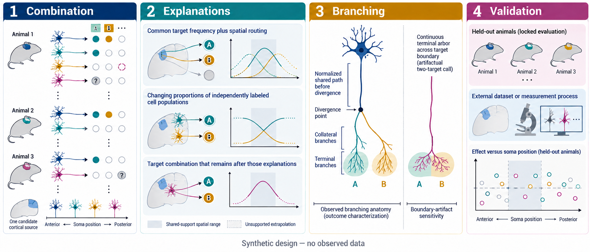

# EP10 — Spatial routing and reproducible target combinations in single-neuron cortical projections

**Status:** scientific design; no EP10 result is reported here.

The [paper plan](outputs/paper_plan.md) translates this design into candidate-
specific claims, decisive alternatives, outcome routes, and a contingent
figure sequence. It does not authorize execution or presume a positive result.

## Scientific question

Within one well-defined cortical source population, which combinations of
projection targets recur across animals and soma locations? How much of each
combination can be explained by target prevalence, spatial routing, or the
mixture of independently identified cell populations? For combinations that
remain, how are the targets reached through the branching structure of complete
single-neuron axons?

MOp is the provisional priority for the first data pass because it can
connect existing morphology and multi-target tracing work. It is not the chosen
source. That choice must be made from animal coverage, soma-position overlap,
independent labels, target observability, and reconstruction quality before
candidate associations are examined. MOs and SSp may later test the boundary of
a result, but they must not be pooled with MOp simply to increase sample size.

The biological replicate is the verified animal. If animal identity cannot be
resolved, the analysis must use the most conservative defensible specimen
grouping and describe any result as cross-group rather than cross-animal.

## Proposed contribution and novelty boundary

Non-random co-projection is already known, and complete-morphology studies
already describe projection and path diversity. EP10 will not claim either as a
new discovery or produce another undifferentiated target-pair atlas.

The proposed contribution links three questions: whether a few named
combinations are stable under measured spatial variation, whether routing or
population composition explains them, and how complete axons implement them.
Novelty must be reassessed for the final source and targets; if prior work has
already answered this linked question, EP10 should change direction or stop.

[Yuan et al. (2024)](https://www.nature.com/articles/s41467-024-52756-x)
used axonal BARseq to show that, in auditory-cortex IT neurons, projection to
another area was associated with laminar termination within a shared cortical
target. EP10 therefore cannot claim that a generic relationship between
co-target identity and within-target laminar distribution is new. Before a
candidate enters locked evaluation, its dossier must state:

- which unresolved explanation it distinguishes beyond that prior association;
- one specific held-out prediction appropriate to the proposed route—an
  anatomical prediction for Route A or a spatial/population prediction for
  Route B; and
- how confirmation or refutation would change interpretation of the named
  pathway.

A laminar association alone is a replication or extension, not the core EP10
contribution.

Clusters derived from the same projection matrix cannot establish an
independent cell type or rule out population mixture.

## A motivating example

Suppose neurons in anterior and posterior parts of one source can reach targets
A, B, and C, and development data suggest that A often occurs with B. Ask in
order whether B is common at the same detected target count, whether position
and independently defined routing geometry predict A+B, and whether labeled
cell populations occupy the two positions in different proportions.

The useful test is where these explanations differ—for example, where routing
predicts less A+B but the combination remains frequent. Freeze the effect
direction, spatial region, and common-support rule in development, then test
final groups that did not select the rule. A location without relevant cells is
extrapolation, not validation.

A deeper question follows once a combination is frozen. Among neurons with
qualifying arborization in A, does the terminal distribution inside A differ
between an A+B group and an A+C group? Development must define whether these
groups require B-positive/C-negative versus C-positive/B-negative cells and
how other targets and `K` are handled. A frozen contrast in unseen final groups can
then test whether the same regional target label conceals different output
organization that an A-averaged projection map would blur. This is a secondary
anatomical endpoint; it does not replace the target-set primary test. Report
the pooled A profile beside the two context-specific profiles and use one
development-frozen measure of how much heterogeneity pooling hides.

The existing grouped split, M2-minus-M1 primary endpoint, search budget,
stopping thresholds, full-search null, and promotion decisions remain
unchanged. The new endpoint uses the same development and final groups rather
than creating a second split.

## Three explanations to distinguish

The explanations are not mutually exclusive. EP10 should estimate where each
one is adequate and where residual organization remains.

| Explanation | Scientific test | Permitted interpretation |
| --- | --- | --- |
| **Target prevalence and spatial routing** | Predict complete target sets from single-target frequencies, soma context, smooth position effects, technical covariates, and routing quantities available for every candidate target set. | Good calibration and a narrow upper bound on residual gains support adequacy of the measured reference at the chosen resolution, not proof that all geometry has been captured. |
| **Known population composition** | Add or stratify by layer, driver, molecular, or other labels obtained independently of the axon target matrix; check overlap and confounding among label, position, and biological group. | Attenuation within independently labeled groups supports a composition explanation. Without suitable labels, population mixture remains unexcluded. |
| **A stable target combination** | Freeze a development-selected combination, effect direction, and applicability region; test its joint probability in unseen final groups after the measured alternatives are included. | Reproduction supports a conditional organizational pattern, not functional coordination, a cell type, or a causal wiring program. |

The predictive implementation uses nested references: M0 represents target
prevalence and source context, M1 adds measured routing, and M2 adds regularized
target associations. All score the same target sets conditional on detected
target count, `K`. Fixed-`K` M0 is not an unconditional independence model.
M2 minus M1 is primary; M1 minus M0 is secondary.

Because fixed-`K` interaction coefficients can be non-unique, claims must use
identified probability contrasts rather than raw coefficients. Position
comparisons should use a common covariate distribution and report uncertainty.
A non-significant interaction does not establish equality; a materially changed
magnitude marks a boundary or heterogeneity.

## First analysis stage

The primary endpoint requires a frozen target vocabulary and a defensible
distinction among arborization, passing axon, verified non-detection, and
unknown. Unknown is never absence. Conditioning on `K` does not explain why
some neurons reach more targets than others.

The run begins by establishing:

- source-by-group and source-by-position support, including zero and excluded
  groups;
- that the same cell or biological group does not cross the development/final
  split or count as an independent replication across releases;
- reproducible target calls from complete trees, including boundary and
  reconstruction-quality examples;
- if the shared-target endpoint may be pursued, a repeatable method for atlas
  alignment and terminal-profile extraction that does not yet select A, B, or C
  or compare their contexts;
- provenance and overlap for any independent labels; and
- a short proceed, revise, or stop decision that names the feasible source,
  target resolution, competing explanations, development and evaluation roles,
  detectable effect and precision, and exact-normalization and null-search cost.

These are the first scientific tasks after launch, not a separate launch gate.
If one coherent source lacks independent biological groups, overlapping
spatial support, or reliable complete-set observation, EP10 must change data,
narrow its claim, or stop before expensive search. Combining incomparable
sources, labels, or measurement types is not a remedy.

The active group allocation, exact scoring, adaptive search, calibration, and
stopping rules remain defined in `SEARCH_POLICY.yaml`; this scientific goal does
not replace them.

## Complete axons as biological evidence

After the target definition and candidate combinations are frozen, EP10 returns
to each complete axon tree. Prespecified summaries should ask where paths to two
targets diverge, how much normalized path they share before divergence, which
collaterals and terminal branches cover each target, and whether an apparent
pair is one continuous terminal tree divided by an atlas boundary.

For an eligible A+B versus A+C comparison, development must also freeze one
target-intrinsic coordinate system and one primary summary of the normalized
terminal-arbor distribution within A. Cortical depth or layer is appropriate
only when biologically meaningful; a three-dimensional subregion or topographic
coordinate may be more informative elsewhere. Total qualifying arbor length in
A is a separate outcome, not a substitute for its normalized distribution.
Terminal-branch density, reconstruction-endpoint density, focality, centroid,
and spread may be supporting summaries, but reconstruction endpoints are not
synapses.

The comparison must use biological-group-level inference on common support: the
group is the animal when verified, or the most conservative specimen otherwise,
with a cross-group rather than cross-animal claim. Use a frozen adjustment or
matching rule for soma position, source layer or independent labels, `K` and
other targets, total morphology, registration, clipping, and reconstruction
quality. Entry route into A must be declared in advance as an alternative
explanation or possible mediator rather than silently matched away.

Every axon has a common root, so a shared ancestor is not a finding. Compare
candidate combinations with pairs matched on distance, overall morphology, and
observability, and show group-level distributions as well as examples.

Predictive geometry and outcome anatomy must remain separate. Routing priors
must be available for every candidate set from an independent atlas or
development data. A test neuron's realized path, branch point, or terminal tree
is an outcome and cannot predict its target presence. Adult morphology can show
implementation, not a developmental decision, energetic cause, or synaptic
mechanism.

Within-A morphology is likewise an outcome. With B/C context labels blinded,
development data may establish technical repeatability and select the most
reliable option from a prespecified set of coordinates or profile summaries.
Within-A morphology cannot choose A, B, or C, and the A+B versus A+C contrast
cannot choose the coordinate, metric, or predicted direction; revise target
calls; enter M0, M1, or M2; or serve as an independent cell label. Only a
contrast frozen in development may be tested in final groups.

## Evidence chain

1. **Phenomenon and observation.** Establish animal and spatial support,
   defensible target calls, and a small set of combinations worth explaining.
2. **Competing explanations.** Compare calibrated predictions from prevalence,
   spatial routing, independently measured population composition, and residual
   association; report combination-level effect sizes and group-level
   uncertainty, not only a global score.
3. **Anatomical implementation.** Quantify branch and terminal organization
   against matched structural references, test A+B versus A+C organization
   within their shared target when activated, and examine sensitivity to target
   boundaries.
4. **Prediction and boundaries.** Test the frozen combination, direction, and
   applicability region in unseen groups. When a genuinely comparable resource
   or measurement exists, test it externally and state whether all parameters
   transfer or only target frequencies are recalibrated.

**Figure note.** This is a study-design illustration, not an observed EP10
result. It links combination selection, competing explanations, full-axon
branching, and validation across groups and conditions. The conditional
A+B/A+C comparison and pooled-versus-context profiles inside A are specified in
the text and are not depicted in this general evidence-chain figure.

Aggregate M2-minus-M1 gain supports this chain but does not validate a named
combination. Each reported combination needs a frozen probability contrast,
group- and position-level uncertainty, a multiplicity procedure, and a stated
domain of common support. Likewise, a held-out subset of one public release is
an internal cross-group test—cross-animal only when animal identities are
verified—not automatically an independent external replication.

## Possible outcomes

| Outcome | What would be needed | Scientific interpretation |
| --- | --- | --- |
| **Combination and anatomical implementation supported** | A named relationship reproduces across final biological groups within its frozen spatial domain, survives measured alternatives, and has robust branch or terminal organization relative to matched references. Cross-animal language is used only when animal identities are verified. Eligibility and activation of the shared-target endpoint are frozen before final evaluation; if activated, its within-A prediction must also reproduce and cannot be dropped after failure. Appropriate external evidence is added when available. | A conditional, observational organization rule is supported for the specified source and measurement regime. |
| **Space or known population composition explains the pattern** | The original pattern first reproduces; the explanatory model is calibrated, residual effects are bounded below a meaningful threshold, and the explanation predicts new final groups. | A measured routing or composition explanation may support an explanatory paper even without useful M2 gain. |
| **Internal predictive gain only** | M2 improves a score within the available release, but named combinations, spatial boundaries, and anatomy remain unsupported; if a comparable external resource exists, transfer also fails. | This is a methods result or preliminary finding, not the intended biological paper. |
| **Unresolved or infeasible** | Groups disagree, uncertainty is wide, the reference remains inadequate, observation is unreliable, or independent grouping and common support cannot be established. | The data do not decide the question. Failure of the design is not evidence that co-projection organization is absent. |

A null test alone cannot support the second outcome. The analysis must be
sensitive to effects of interest and precise enough to exclude a scientifically
meaningful residual association.

## Decisions still open

Before outcome-discriminating development, investigators must settle the final
source, target granularity and laterality, common-support rule, independent-label
strategy, effect scale and meaningful margin, combination-selection and
multiplicity procedures, branch-summary normalization and matched references,
the shared-target coordinate and terminal-profile summary, and the standard for
external comparability. Dataset roles must follow identity, coverage, and
measurement quality rather than favorable associations.

## Claim boundary

The strongest positive claim is that, within a frozen source population,
target vocabulary, observation rule, detected target count, and spatial domain,
a specific reconstructed target combination shows reproducible organization
beyond measured alternatives and is realized through a reproducible axonal
branching pattern. When the shared-target endpoint is activated, the claim may
also state that the terminal profile within a named target changes predictably
with a frozen co-target context.

EP10 cannot establish synaptic connectivity, shared function, a causal or
developmental program, a new cell type, whole-brain generality, or independence
from analyses that reuse the same cells. Any conclusion must state which
alternatives were actually measured and which remain unresolved.

Complete morphology can resolve axonal arbor topography and branch organization.
Unlike the EP12 question, it cannot identify postsynaptic or input partners,
synapse number or strength, or cell-type-specific synaptic connectivity. Target
identity and terminal morphology extracted from the same reconstruction are
complementary evidence, not independent replication.
