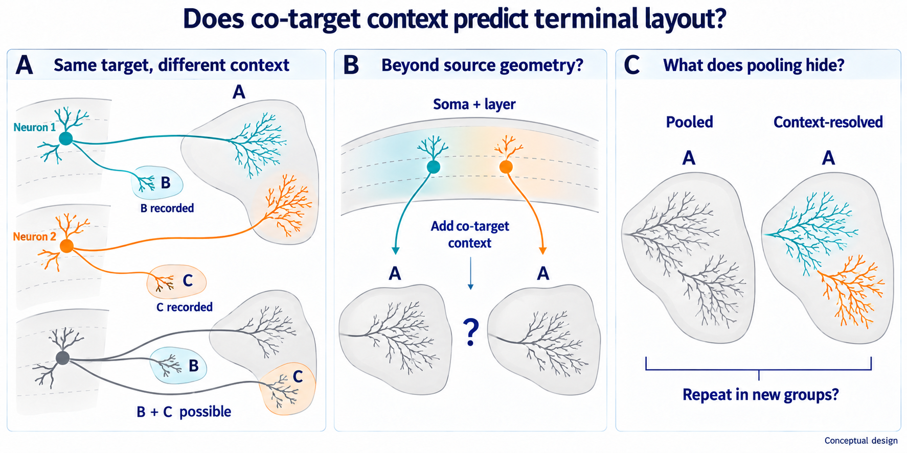

# Does co-target context predict terminal organization inside a shared target?

[Scope and novelty review, 2026-10-02](outputs/scope_novelty_review_20261002.md).

A neuron can reach the same cortical or subcortical region as another neuron
without placing its terminal arbors in the same part of that region. EP10 asks
whether that difference is predictably associated with the neuron's other
**positively observed co-targets**, beyond soma location, source layer, and
flexible continuous geometry.

The intended paper is not another co-projection catalogue. Its central result
would concern one named pathway: when "projects to A" pools together different
terminal implementations, which co-target context distinguishes them, which
measured alternatives explain them, and whether the prediction survives new
biological groups.

This is a schematic of a **planned biological follow-up**, not an EP10 result.
B and C denote recorded-positive contexts; the B+C example illustrates their
possible overlap, not a selected cell class. A/B/C and arbor layouts are
generic illustrations, not chosen targets or measured differences. The pooled
and context-resolved views show the same schematic arbors. Terminal arbors
are not synapses. [Imagegen prompt](outputs/ep10_within_target_implementation-v2-prompt.md).
The [paper plan](outputs/paper_plan.md)
specifies the contingent manuscript, and [DATASETS.md](DATASETS.md) states what
the available observations can support.

## What changes, and what does not

The within-A terminal-profile contrast is now the **scientific primary for the
next biological study**. It is no longer an optional panel attached to a
target-combination paper. The co-target contrast and a branch-level explanation
must be specified before its held-out evaluation.

This is a prospective biological design. Existing execution contracts and
recorded attempts remain separate. [SEARCH_POLICY.yaml](SEARCH_POLICY.yaml),
[DATASETS.md](DATASETS.md) and the [execution ledger](outputs/experiment_log.md)
govern already initiated work; this narrative changes no operative model,
observation rule, threshold, budget, stopping decision or data-access permission.
The terminal-profile study requires its own prospective freeze before execution.

The new biological endpoint is **planned, not activated or executed**. Its
profile estimator, anatomical contrast, useful margin, uncertainty,
multiplicity, observation sensitivities, and evaluation-access contract still
need a separate prospective freeze. This document neither opens final groups
nor converts exposed development data into confirmation.

## The prior-work boundary

Motor-cortex spatial organization is a reference to explain, not the discovery
to claim. [Falasconi et al. (Cell, 2026)](https://pubmed.ncbi.nlm.nih.gov/42777707/)
report 16 projection-defined motor-cortex modules, two spatial axes, and
aligned wiring and cell-type composition. EP10 must therefore compare its
within-target result against source-space organization, rather than call the
rediscovery of source modules or spatial routing novel.

[Gao et al. (Neuron, 2026; online 2025)](https://pubmed.ncbi.nlm.nih.gov/41253150/)
already report projection-defined subtypes and diverse single-neuron terminal
arborization in the resource used by the active EP10 analysis.
[Liu et al. (2024)](https://www.nature.com/articles/s41467-024-54745-6)
likewise establish multiscale morphological diversity and stereotypy.
[Han et al. (2018)](https://www.nature.com/articles/nature26159) establish
non-random target combinations. None of these broad phenomena is an EP10
novelty claim.

[Yuan et al. (2024)](https://www.nature.com/articles/s41467-024-52756-x)
already associate co-target status with laminar distribution in a shared
auditory-cortex target. Thus even the central association is not generically
new. The possible contribution is **candidate-specific**: a prespecified
within-target prediction that survives flexible source geometry and eligible
independent labels, with a full-tree account of its implementation and a
quantified consequence of pooling. A new source area, prettier trees, or
additional clustering is not sufficient.

The exact source, A, and co-target contexts remain unchosen for this follow-up.
Their dossier must identify the unresolved pathway interpretation, its closest
published answer, and the different conclusion implied by confirmation or
refutation. Prior sample reuse is not independent replication; source-paper
analyses of the same trees are particularly important competitors.

## The contrast: positive contexts, not exclusive classes

Let A denote a shared target with qualifying recorded terminal arborization.
Define a B-context by **A and B recorded**, and a C-context by **A and C
recorded**. Neither definition requires the other target to be absent.

A neuron with A, B, and C recorded belongs to both context summaries. Keep its
identity and the covariance between summaries; do not duplicate it as two
independent observations or silently remove it. Report the overlap and
effective support by biological group. No mapped observation in B or C is
unknown, never a B-negative/C-negative biological label.

For neuron i, let q_iA(b) be its qualifying terminal-arbor length in frozen
within-A bin b, divided by its total qualifying length in A. It describes
**where the recorded arbor lies**, not how much A arbor the neuron has.
Total qualifying A length is a separate quantity.

Before outcome-discriminating anatomy, freeze one biologically interpretable
within-target coordinate, one profile resolution, and one signed profile
summary theta_iA (for example an anatomical first moment on a justified
coordinate). Freeze its direction and meaningful margin before evaluation.
A generic three-dimensional coordinate is used only where it has a defensible
anatomical interpretation; a cortical depth contrast is not imposed on every
target.

The proposed primary is the difference in group-first mean theta_iA between
the B-positive and C-positive contexts, standardized to the **same measured
covariate distribution on common support**. Use paired biological-group
effects and retain within-neuron overlap. It is an association between recorded
contexts and recorded A profiles, not a causal effect of acquiring B or C.

Soma position, source layer, available axon-independent labels, registration,
clipping, mapping quality, and reconstruction quality define the measured
reference. Control recorded-positive count K_i_obs as an observation quantity,
not biological target number. Other co-targets cannot be recoded as verified
negatives. Predeclare how their positive overlap enters adjustment and how
sparse overlap limits the estimand.

## The decisive comparison

The strongest rival is a continuous source-space explanation: context B and
context C sample different soma positions, layers, known populations, or
observation-quality regimes, so their A profiles differ without additional
contextual organization.

| Reference | Biological question |
| --- | --- |
| Flexible soma/layer/independent-label and continuous-geometry predictor of q_iA | Is the measured source-space and observation reference sufficient? |
| The same predictor with recorded-positive co-target context added | Does context add a reproducible within-A prediction on common support? |
| Frozen full-tree path and collateral characterization | Which branch arrangement realizes the conditional profile shift, or explains it away? |

The primary evidence is the frozen anatomical contrast, not an aggregate
target-pattern score. Held-out improvement of profile prediction is supporting
evidence against an inadequate reference; it does not substitute for a
meaningful, reproducible pathway contrast. Model capacity, calibration, and
source-space extrapolation must be addressed before attributing improvement
to context. Projection-derived clusters cannot serve as independent labels.

Compare the pooled group-first mean of neuron-normalized A profiles with the
context profiles. A raw amount-weighted projection map is a different
estimator and must be shown separately. Freeze one pooling-discrepancy summary,
its null, useful margin, and group-level uncertainty; visible separation alone
does not quantify what an average hides.

## What full trees add

For the chosen contrast, characterize entry route into A, branch divergence,
collateral organization, and terminal-tree layout under a frozen matched
reference. A shared ancestor is universal and is not a finding.

Entry route is a prespecified alternative explanation or possible mediator,
not automatically matched away. Analyze the source-adjusted total association
first, then the declared entry-route comparison; neither is causal mediation.
Report whether separate terminal trees or a continuous tree crossing an atlas
boundary creates the profile shift. Check amount, registration, clipping, and
boundary sensitivities, and show all-group distributions beside fixed-rule
examples.

Realized paths and terminal profiles are outcomes. They cannot enter M0/M1/M2
as predictive geometry, choose the original target panel, or redefine the
separately frozen observation rule. Profile coordinates may be selected for technical
repeatability only with context labels blinded; observed B/C separation cannot
choose the metric, direction, or candidate.

## Execution boundary

Existing execution history belongs in the [execution ledger](outputs/experiment_log.md).
This planned anatomical study neither relabels an already-initiated primary
endpoint nor activates terminal-profile fitting or held-out evaluation.

## Outcome routes and claim limits

| Observation in a future frozen study | Interpretation |
| --- | --- |
| The within-A context contrast reproduces, adds profile prediction beyond the measured continuous reference, and has robust branch-level implementation | A named recorded-positive context identifies reproducible terminal organization in A; candidate-specific novelty still needs to exceed the source papers. |
| Source geometry or eligible independent labels explain a reproduced contrast, with a precise useful residual bound | A narrower explanation or extension of known spatial organization, not automatically a new biological paper. |
| Contrast exists only in development, disappears with quality/boundary controls, or depends on one group | No supported implementation claim. |
| Common support, profile reliability, positive-context overlap, or precision is inadequate | The question is unresolved; do not redefine targets after final access. |

Biological groups are verified animals only when that identity is established;
otherwise use conservative specimen groups and cross-group wording. More cells
do not replace group replication. A held-out public-release subset is internal
validation, not external replication.

Morphology resolves axonal topography and branching, not postsynaptic/input
partners, synapse number or strength, function, developmental decisions, a new
cell type, or causal wiring. Target calls and terminal anatomy from the same
reconstruction are complementary observations, never independent replication.
This distinguishes EP10 from a synaptic circuit question and from a
groups-versus-continuum organization question.
