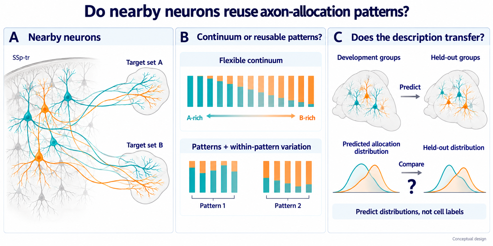

# EP11 paper plan — Do nearby somatosensory neurons use reusable output patterns?

[Scope and novelty review, 2026-10-02](scope_novelty_review_20261002.md).

Writing revision: 2026-09-30. This is a prospective anatomical inference plan,
not a biological result, cohort activation or authorization to open outcomes.
Existing execution contracts govern active work; this narrative changes no
operative endpoint, role assignment or decision rule. Actual feasibility and
optimizer history stay in [experiment_log.md](experiment_log.md).

*Conceptual illustration only. A/B, colors, strips and distributions do not
encode observed targets or results. Allocation is regional axon centerline
length, including passing grey-matter axon, not terminal mass or synapses.
The group icons are not evidence of independently verified animals.*

## The paper in one paragraph

Projection diversity and soma–axon topography are established. The useful
question is what a projection-group description adds once continuous anatomy
and continuous nearby-cell variation have been given a fair account. In one
source population, trunk somatosensory cortex (`SSp-tr`), EP11 would compare
the downstream regional allocation distributions of neurons on shared
position/depth support. A positive result would identify one concrete,
development-defined allocation rule that recurs in held-out replicate units
and improves prediction beyond a qualified continuum. A sufficiently precise
continuous result would bound the added value of the tested group description.
Neither result would discover molecular or functional cell types.

## What the proposed data must support

The proposed Gao study uses brain/sample units only as inventory identifiers
until independent-animal identity is established. Its intended regional outcome
and role layout require their own prospective execution contract; a paper plan
does not activate them. Geometry support alone cannot establish reconstruction
eligibility, group recovery or sufficient precision.

A paper-level result requires both production recovery and adequate uncertainty
at the biological-replicate level. More simulated draws can improve a numerical
check but cannot increase the real number of independent replicates. More cells
cannot silently substitute for more animals or justified replicate units.

## What has already been published

[Winnubst et al. (2019)](https://pmc.ncbi.nlm.nih.gov/articles/PMC6754285/)
described projection subtypes and long-range organization from complete
axonal reconstructions. [Peng et al. (2021)](https://doi.org/10.1038/s41586-021-03941-1)
established extensive within-type projection diversity and topographic
organization. Neither diversity nor a separated embedding is new.

[Timonidis et al. (2023)](https://pmc.ncbi.nlm.nih.gov/articles/PMC10722239/)
examined motifs along a morphological continuum in somatosensory thalamus.
It is an important nearby precedent, not a direct `SSp-tr` result. EP11
cannot claim that considering motifs and gradients together is unprecedented.

[Gao et al. (2026; online 2025)](https://www.sciencedirect.com/science/article/pii/S0896627325008001)
reported 346 projection-defined subtypes in the release that supplies the
primary cohort, alongside modular organization and topographic relationships.
Their classifications are a prior description, not independent validation
labels: provider `class/class1/class2` and projection summaries remain
excluded. The advance must be the conditional usefulness and direct held-out
reuse of a named allocation rule, not another atlas classification.

For the A1876 sensitivity, [Yufeng Liu et al. (2024)](https://doi.org/10.1038/s41467-024-54745-6)
already studied multiscale morphology, spatial clustering, and projection
motifs in the exact release. [Lijuan Liu et al. (2025)](https://doi.org/10.1038/s41592-025-02621-6)
used potential-connectivity barcodes and spatially tuned clustering;
[Xiong et al. (2025)](https://doi.org/10.1038/s41592-025-02784-2)
built probabilistic arbor/bouton connectomes from a near-identical resource.
Those estimands differ from regional axon-length allocation. Shared cells or
brains are reanalysis, never independent replication.

This review motivates a possible contribution; it does not certify that no
prior study has performed a comparable held-out adjudication.

## A concrete biological object, not a clustering score

The proposed Gao outcome is a 56-coordinate composition: relative axon
centerline length in 28 fixed named Allen targets, crossed with laterality.
Passing grey-matter axon contributes. Normalization discards total
named-target length. This is not synapse count, terminal-arbor mass,
physiological output, or exclusive target presence. Unknown/truncated
coordinates remain distinct from verified zeros under the common observation
rule.

For the principal anatomical claim, development selects a named allocation
contrast within that fixed vocabulary. An interpretable example is the
difference between summed proportions in two disjoint named target sets,
`r(y) = sum(y_A) - sum(y_B)`. This is an example of a permitted reporting
scale, not a selected endpoint. The report freezes the actual source, target
sets, laterality, direction, spatial domain, meaningful effect, and
multiplicity rule before audit. All additional claims stay within existing
multiplicity controls; no attractive audit panel chooses the story.

A recurring distribution of this contrast can be biologically interpretable
without being an intrinsically discrete type. Its conditional distribution,
uncertainty, and common spatial support matter more than colored clusters.

## Three explanations on exactly the same cells

| Explanation | What it would mean |
| --- | --- |
| Position-driven allocation | Expected allocation changes smoothly with tangential position and depth; neighborhood differences follow sampling and anatomy. |
| Continuous nearby-cell variation | A connected latent trajectory explains variation left after measured anatomy, even if uneven sampling makes it look multimodal. |
| Reusable patterns, possibly with internal gradients | Fixed allocation signatures add calibrated predictive information beyond both continuous accounts and recur on overlapping support. |

The existing matched comparisons implement these questions:
`P_ref - B_pair_for_P_ref` describes position/depth organization;
`C_ref - P_pair_for_C_ref` describes residual continuous variation;
`H_ref - C_ref` is the operational primary;
`H_ref - D_pair_for_H_ref` describes continuity within supported patterns.

C and H have equal admissible continuous-backbone capacity and each optimizes
its own likelihood. Their family references are independently selected by
absolute development score under equal budgets. No weak continuum is selected
to make H look favorable.

New-neuron scoring integrates latent groups and coordinates. Post-score
membership may show recurrence or separation; it is not a predictor learned
from an independently observed property. The study therefore predicts an
allocation distribution, not an individual neuron's group before seeing its
axon.

## The decisive transfer

Development learns the descriptions and freezes the principal allocation
rule. The audit applies them without re-clustering, matching labels, fitting
new unit effects from held-out outcomes, changing prevalence, or retuning
targets. Scores average cells within the verified replicate and then weight
replicates equally.

A paper figure must show the actual named allocation by replicate and
position, predictions from the competing descriptions, uncertainty, and where
common support ends. A pooled-neuron likelihood improvement or a visually
clean embedding alone is insufficient. Layer/Cre-line sampling, acquisition,
reconstruction, and disjoint territories cannot masquerade as a local
allocation division.

This transfer is cross-animal only after animal identity is independently
certified. An explicitly adopted cross-brain/sample estimand would carry
narrower wording throughout; this revision does not activate that alternative.

## Power determines whether either answer is interpretable

First distinguish failed estimation from inadequate data. The registered
synthetic suite must show recovery at meaningful effects under the actual
layout; oracle labels and optimizer self-tests are not substitutes. Separately,
replicate-level intervals must distinguish meaningful added group value under
the fixed common-support design.

If production recovery succeeds but precision still fails, stop promising
an adjudication of groups versus a continuum. A narrower named-target
estimand, a revised role design, or additional independent animals would be
a prospective redesign, with a declared effect and new precision basis
before outcome access. None is activated here, and none rescues the current
primary after an unfavorable result. Do not enlarge neighborhoods or lower
recurrence requirements simply to obtain a conclusion.

## What would constitute a result?

| Outcome | Permitted anatomical conclusion |
| --- | --- |
| Meaningful H-over-C gain plus fixed-pattern recurrence and a reproduced named rule | Reusable allocation patterns add information beyond the tested qualified continuum in this source and support domain. |
| Calibrated continuum, sensitivity to meaningful groups, and a tight upper bound on added group value | The tested group description adds less than the meaningful margin at this resolution. |
| Wide interval, weak support, failed adequacy, or unrecovered fixtures | The explanations remain unresolved; neither groups nor continuity is established. |
| Insufficient verified replicates or observation support | This resource cannot execute this design; no negative biological conclusion follows. |

A supported pattern may retain internal gradients. No route proves intrinsic
discreteness, functional channels, molecular identity, synaptic specificity,
or whole-cortex generality.

## Minimal empirical figure sequence

1. **Source and common support:** replicate-by-position/depth coverage,
   layer/line sampling, reconstruction eligibility, and exclusions.
2. **Named downstream allocation:** the principal rule over position with
   continuous predictions, distributions, and uncertainty.
3. **Fixed-rule held-out reuse:** the same rule in every audit replicate,
   H-versus-C gain, fixed signatures where supported, and influence.
4. **Interpretation boundaries:** internal gradients, difficult continua,
   technical decoding, and separate observation sensitivities.

These are planned empirical panels, not generated results. The image at the
top is only a conceptual schematic, with its generation prompt in
[ep11_conceptual_question-v2-prompt.md](ep11_conceptual_question-v2-prompt.md).

## Relationship to the other projection episodes

EP09 tests correct dendrite–projectome pairing within independently defined
classes. EP10's new scientific follow-up tests terminal implementation inside
a shared target across positively observed co-target contexts. EP11 tests
the usefulness of a regional allocation-pattern description beyond a flexible
continuum. They are different questions, not three confirmations of one
discovery. A1876 sensitivity shares data with EP09/10; Gao is a separate
primary release, not a blanket guarantee of independent animals or pipelines.

## Present handoff

This is a prospective paper-design handoff. Existing execution contracts,
scientist authority and recorded attempts remain separate; see the
[execution ledger](experiment_log.md) for current stage and next action.
This writing task submits no jobs, changes no compute budget and grants no
new outcome access.
