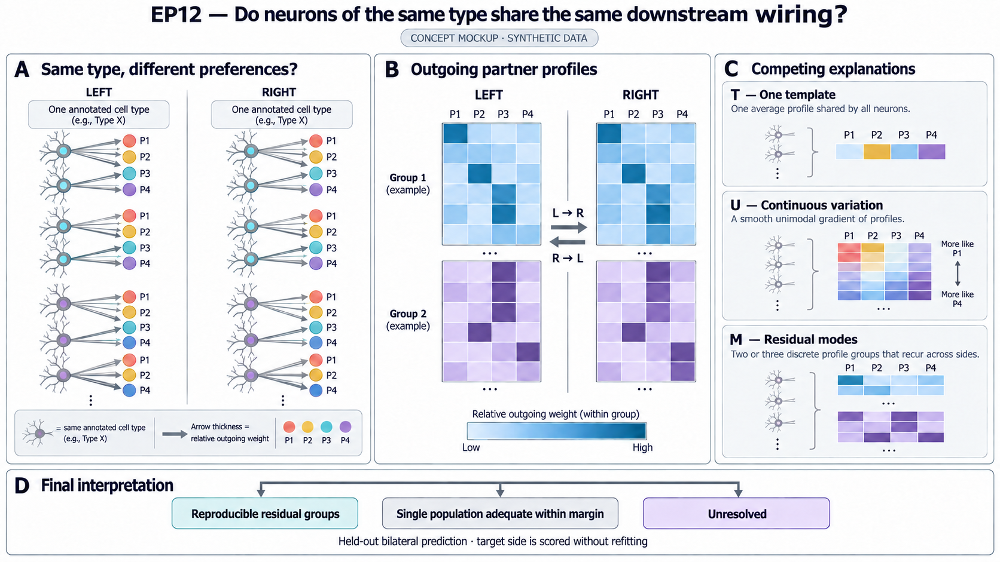

# Do neurons of the same type share the same downstream wiring?

Neurons assigned to the same cell type are often summarized by one wiring
profile. That summary may hide meaningful differences. Some cells could
prefer one set of downstream partners, while others of the same type prefer
another.

EP12 asks whether those differences form reproducible groups. If neurons on
the left prefer one set of downstream partners, can the same preference be
recovered on the right? Or is the apparent grouping better explained by
continuous variation, anatomy, connection strength, or reconstruction
quality?

We start with outgoing partner-type profiles in the pinned MaleCNS v1.0
release. This first test measures bilateral reproducibility in one male fly.
It is the entry point to a larger circuit question:

> When does averaging neurons of the same type hide distinct input-output
> pathways?

The intended paper should identify a specific wiring organization, explain
what a type average misses, and test that explanation beyond the data used
to discover it. Finding another cluster or improving a predictive score is
an intermediate result. Neither establishes a new cell type or its function.

The [paper plan](outputs/paper_plan.md) sets out the circuit follow-up,
closest prior work, decisive comparisons, and evidence needed for each claim.
The T/U/M test below remains the primary outgoing round. The follow-up is a
separate proposed round; its results cannot change this round's conclusion.

## At a glance

| Question | EP12 design |
| --- | --- |
| What varies? | The distribution of a neuron's outgoing connections across downstream partner types. |
| What is compared? | One average profile (T), one flexible continuous population (U), and two or three residual groups (M). |
| What must repeat? | A preference learned on one body side must predict neurons of the same type on the other side. Both directions are required. |
| What is held out? | Twenty percent of whole annotated types are reserved for one final evaluation. |
| What is the main score? | The held-out predictive gain of M over the better fair T/U reference. |
| What can the first round conclude? | Reproducible groups, an adequate single-population description within a fixed margin, or an unresolved result. |
| What would make a deeper discovery? | A specified input-output organization that the type average misses, with evidence beyond the discovery data. |
| What is the next test? | After the outgoing result is fixed, ask whether outgoing preferences predict previously unused incoming profiles, and whether the association transfers to a separately locked external source. |

## From a wiring difference to a circuit finding

Consider a hypothetical type X. Some X neurons mainly receive from A and
project to B; others receive from C and project to D. A graph that merges all
X neurons can suggest A-to-D and C-to-B paths through X even when those
cell-level chains are weak or absent. This is an illustration, not an EP12
result. Real data must establish the size and reproducibility of the
association, including missing connections and anatomical organization.

The follow-up asks whether such input-output associations exist in a small,
explicitly selected circuit, and whether retaining a reproducible group or
continuous coordinate improves their prediction. Anatomy, continuous
variation, and discrete groups are competing explanations. A continuous or
spatial organization can be biologically informative without supporting
residual modes in the primary test.

Known within-type heterogeneity and cross-brain connectivity subgroups are
starting points in the literature, not sufficient novelty claims. Each
candidate needs a comparison with existing annotations and circuit papers.
The paper must show what is newly learned about that circuit, or establish
a useful, well-tested boundary on when averaging is adequate.

The follow-up has its own endpoint, source manifest, calibration, budget,
selection rule, and held-out evaluation. Reusing the same male or the other
body side provides a diagnostic, not new independent confirmation. A local
case cannot replace a failed type-aggregate outgoing test.

## Three competing explanations

Every analysis compares the same three model families on the same profiles and
evaluation units.

| Model | Scientific explanation |
| --- | --- |
| **T: one type template** | One average downstream partner profile describes the type well enough at the tested resolution. |
| **U: a flexible single population** | Cells vary continuously around that profile, without distinct groups. |
| **M: two or three residual modes** | Cells form distinct partner-preference groups that reproduce across sides after the planned adjustments. |

U is essential. A mixture can imitate continuous variation, so M cannot win
merely by being more flexible. It must predict better than both T and U, and
its groups must be reproducible and interpretable.

## How the test works

1. **Assign whole types.** Before connection values are opened, use
   annotation-only fields to assign 80% of eligible types to development and
   20% to final evaluation.
2. **Compare T, U, and M fairly.** Every trial fits all three explanations
   under the same data roles and comparable capacity.
3. **Choose one complete procedure.** Use a rule fixed in advance and based
   only on development data. M does not have to win during development for a
   scientifically valid comparison to continue.
4. **Transfer across sides.** For each final type, fit the chosen procedure on
   one side and score the other without fitting on the target side; then
   reverse the direction. Both transfers occur in one final evaluation.
5. **Report the answer.** Apply thresholds and uncertainty rules fixed before
   the development analysis that could favor one explanation over another.

A valid comparison is not the same as evidence for M. A well-qualified test
must be allowed to reach final evaluation even when T or U looks better during
development.

## First-round figure concept

The main figure should place left- and right-side outgoing profiles for the
same annotated type beside the predictions of T, U, and M. Illustrative types
are chosen by a development-only rule fixed in advance; the quantitative
summary reports every assigned final type.

The mockup below uses synthetic values only. It is a design aid, not an
observed EP12 result.

This planned panel tests the outgoing phenomenon. The paper plan adds named
partners and cell-level anatomy, competing input-output explanations, and
external evaluation. All figure claims remain hypotheses until supported by
observed results.

## The three scientific answers

| Detailed outcome | Evidence required | Permitted interpretation |
| --- | --- | --- |
| **Reproducible residual groups** | A valid final evaluation; M exceeds the meaningful margin in both directions; the groups recur across sides; their partner preferences are identifiable; all required controls pass. | Eligible annotated types in this male contain bilaterally reproducible residual wiring groups. |
| **Single population adequate within margin** | A calibrated T/U reference; both directional upper bounds for M's advantage fall below the meaningful margin; synthetic tests show adequate sensitivity. | Within this analysis, precision, and model family, a single-population description is adequate. |
| **Unresolved** | A valid final evaluation is completed, but intervals are wide, directions disagree, structure is ambiguous, or the evidence supports only a narrower claim. | These data do not decide the prespecified broad question. |

A nonsignificant difference is not evidence that one population is adequate.
An adequacy conclusion requires enough precision to rule out the meaningful
advantage set in advance.

The T-versus-U comparison remains a prespecified explanatory readout. If U
beats T but M adds no meaningful advantage, EP12 may report that one average
profile misses continuous heterogeneity. This cannot replace the primary
M-versus-better-T/U test after results are seen, and it is not a discovery of
new cell types.

### When the test does not reach an answer

| Status | What happened | What may be said |
| --- | --- | --- |
| **No valid comparison** | Development is completed, but no fair and usable T/U/M comparison can continue; final types remain unopened. | A development-stage limitation prevented the primary held-out test. |
| **Incomplete search** | The run stops before the required search is complete. | Search is incomplete; no completed-search conclusion is allowed. |
| **Technical failure** | An unrecoverable execution error, damaged or mismatched input, role leakage, or final-evaluation failure invalidates the analysis. | No scientific interpretation is allowed. |

## What makes a comparison valid

A complete comparison must:

- use the assigned development and final roles without leakage;
- evaluate T, U, and M under fair capacity and calibration rules;
- preserve unknown, untyped, fragment, and missing partner mass;
- pass synthetic tests for average, continuous, grouped, weak-signal, and
  side-artifact scenarios;
- reproduce when rerun under the same settings; and
- record complete outputs, failures, resource use, and the reason for every
  inclusion or exclusion.

Poor real-data performance by M, weak separation, or continuous-looking
variation is a scientific result, not a broken comparison. Numerical failure,
target-side fitting, unfair model capacity, or uncontrolled missing output
makes the comparison invalid.

For each type and transfer direction, the score is held-out log predictive
density per eligible incident synapse. Neurons are weighted equally within a
type and direction; types and directions are then weighted equally. Synapses
and edges are not treated as independent biological replicates.

## Data roles and scope

The split is by whole provider type. Neurons, edges, synapses, and body sides
cannot receive roles independently of their focal type. Every assigned final
type stays in the accounting. A rule fixed in advance may mark a type
unscorable, but the type cannot be silently removed or replaced after final
values are opened.

Provider group and instance labels cannot be used to define, initialize, fit,
or select the candidate groups. They may be inspected only later to ask
whether a result merely rediscovers an existing annotation.

Outgoing composition is primary. Incoming composition is a later, separately
fixed scope analysis. It cannot rescue the outgoing result and is not
independent evidence because the same graph edges contribute to both views.

Previously inspected annotation inventories remain exposed feasibility
evidence. Revising the study cannot make previously seen information
unobserved. The live exposure and execution state must therefore be checked
before a run begins.

## Controls

The analysis must test whether any apparent groups are explained by:

- connection strength or missing endpoint mass;
- reconstruction status and other technical quality measures;
- anatomical position, neuromere, serial organization, or optic structure;
- a few influential types, partner families, or high-strength neurons;
- arbitrary partner vocabularies, pooling choices, ranks, or nuisance terms;
- shuffled partner identities or side labels; and
- continuous variation that a mixture happens to approximate.

The post-result comparison with provider group, instance, or published
assignments is a novelty check only. A match is a rediscovery, not a new type.

Report the anatomical contribution as well as the adjusted residual result.
An effect explained by location cannot support residual modes, but may
motivate a separately tested hypothesis about spatial wiring organization.
Do not remove an anatomical adjustment after seeing which conclusion wins.

## First-round search and null calibration

| Item | Limit |
| --- | ---: |
| Valid trials | 36 minimum; 96 maximum |
| Patience | 16 valid trials without improvement, active only after trial 36 |
| Total compute | 1,000 CPU-core-hours |
| Per trial | 32 CPU cores; 192 GiB RAM; 12 wall-hours |
| Overall wall clock | 120 hours |
| GPU | 0 |

If at least one complete comparison is ready for null calibration, the
development data choose a fair T or U generator using a separate rule fixed in
advance. The study then runs exactly 99 synthetic-null searches. Each starts
from the beginning and repeats the same T/U/M search and selection logic, but
does not launch another layer of null searches.

Each fitted-T/U null keeps the development sample sizes, connection strengths,
missingness, and side structure. The observed and null searches use the same
development statistic: M minus the better fair T/U reference after the fixed
selection rule has been applied. Because this revision changes that selection
program, an older null calibration cannot be reused.

The full program therefore has a minimum declared scale of 36 trials × 3
models × 100 observed-or-null searches = 10,800 model-family fits before types
and directions are counted. This is a protocol count, not measured runtime.
A cost study must show that the planned work fits the compute limit before
real connection outcomes are opened.

The null probability is used when deciding whether the final result supports
M. Completing the null program correctly is required for a valid comparison;
failing its scientific threshold does not by itself make the comparison
invalid or prevent an informative T/U result.

## Decisions that still need to be made

Before development that could distinguish the explanations begins, a
scientist must set:

- the numerical meaningful margin, its unit, and the simultaneous uncertainty
  method;
- the sensitivity rule for allowing an adequacy conclusion;
- the development-only rule for choosing the final comparison;
- the separate development-only rule for choosing the null generator; and
- the development-only rule for choosing illustrative types in the main
  figure.

These values are deliberately not invented here. Until they are set, EP12 is
a revised design, not a ready or completed analysis.

Any small real-data diagnostic must use assigned development types only.
Before their connection values are opened, its selection rule, allowed
outputs, and exposure record must be fixed.

If a smaller fixed comparison is chosen instead of the adaptive study, it must
be described as a different study design. Its success cannot be counted as
completion of this search.

## Execution evidence still required

The current EP12 directory describes the study but does not contain a working
episode-specific executor. Before anyone claims that EP12 can run through to a
result, synthetic tests must demonstrate:

- positive, adequate, and unresolved outcomes;
- distinct handling of no-valid-comparison, budget exhaustion, and input
  failure;
- recovery after interruption without losing or double-counting a trial; and
- one final opening even if an acknowledgement is lost and the run resumes.

Documentation or a passing structural check is not evidence that the study
ran. A real result requires durable trial records, the selected procedure,
the final-evaluation record, the detailed outcome, the reason, and links to
the supporting outputs.

## First-round claim boundary

The strongest positive wording is **bilaterally reproducible residual outgoing
wiring groups within eligible curated types in this MaleCNS male**. EP12 does
not establish new cell types, cross-animal or cross-sex generalization,
molecular identity, causality, function, or behavior.

The proposed paper-level claim concerns the accuracy of a structural
input-output description. It requires the additional evidence in the paper
plan. Static synapse counts alone do not establish signal transmission,
selective gating, or a behavioral computation. A successful primary round
does not automatically mean the paper-level claim has been earned.

This local revision does not authorize data access, computation, or formal
acceptance. No real EP12 analysis or final evaluation was run while preparing
it.
