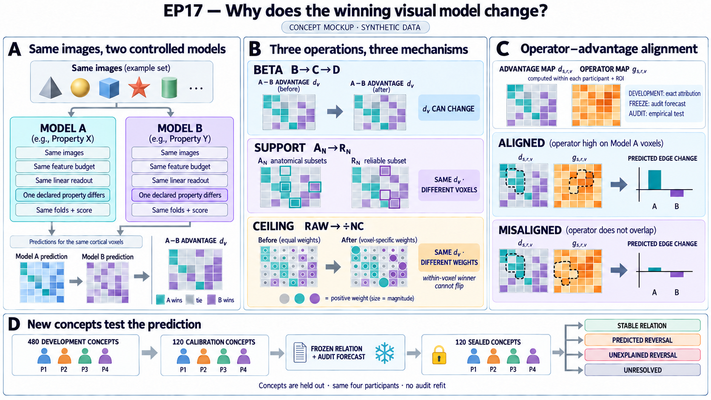

# When does an fMRI measurement choice change which visual model wins?

Suppose model A predicts visual-cortex responses better than model B for the
same images and people. If B wins after denoising the beta estimates, selecting
more reliable voxels, or dividing by a noise ceiling, what changed?

Those operations are scientifically different:

- beta construction can change the response estimated at each voxel;
- voxel selection keeps a voxel's score but changes which voxels enter the
  regional average; and
- positive noise-ceiling normalization keeps the voxels and predictions fixed
  and only changes their weights. It cannot reverse A versus B within one
  voxel, although it can reverse the regional average.

EP17 asks whether a model relation is stable across those operations and,
when it changes, whether the change can be predicted from where each model's
voxelwise advantage lies. The intended paper is not a catalogue of fragile
rankings. It should explain which measurable property of the response makes a
particular model benefit from a particular measurement choice.

The [paper plan](outputs/paper_plan.md) describes the explanatory prediction,
the novelty threshold, and the evidence required for each planned figure. No
model-ranking result is claimed here.

## At a glance

| Question | EP17 design |
| --- | --- |
| What is compared? | Controlled pairs of visual models that differ in one declared property: architecture, objective, or training data. |
| What stays the same? | The four CNeuroMod participants, exact images, concept folds, linear readout family, and pairwise scoring rule. |
| What changes one at a time? | Beta construction, voxel support, or noise-ceiling weighting. |
| What is the primary score? | Held-out voxelwise explained variance, aggregated with equal participant weight. |
| What is the explanatory prediction? | A measurement operation should favor the model whose voxelwise advantage aligns with the operation's independently defined reliability, inclusion, or weighting map. |
| What is held out? | Concepts, not random images: 480 development, 120 support/calibration, and 120 sealed audit concepts. |
| What does the audit establish? | Whether one frozen relation and its explanation repeat on new concepts in the same four people, without refitting the readout. |
| What can the study conclude? | Stable relation, predicted measurement reversal, unexplained reversal, scientific conditionality, or an unresolved comparison. |

## Why a robustness grid is not enough

Model rankings are known to depend on analysis choices. Showing another set of
rank flips would therefore be descriptive rather than explanatory. EP17 must
add two things:

1. isolate one measurement operation while holding the model pair, images,
   predictions, voxels, or weights fixed as required; and
2. predict the direction of the ranking change from an independently defined
   property of the measured response.

The source data paper and GLMsingle processing family establish the dataset
and the B/C/D response stages. Before a paper claim, a focused novelty review
must compare the selected model pair and operator–advantage prediction with
prior work on fMRI encoding-model reliability, voxel selection, noise-ceiling
normalization, and analysis-dependent model rankings. “We tested more
contracts” is not a sufficient contribution.

## Competing explanations

| Explanation | Prediction |
| --- | --- |
| **Stable model relation** | The same model clears the practical margin under every eligible measurement contract, and its advantage is not confined to one reliability or spatial stratum. |
| **Recoverable-signal effect** | A beta-stage change is largest in voxels whose repeat reliability improves at that stage; a development-fitted reliability-gain prediction repeats on sealed concepts. |
| **Support reweighting** | Reliable-voxel selection changes the regional relation by selecting voxels where one model already has a larger fixed-prediction advantage. Development gives an exact membership decomposition; its frozen value becomes a forecast for audit concepts. |
| **Ceiling reweighting** | Raw and normalized scores differ because inverse-ceiling weights align with one model's voxelwise advantage. Development gives an exact weight decomposition; agreement on audit concepts is a separate empirical test. |
| **Scientific specialization** | A relation differs reproducibly by a preregistered visual ROI or external semantic stratum, not merely by a measurement operation. |
| **Readout dependence** | Linear encoding and a fixed-dimensional representational comparison favor opposite models under the same response and support. |
| **Unexplained measurement sensitivity** | A genuine reversal survives isolation controls, but the frozen operator–advantage prediction has the wrong sign or magnitude. |
| **Underidentification or nonreplication** | Bounds are too wide, the comparison is not isolated, or the development relation does not survive on sealed concepts. |

A point-estimate sign change is not a reversal. Nonsignificance is not
equivalence, and wide intervals are not evidence that two models are tied.

## Data roles and scope

EP17 uses CNeuroMod-THINGS 1.0.1 and the same four intensively sampled
participants throughout. Whole concepts receive one role across every image,
repetition, participant, and beta stage:

| Role | Concepts | Use |
| --- | ---: | --- |
| Development | 480 | Fit and compare controlled model pairs; choose one final relation and explanation |
| Support/calibration | 120 | Define repeat reliability, reliable-voxel support, and B/C/D noise ceilings; never fit or score a candidate model |
| Sealed audit | 120 | Apply the frozen development predictor once, with no readout refit |

The audit uses new concepts but the same four participants. It is not a new-
participant, cross-dataset, or population replication. Participants and
concept blocks are the uncertainty dimensions; voxels and images are not
independent biological replicates.

The exact four-person image intersection and 720 eligible concepts must be
reconstructed from events before neural values are opened. Candidate model
features cannot define or repair the split.

## Controlled model pairs

Freeze three required promotion-eligible model pairs and at most one optional
pair before candidate-discriminating neural scores are opened. Each pair must
isolate one declared contrast:

- training objective at fixed architecture and image corpus;
- architecture at fixed objective and image corpus; or
- training corpus at fixed architecture and objective.

A trained-versus-deterministically-initialized-random pair is a mandatory
falsifier and cannot become the paper's winner. Every checkpoint must have a
named version, license, parameter count, training lineage, image
preprocessing, eligible layers, and THINGS exposure status. Known exact or
near-duplicate exposure makes a checkpoint a control rather than a clean
promotion candidate; unknown exposure is not evidence of no exposure.

Within a pair, both models receive the same folds, feature-dimensionality
rule, layer budget, PCA-rank grid, ridge grid, images, voxels, and score
weights.

## The three measurement operations

For model pair A versus B, define the held-out voxelwise advantage separately
for participant `s`, visual ROI `r`, and that participant's native voxel `v`:

`d_s,r,v = R²_A,s,r,v - R²_B,s,r,v`.

All maps, support choices, and reweighting calculations are made within a
participant and ROI. Effects are averaged over voxels within `(s,r)`, then over
a predeclared ROI set with equal ROI weight if a relation contains more than
one ROI, and finally over the four participants with equal weight. Native
voxels are never pooled across people as though they were independent cases.

The primary paper distinguishes three ways that a regional average can change.

| Operation | What changes? | What must remain fixed? | What a reversal would mean |
| --- | --- | --- | --- |
| **Beta B→C or C→D** | The response target at each voxel | Images, voxel identity, folds, model features, layer/PCA/ridge choice, and score | The measurement stage changed `d_s,r,v` itself |
| **Support A_N→R_N** | Which voxels enter the mean | Stage D, one common out-of-fold voxel-prediction bank, `N`, spatial quotas, and per-voxel scores | The selected population carried a different mix of fixed voxel advantages |
| **Raw→ceiling-normalized R²** | The positive weight applied to each voxel | Images, response, predictions, voxel set, raw R², and ceiling floor | Reweighting fixed voxel advantages changed the regional mean |

`A_N` is the mean over a fixed bank of anatomical subsets of size `N`.
Both are built separately within participant and ROI. `R_N` contains the top
D-stage calibration-reliability voxels with exactly the same subparcel and
spatial-bin quotas. `A_all→A_N` is reported as a size-control, not a headline
biological result.

The complete initial contract family is fixed before model scores:

| Edge | Endpoint 1 | Endpoint 2 | Score and fixed anchor |
| --- | --- | --- | --- |
| Beta B→C | B on `A_all` | C on the same `A_all` | Raw R²; common anatomical voxels |
| Beta C→D | C on `A_all` | D on the same `A_all` | Raw R²; common anatomical voxels |
| Size control | D on `A_all` | D on `A_N` | Raw R²; one D-stage prediction bank |
| Support A_N→R_N | D on `A_N` | D on `R_N` | Raw R²; equal `N` and spatial quotas |
| Ceiling treatment | Raw D score on `V_NC` | Normalized D score on the same `V_NC` | Identical predictions and voxels |

`V_NC` is the D-stage `A_all` subset that passes the outcome-independent
response-variance rule and has a finite calibration ceiling before flooring.
Its ceiling-quality threshold and floor are fixed before scores. An endpoint
may be removed only for a prespecified structural or calibration failure; its
reason remains visible. The audit uses the homologous stage, support, weights,
and endpoint definition on the 120 audit concepts. Contracts cannot be added,
dropped, or relabeled after a model score is seen.

For beta edges, each model uses one layer, PCA rank, and ridge setting selected
jointly for B/C/D inside development training concepts. The selection
objective is mean inner-validation raw R² across the three stages after
voxel-within-ROI, equal-ROI, and equal-participant aggregation. Ties choose the
shallower registered layer, then the smaller PCA rank, then the larger ridge
penalty. Voxel coefficients are fitted separately to B, C, and D because the
response target differs, and all endpoint-specific coefficient banks are
locked for audit. Stage-specific retuning is a sensitivity and cannot support
a pure beta reversal.

For support edges, generate one out-of-fold prediction bank for all eligible
voxels before applying either support mask. If `A_N` and `R_N` use different
layers, ranks, penalties, prediction fits, or spatial quotas, the comparison is
support × fitting and cannot be called a support-only reversal.

For ceiling edges, use the identical finite voxel set and predictions. Divide
each voxel's raw held-out R² by `max(NC_s,r,v, tau)` and average the voxelwise
ratios. Do not divide one ROI mean by another, clip negative R², or clip values
above one. A positive denominator cannot change the winner within a voxel; it
can only change the aggregate by giving voxels different weights.

## The explanatory prediction: operator–advantage alignment

Support/calibration concepts define an outcome-independent map within each
participant and ROI for every operation:

| Edge | Calibration-defined operator map |
| --- | --- |
| B→C | Per-voxel change in repeat reliability from B to C |
| C→D | Per-voxel change in repeat reliability from C to D |
| A_N→R_N | Difference between reliable-support inclusion weight and the mean anatomical-bank inclusion weight |
| Raw→normalized | The fixed positive weight `1 / max(NC_v, tau)` |

Development concepts estimate the voxelwise model advantage. The analysis
then asks whether that advantage aligns with the relevant operator map.

There are two different claims, and they must not be confused:

1. **Development attribution.** For support and ceiling edges, reaggregating
   development `d_s,r,v` under the two frozen weight vectors exactly reproduces
   the development edge change. This is an algebraic identity within the
   development data, not held-out evidence.
2. **Audit forecast.** Before audit, use development `d_s,r,v` to calculate and
   freeze a signed forecast for the audit edge. The evaluator then computes the
   observed edge from audit `d_s,r,v`. Audit advantages never enter the
   forecast. Agreement in sign and absolute error is therefore empirical, not
   tautological.

For beta edges, the explanation is not algebraic. Calibration repeat
reliability is the Pearson correlation between two deterministic repeat halves
across calibration images; its Fisher-z stage difference is the operator map.
Within each participant and ROI, fit

`change in d = spatial-bin intercept + beta * reliability gain`

by ordinary least squares, with no tuned penalty. The gain map is standardized
within `(s,r)` using calibration values only. Fit on the mean voxelwise change
from 12 development concept blocks and predict each of the other 12 blocks,
then reverse the halves. Participant-by-held-out-block errors, not voxel rows,
score this cross-fit. A rank-deficient design or inadequate residual variation
in reliability gain makes the beta explanation inapplicable rather than
inviting another model.

After cross-fit qualification, refit that same equation to all 24 development
blocks and freeze its audit forecast. High- and low-gain voxels are the upper
and lower halves of the calibration gain map within each `(s,r)`; the median
and tie rule are fixed without development or audit scores. The beta
explanation predicts both the aggregate stage change and a larger signed
change in the high-gain half.

After development, freeze for the selected relation:

- the operator map and voxel set;
- the development-only signed audit forecast and an edge-specific absolute
  prediction-error margin;
- the high- versus low-operator strata;
- the exact aggregation and uncertainty rule; and
- the participant and audit-block units used to judge the forecast.

On sealed concepts, the forecast must have the same direction as the observed
edge and absolute error no larger than its frozen margin. For a beta edge, the
preregistered high-minus-low gain contrast must also cross its own signed
margin. If those tests fail, the reversal may be real but the proposed
recoverable-signal or reweighting explanation is rejected. It is reported as
unexplained response-geometry or readout sensitivity.

This explanatory test cannot rescue a primary relation that fails its own
margin or audit requirement.

## Response, fitting, and score

Within participant, beta stage, image, and voxel, average all retained
trialwise betas with equal repetition weight. Each unique image then receives
equal weight in fitting and scoring.

The primary linking model is voxelwise ridge regression. Every learned
operation—feature centering, PCA, layer choice, rank, and ridge penalty—is
nested inside development training concepts. No outer-held-out concept may
choose a model setting.

The primary score is held-out explained variance:

`R² = 1 - sum(y - y_hat)² / sum(y - training_mean)²`.

The baseline mean always comes from the corresponding development training
data, including when sealed audit concepts are scored. Negative held-out R²
values are retained. Before model outputs, a voxel must have finite response
values and nondegenerate response variance under every endpoint in its edge.
The numerical variance threshold is fixed in qualification. A model-specific
missing prediction or score invalidates the whole paired trial; pairwise or
model-specific deletion is prohibited.

Pairwise effects are calculated within participant and ROI, then aggregated
with equal ROI and participant weights as declared by the relation. The common
prediction bank and the finite voxel set are locked before applying support or
ceiling weights.

Held-out correlation is a sensitivity, not a substitute for R². A
fixed-dimensional linear CKA comparison is a secondary linking falsifier. R²,
correlation, normalized R², and CKA keep their own margins and are never pooled
on one numerical scale.

## Uncertainty and scientific decisions

The primary uncertainty procedure crosses equal-weight resampling of the four
participants with resampling of 24 development or 12 audit concept blocks.
All exemplars and repetitions of a concept stay together. Voxelwise rows never
create the inferential sample size.

Raw R², normalized R², correlation, CKA, and beta high-minus-low effects each
have a separately frozen practical margin. For a raw-to-normalized reversal,
the two endpoints retain their own margins and units. Familywise uncertainty
is controlled with one max-t bound over their studentized statistics; the raw
and normalized effect values are never averaged or put on one numerical
scale.

For the component-specific margin `epsilon_j`:

- **stable positive:** every eligible-contract lower bound is above
  `epsilon`;
- **stable negative:** every upper bound is below `-epsilon`;
- **genuine reversal:** both ends of one isolated edge cross opposite margins;
- **practical equivalence:** every complete simultaneous interval lies inside
  its own `[-epsilon_j, epsilon_j]`; and
- **underidentified:** the bounds overlap both a decision region and the
  equivalence or null region.

The bootstrap describes these four participants and sampled concept blocks.
It does not establish population prevalence.

## Development search and one-shot audit

Development covers all three required controlled pairs on the isolated beta,
support, and ceiling edges before adaptive successors. Successors change one
scientific operator at a time and must state a prediction, competing
explanation, falsifier, cost, and retirement condition.

The first round permits 32–72 valid trials, requires at least two adaptive
successor cycles and two incumbent/challenger decisions, and devotes at least
40% of post-coverage trials to falsification. Limits are 6,000 CPU-core-hours,
256 GPU-hours, 240 wall-clock hours, and 4 TiB of transient scratch.

Development selects one primary relation and at most two disclosed secondary
checks. ROI/semantic conditionality and CKA remain secondary and cannot become
independent candidate-ready outcomes. Before audit, freeze the model pair,
all endpoints and their exact audit mappings, prediction bank, measurement
edge, operator map, development-only forecast, response and score, every
component margin and adequacy-width threshold, concept blocks, uncertainty
procedure, and evaluator.

The evaluator applies the frozen development voxel coefficients directly to
all 120 sealed concepts. No layer selection, hyperparameter tuning, readout
refit, voxel replacement, subset rescue, margin change, or second audit run is
allowed.

Audit gates depend on the selected relation. A robust relation must clear all
frozen contract endpoints. A reversal must clear both edge endpoints in
opposite directions and pass the frozen forecast; a beta explanation also
requires the high-minus-low gain contrast. Secondary conditionality requires
its interaction and both stratum effects, while linking dependence requires
both encoding and CKA, but neither can rescue a failed primary relation.

The same intersection of at least three of the four participants must clear
every signed component of the selected relation. It is not enough for
different groups of three to clear different components. Every
leave-one-participant and leave-one-audit-block mean must retain the required
direction. An adequately precise nonreplication additionally requires the
pre-audit width threshold for that score scale; wider bounds are
underidentified, not negative evidence.

## Planned question figure

The figure below is a synthetic design illustration. It contains no
CNeuroMod image or neural result.

The figure should make the three mathematical mechanisms visible: beta stages
can change voxelwise advantages, support changes membership, and ceiling
normalization changes positive weights only. It should then show how alignment
between the voxelwise advantage map and the operator map predicts a held-out
ranking change.

## Possible conclusions

| Outcome | Evidence required | Interpretation |
| --- | --- | --- |
| **Contract-robust relation** | One model clears the same signed margin under every eligible primary contract and repeats on sealed concepts. | The controlled pair relation is stable within the declared response, support, and weighting family. |
| **Predicted measurement reversal** | Both isolated edge endpoints cross opposite margins; the frozen operator–advantage prediction has the correct direction and acceptable error on sealed concepts. | A named measurement operation predictably changed which model was favored. |
| **Unexplained measurement reversal** | The reversal itself passes, but the operator–advantage prediction fails. | The ranking change is real within the design, but the proposed reliability or reweighting explanation is unsupported. |
| **Secondary scientific conditionality** | A preregistered ROI or semantic interaction and both within-stratum effects clear their margins and repeat on sealed concepts. | The relation may be conditional on a named neural or stimulus stratum; this cannot rescue or replace the primary result. |
| **Secondary readout dependence** | Encoding and fixed-dimensional CKA cross opposite margins under the same data contract. | The conclusion may depend on the linking criterion; this is disclosed as a falsifier, not an independent positive terminal. |
| **Held-out-concept nonreplication** | Development is precise, but an adequately powered sealed-concept test supports equivalence, the opposite direction, or stable heterogeneity. | The development relation did not transfer to new concepts in the same people. |
| **Underidentified** | Intervals are too wide, the edge is composite, or required calibration/support is inadequate. | The data do not distinguish the competing explanations. |
| **Technical failure** | Role separation, identity alignment, fixed prediction banks, or audit execution fails. | No scientific interpretation is permitted. |

## Data readiness and access boundary

The restricted CNeuroMod source and stimulus archive are available, but EP17
is not analysis-ready. The stimulus archive remains encrypted and unextracted;
the exact event-image join, four-person common universe, 480/120/120 roles,
role-filtered handoffs, B/C/D alignment, ROI crosswalk, support sizes and
quotas, ceiling estimator, controlled model pairs, feature grids, margins, and
operator-prediction tolerance remain to be fixed or verified.

The mixed neural source must not be mounted to the search worker. A trusted
builder may create metadata, calibration, and development artifacts; the
sealed audit handoff remains evaluator-only until the final relation and
prediction are frozen.

EP17 and EP18 share the THINGS stimulus ecosystem. Before either sealed
outcome is opened, record exact concept and image overlap, feature or
checkpoint reuse, and first-access history. The two episodes cannot be called
independent stimulus-family replications.

## Claim boundary

A successful EP17 would show that a controlled visual-model relation is stable
or changes for a predictable measurement reason across specified contracts
and new concepts in the same four intensively sampled participants.

It would not establish cross-dataset transport, generalization to new people,
population prevalence, a universal model ranking, causal superiority of an
architecture or objective, or correctness outside the registered response and
linear-readout family.
