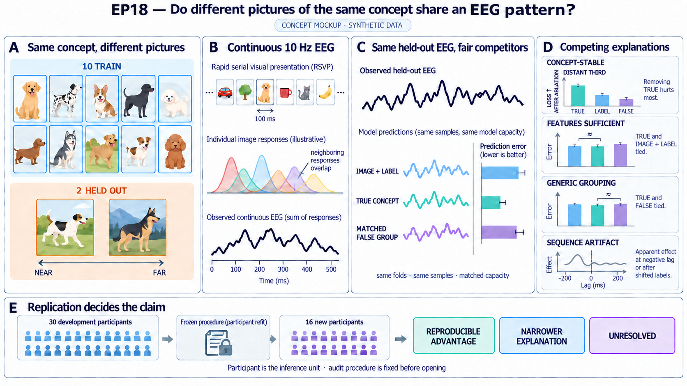

# Do different pictures of the same concept share an EEG pattern?

Imagine seeing twelve very different pictures of a dog. Ten pictures are used
to estimate the response shared by the concept, and two new dog pictures are
held out. Can that shared response improve prediction of the held-out EEG
after strong visual features and features derived from the word “dog” have
already had a fair chance to explain it?

That is the question in EP18. It is not another test of whether object
category can be decoded from EEG. Cross-exemplar category information has
already been reported in THINGS-EEG. The harder question is whether a
categorical template predicts better than a capacity-matched label basis
built on the same image model, whether the same advantage survives deliberately constructed false
groupings of the images, and whether it repeats in people who were not used
to develop the analysis.

The intended paper should explain when a category-level response remains
useful despite large visual differences between exemplars. A small accuracy
gain by itself is not enough.

The [paper plan](outputs/paper_plan.md) describes the explanatory follow-up
and the evidence needed for each planned figure. No EEG result is claimed in
this document.

## At a glance

| Question | EP18 design |
| --- | --- |
| What is being predicted? | Continuous multichannel EEG during a 10 Hz image stream. |
| What is held out within a person? | Two of the twelve exemplars of every concept; the other ten are used for fitting. |
| What is the strongest reference? | The same image features plus continuous label and human concept features, including a capacity-matched nonlinear label readout. |
| What makes the test category-specific? | The true concepts must beat eight false groupings matched for visual similarity, temporal context, and fitting capacity. |
| What is the inferential unit? | A whole participant, after averaging that participant's six held-out block pairs. |
| What is the independent replication step? | Develop the complete procedure in 30 participants and apply it once in 16 held-out participants. |
| What would explain the result? | The advantage should persist for the held-out exemplars that are least visually similar to their ten training exemplars. |
| What can the study conclude? | A reproducible categorical-basis advantage, feature sufficiency, readout insufficiency, nonspecific grouping, sequence artifact, nonreplication, or an unresolved test. |

## Why this study is needed

The original THINGS-EEG1 paper reported cross-exemplar concept structure.
Later work showed that low-level visual statistics can create apparently
semantic decoding, and other studies have compared perceptual, conceptual,
vision-model, and language-model representations in THINGS EEG and MEG.
Relevant starting points include:

- [Grootswagers et al. (2022)](https://doi.org/10.1038/s41597-021-01102-7),
  which introduced THINGS-EEG1 and its cross-exemplar analyses;
- [Holm et al. (2024)](https://doi.org/10.1016/j.neuroimage.2024.120626),
  which demonstrated low-level visual confounding in THINGS-EEG; and
- [Rong et al. (2025)](https://doi.org/10.7554/eLife.108915),
  [Kim et al. (2026)](https://doi.org/10.1167/jov.26.8.2), and
  [Watson et al. (2026)](https://doi.org/10.1016/j.neuroimage.2026.122012),
  which examined perceptual, conceptual, behavioral, vision-model, or
  language-model contributions in related datasets.

EP18 therefore sets a stricter novelty threshold. The result must concern
single held-out exemplars in continuous EEG, explicitly model overlapping
responses, survive a strong image-and-label reference, beat matched false
groupings, and repeat in whole participants not used for development.

Even that result would show an advantage of a particular categorical basis
and regularization scheme. It would not establish abstract, amodal, purely
semantic, or vision-independent coding.

## Competing explanations

| Explanation | What it predicts |
| --- | --- |
| **Concept-stable response** | A true-concept template predicts held-out EEG better than the capacity-matched label basis, beats every matched false grouping, and retains an advantage for exemplars that are distant in the frozen visual-only feature panel. |
| **Image and label features are sufficient** | Once the strongest image and nonlinear label readout is included, the categorical template has no practically meaningful advantage. |
| **The label readout was too weak** | A categorical advantage over a linear label model disappears when the nonlinear label model receives comparable fitting capacity. |
| **Generic grouping is enough** | One or more visually and temporally matched false groupings predict as well as the true concepts. |
| **RSVP sequence artifact** | Apparent concept prediction also appears at negative lags, after long within-sequence label shifts, or depends on targets, responses, drift, or sequence boundaries. |
| **Development-only effect** | The complete effect appears in the 30 development participants but does not repeat under the frozen procedure in the 16 held-out participants. |
| **The data cannot decide** | Reliability, rank, matched-group construction, or participant-level precision is inadequate. |

These are scientific outcomes, not merely pass/fail labels. The analysis must
be capable of returning each one without changing the question after seeing
the result.

## The decisive first test

THINGS-EEG1 contains 1,854 concepts with 12 images per concept. The main
session has 12 blocks; each block contains one image from every concept. Six
fixed outer folds hold out block pairs `{0,6}`, `{1,7}`, …, `{5,11}`. In each
fold, ten exemplars train the model and two different exemplars are scored.

Every model is fitted directly to the same continuous EEG samples. The models
share folds, preprocessing, nuisance terms, temporal support, sensor space,
whitening, and tuning opportunities. The key models are:

| Model | Information available | Scientific role |
| --- | --- | --- |
| **Image model** | Low-level image measurements and frozen vision or vision-language features | Shows how much of the EEG is predictable from the image itself. |
| **Linear label model** | Image model plus continuous features derived from concept names and human ratings | Common reference for the added-slot comparisons. |
| **Capacity-matched label model** | Linear label model plus a nonlinear readout of the same continuous label features | Strongest reference; rules out a gain caused only by an underpowered label readout. |
| **True-concept model** | Linear label model plus one regularized categorical concept slot | Tests whether the categorical basis predicts held-out exemplars. |
| **False-group models** | The same linear label model plus one matched pseudo-group slot | Tests whether any visually coherent grouping would work as well. |

The nonlinear label slot, true-concept slot, and pseudo-group slots must have
comparable effective fitting capacity. The true-concept model does not also
receive the nonlinear label slot. This makes the comparison about which added
basis predicts held-out EEG better, rather than which model simply has more
parameters.

For participant `p`, average each model's held-out loss across the six outer
folds before inference. The primary participant-level contrasts are:

- capacity-matched categorical-basis advantage:
  `loss(capacity-matched label) - loss(true concept)`; and
- partition specificity for each false grouping:
  `loss(false grouping k) - loss(true concept)`.

Positive values favor the true concept. The final claim requires the
participant-level lower bound for the first contrast to exceed its meaningful
margin and the lower bound for every one of the eight partition contrasts to
exceed its margin. Folds, images, sequences, sensors, and samples are repeated
measurements, not independent biological replicates.

## Why continuous EEG must be modeled directly

Images arrive every 100 ms, while an EEG response lasts much longer. An epoch
around one image therefore contains responses to several neighboring images.
EP18 uses one time-expanded model over each physical sequence so that every
image enters at its actual onset and overlapping responses are estimated
together.

Physical sequences are hard signal boundaries. Filtering, detrending,
temporal expansion, and trimming cannot borrow samples across them. Every
training-derived transform is fitted inside the training blocks, and no raw
or transformed sample may contribute to both fitting and scoring. Ordinary
prestimulus baseline correction is not used because it would fold responses
to earlier RSVP images into the current trial.

This continuous model is part of the scientific test. Replacing it with
isolated image epochs would make a category effect difficult to distinguish
from neighboring-image structure.

## False groupings that test the right alternative

Random labels test capacity but do not test residual visual organization. The
primary comparator bank therefore contains exactly eight EEG-blind false
partitions. Each partition:

- uses every one of the 22,248 main images exactly once;
- contains 1,854 groups of 12 images;
- places one image from every main block in each group;
- never puts two images from the same true concept in one group; and
- is matched to the true concepts, separately in every outer fold, for
  held-out-to-training image-feature distance, within-group scatter, temporal
  context, and the effective fitting capacity of the added slot.

The generator and acceptance tolerances are fixed before EEG comparison. If
all eight acceptable partitions cannot be constructed, the question is
underidentified; the matching rule cannot be loosened after inspecting EEG.
These partitions form a finite set of competing models, not a permutation
null.

## The explanatory prediction

The primary test asks whether a categorical basis wins. The next question is
why.

For every held-out image, measure its distance from the ten training images
of the same concept using a frozen visual-only feature panel, without EEG.
This panel contains low-level, supervised-vision, and self-supervised-vision
features; it excludes captions, concept names, human semantic features, and
vision-language embeddings. Freeze the distance definition and its near,
middle, and distant thirds before model comparison.

An onset-to-next-onset error bin cannot answer this question because the EEG
in that 100 ms interval still contains responses to earlier images. Instead,
use a post-fit contribution ablation that preserves the complete continuous
model. For each fitted model, remove only its added-slot prediction for
distant held-out events over the full 0–800 ms response horizon, leave all
other event contributions untouched, and rescore the complete physical
sequences with the same mask. No model is refitted for this analysis.

For each participant, compare the loss increase caused by removing distant
true-concept contributions with the loss increase caused by removing the
corresponding capacity-matched label contributions. Make the same comparison
against each of the eight matched false-group slots. Simulations with the
real overlapping event design must show that these ablations recover a
distant-exemplar signal without misattributing neighboring-image effects.

The preferred explanation makes a directional prediction:

> If the advantage reflects a response stable across concept exemplars,
> removing true-concept contributions for the most distant held-out images
> should harm prediction more than removing the capacity-matched label or
> false-group contributions. If residual visual similarity is sufficient,
> that distant-exemplar advantage should shrink toward zero.

This analysis uses the same folds, continuous model, samples, and
participant-level aggregation as the primary test. The label comparison and
eight false-group comparisons form a separate nine-endpoint simultaneous
participant-level family. It is an explanatory endpoint, not a way to rescue
a failed primary comparison. The complete rule is fixed before audit and then
repeated in the 16 audit participants.

A prespecified time-resolved analysis provides a second, weaker diagnostic.
Image-feature prediction should dominate the earliest response, whereas a
concept-stable advantage is expected to persist into later positive lags. A
late advantage that also appears at negative lags or after long label shifts
is evidence for sequence leakage, not conceptual stability. Time-resolved
peaks cannot replace the global continuous-prediction endpoint.

## Development and held-out participants

The provider marks four of 50 participants for exclusion, leaving 46
potentially eligible participants. Eligibility uses provider notes and fixed
file, header, event, and marker checks only. It cannot use EEG quality,
reliability, predictions, or effect direction.

Thirty whole participants are assigned to development and 16 to audit before
any EEG-derived model comparison. The participant is the replication and
inference unit. No assigned participant may be removed, replaced, or moved
between roles because of a later neural result.

Development chooses one complete image, label, and temporal recipe using only
prediction of the capacity-matched label model plus positive controls and
numerical diagnostics. True-concept scores, false-group scores, and their
pass/fail summaries remain hidden during that choice. After the baseline is
fixed, those scientific contrasts are released once. A failed control or
unfavorable contrast classifies the episode; it cannot send the search back
to select a friendlier baseline.

Audit opens only if the released development means clear the categorical and
all eight false-group margins, every required development control passes, and
development-participant simulations and uncertainty estimates show that 16
participants can resolve the meaningful margins. Otherwise the episode is
classified without opening audit EEG.

After those conditions pass, the fixed procedure is refitted and scored
within each audit participant using the six 10-block/2-block folds. This is
replication in new participants, not zero-shot transfer of one person's EEG
template.

## Controls that decide what the result means

The fixed procedure carries the following controls into audit:

- recoverable image, task, and repeated-image signals at the cohort level;
- negative-lag concept predictors;
- long, noncircular within-sequence concept-label shifts;
- explicit target, validated-response, sequence-position, boundary, and drift
  terms;
- synthetic null, image-only, concept, neighbor, target, drift, and latency
  scenarios using the real event structure;
- influence checks across participants, held-out block pairs, physical
  sequences, broad object categories, and concepts; and
- the required expanded image-feature panel.

Failure of a positive control means that the biological comparison is not
identified. A control effect at negative lags or shifted labels supports a
sequence or filtering artifact. Neither outcome may be repaired by excluding
an inconvenient participant or choosing a different feature panel.

## Planned question figure

The figure below is a synthetic design illustration. It contains no THINGS
source images and no observed EEG result.

The figure should let a reader see the complete scientific fork: different
pictures of one concept, continuous overlapping EEG, the three fair added-slot
comparisons, the visual-feature-distance prediction, and replication in new
participants.

## Possible conclusions

| Outcome | Evidence required | Interpretation |
| --- | --- | --- |
| **Reproducible categorical-basis advantage** | The true concept clears the capacity-matched margin, beats all eight matched false groups, passes sequence controls, and repeats in audit participants. | The categorical basis predicts held-out exemplars better within this THINGS inventory and model family. |
| **Stability across visual-feature distance** | The primary result passes, and removing true-concept contributions for the distant third harms audit prediction more than removing the capacity-matched label or every false-group contribution. | The stronger explanation—that the useful response survives large changes in the prespecified visual-only feature panel—is supported. If this prediction fails, retain only the narrower predictive-basis result. |
| **Feature and readout sufficiency** | With adequate precision, the true-concept advantage over the capacity-matched label model is smaller than the meaningful margin. | The tested image and label representation is sufficient at the study's resolution. |
| **Readout insufficiency** | The concept wins against the linear label model but not the capacity-matched nonlinear label model. | The apparent categorical advantage was explained by a more flexible readout of continuous label features. |
| **Partition nonspecificity** | With adequate precision, at least one matched false grouping is equivalent to or better than the true grouping. | The result does not distinguish true concepts from matched visual and temporal organization. |
| **Sequence or filtering artifact** | Negative-lag or shifted-label controls show a meaningful effect, or the effect depends on forbidden cross-boundary information. | The apparent concept advantage is not interpretable as a stimulus-locked concept response. |
| **New-participant nonreplication** | A precise development conjunction fails under the frozen procedure in the audit participants. | The development result did not reproduce in new participants. |
| **Development conjunction failed** | After one baseline is fixed and its scientific contrasts are released, the categorical advantage or at least one partition contrast does not exceed its development margin. | The one-shot audit is not opened; development did not support the complete prespecified prediction. |
| **Underidentified** | Reliability, design rank, matching, simulations, or participant-level precision is inadequate. | These data and this design do not decide the question. |
| **Technical failure** | Event reconstruction, sample separation, access control, or fixed-procedure execution is invalid. | No scientific interpretation is permitted. |

A nonsignificant comparison is not evidence of sufficiency or equivalence.
Those conclusions require enough precision to rule out the meaningful margin.

## Data readiness and access boundary

The EEG release and authorized THINGS image archive are available. Before any
EEG-driven comparison, the episode must still build and freeze the exact
event-image join, participant assignment, development-only data view, common
sensor transform, feature registry, and eight matched partitions.

The same user account can currently reach the public files for every
participant. Therefore the 16-person set is presently a procedural holdout,
not a permission-blinded audit. Setup that does not inspect neural outcomes
may proceed, but an audit described as permission-separated requires an
evaluator or controlled mount that the development process cannot bypass by
re-downloading the public data.

EP17 and EP18 share the THINGS stimulus ecosystem. Their exposure record must
identify exact image and concept overlap, reused features or checkpoints, and
first-access history. EP18 may provide new EEG evidence, but it is not an
independent stimulus-family confirmation of EP17.

## Claim boundary

The strongest permitted conclusion is:

> Within the fixed THINGS-EEG1 inventory, a categorical true-concept template
> predicted held-out exemplars better than the frozen capacity-matched label
> basis built on the same image model, outperformed the fixed bank of
> image-feature- and time-matched alternatives, and repeated in participants
> not used for development.

This is a participant-generalization claim conditional on the observed 1,854
concepts and 22,248 images. It is not a claim about unseen concepts, a new
image population, abstract semantics, amodal representations, causal
computation, or a universal object ontology.
