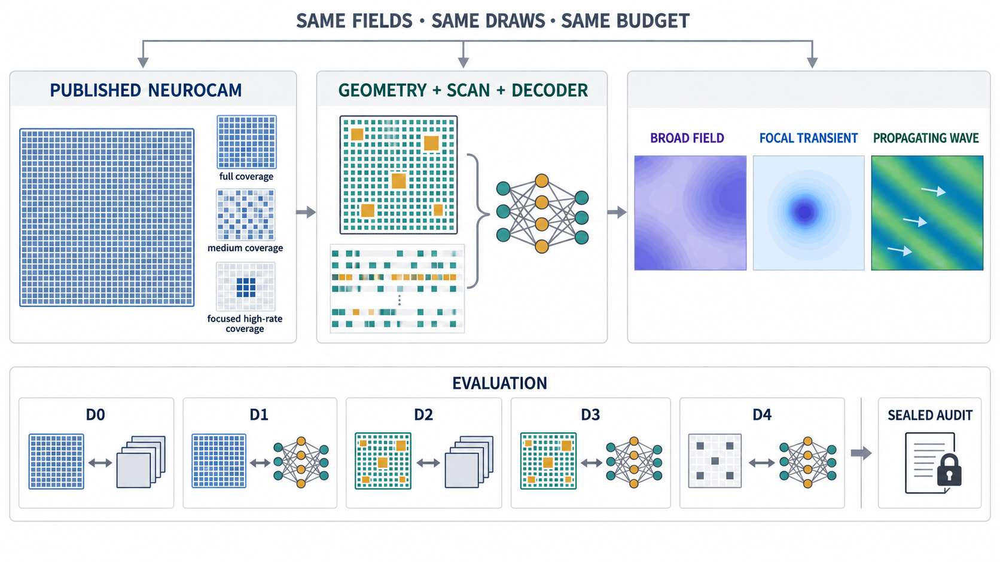

# Can a constrained NeuroCam redesign recover cortical voltage fields better?

NeuroCam uses a 64 × 64 multiplexed electrode array to observe cortical
surface voltage. Its architecture creates a basic trade-off: reading more
pixels gives wider spatial coverage, while revisiting fewer rows or source
groups gives better temporal resolution. Electrode size creates a second
trade-off between spatial averaging and sensitivity to local events.

EP20 asks whether a legal change to electrode geometry and scan allocation,
paired with reconstruction software that knows the resulting measurement
pattern, can improve that trade-off. The candidate must remain inside the
published NeuroCam footprint and row-column topology and must not gain extra
wires, conversion work, latency, or modeled power and thermal capacity.

The test is deliberately harder than comparing new hardware with old
software. One locked co-designed candidate must beat:

- every eligible published NeuroCam operating point with conventional
  reconstruction;
- the same NeuroCam frontier with equally optimized software;
- the candidate hardware with conventional software; and
- every registered simple hardware or scheduling heuristic given the same
  software family and tuning budget.

All comparisons use the same cortical fields, device draws, nuisance draws,
evaluation masks, and resource envelopes. The result must also survive a
sealed change in both the field generator and the device model.

This is a virtual design study. A positive result can justify fabricating or
physically testing one compiled design. It cannot show that an unbuilt device
outperforms fabricated NeuroCam hardware, is safe or stable in chronic use,
or is ready for foundry sign-off or in-vivo deployment.

## At a glance

| Question | EP20 design |
| --- | --- |
| What varies? | A legal uniform or two-scale pad pattern, a legal row/source acquisition schedule, and a capacity-capped reconstruction rule. |
| What stays fixed? | The 64 × 64 lattice, 150-micrometre pitch, approximately 9.6 × 9.6 mm active area, one-TFT row-column topology, and no more than 64 gate plus 64 source lines. |
| What is reconstructed? | Cortical-surface voltage on one common dense grid in the primary 1–100 Hz band. |
| What is the main score? | Paired change in field reconstruction R² against every eligible member of the locked NeuroCam reference frontier. |
| What prevents an easy win? | Equal software capacity, training effort, data, seeds, conversion, latency, bitrate, and modeled physical-resource accounting. |
| What checks overfitting? | Registered falsifiers plus a one-shot audit using independently implemented signal and electronics models. |
| What is the empirical check? | A development D0/D1 replay stress plus a disjoint post-lock catastrophic-plausibility replay; neither validates an unbuilt geometry. |
| What would success mean? | One virtual co-design specification is worth fabrication or device testing. |

## First-round figure concept

This first-round figure is a map of the planned comparison, not a result.
Every arm receives the same simulated cortical fields, device draws, masks,
and resource envelope. The values and waveforms are synthetic illustrations;
the figure contains no experiment output and provides no evidence that a
candidate passed any gate.

The figure emphasizes the two questions EP20 must answer separately: whether
co-design beats the full D0/D1 NeuroCam frontier and matched D2/D4 controls,
and whether that advantage survives an independent one-shot audit after
exactly one D3 candidate is locked.

## The published reference

The named reference is the NeuroCam report and supplement described in
[DATASETS.md](DATASETS.md). The paper reports a 64 × 64 Ln-IZO TFT array with
150-micrometre pitch, approximately 9.6 × 9.6 mm active area, 70 × 135
micrometre gold sensing pads, 64 shared gate lines, and 64 shared source
lines.

Three reported dynamic operating points anchor the reference:

| Mode | Pixels acquired | Effective rate per pixel | Reported RMS noise |
| --- | ---: | ---: | ---: |
| 24S × 16G | 384 | 1000 S/s | 8.8 ± 4.2 microvolts |
| 24S × 64G | 1536 | 250 S/s | 12.6 ± 8.4 microvolts |
| 64S × 64G | 4096 | 250 S/s | 63.6 ± 24.1 microvolts |

The paper also reports a representative channel gain of 0.78 ± 0.12, a
single-channel 3-dB frequency above roughly 1 kHz, source-line neighbour
crosstalk near −12.6 dB, gate-line neighbour crosstalk near −37.2 dB, and
more distant crosstalk near −45 dB. These are documentary anchors, not a
complete digital twin.

The 1-kHz channel response does not imply 1-kHz full-array imaging. With the
reported 62.5-microsecond row dwell, a full 64-row scan takes about 4 ms and
has a nominal per-pixel Nyquist frequency near 125 Hz. EP20 therefore promotes
only on the 1–100 Hz cortical-surface field. A registered 100–400 Hz
reduced-mode analysis is diagnostic only and cannot rescue a failed primary
result. Here, “focal transient” means an epileptiform or other field event,
never a sorted single-neuron spike.

## Why co-design might help

A uniform array and uniform scan spend the same kind of measurement effort
everywhere. A two-scale pad pattern might preserve broad spatial structure
with some electrodes while retaining local structure with others. A
nonuniform but legal schedule might revisit informative rows or source groups
more often. Software that receives the exact pad, timing, and device state
could then reconstruct an irregular measurement stream without pretending it
came from a uniform movie.

That story has several plausible alternatives:

| Explanation | What the result would mean |
| --- | --- |
| Uniform-reference robustness | Once noise, conversion, timing, and device shifts are matched, the published uniform architecture remains the best robust choice. |
| Software sufficiency | Better reconstruction on NeuroCam recovers nearly all available gain; new hardware is unnecessary. |
| Geometry benefit | A legal two-scale pad pattern improves the broad-versus-local spatial trade-off. |
| Rate-allocation benefit | A legal schedule improves the spatial-versus-temporal trade-off without extra resources. |
| Hardware-software complementarity | The compiled hardware change and its measurement-aware decoder work better together than either component alone. |
| Simulator exploitation | The apparent gain disappears under an independent forward model, electronics law, nuisance family, or fabrication rounding. |
| Underidentification | Available public data cannot constrain the reference model well enough to distinguish these explanations. |

## The five-way comparison

Every candidate is evaluated through the same nested ladder:

| Arm | Hardware | Software | Question answered |
| --- | --- | --- | --- |
| **D0** | Complete registered NeuroCam operating frontier | Conventional s0 | What does the paper-derived reference do with a standard analysis? |
| **D1** | Same complete NeuroCam frontier | Every registered s1 subclass under equal budget | Is software alone sufficient? |
| **D2** | Compiled candidate hardware | Conventional s0 with a compatible adapter | Does hardware alone help? |
| **D3** | Same compiled candidate hardware | The s1 subclass selected before any candidate-hardware result | Does true co-design help? |
| **D4** | Every registered resource-matched simple heuristic | The same selected s1 family and budget | Is a simple geometry or schedule enough? |

The full D0/D1 frontier is locked before any D2, D3, or D4 outcome. All three
registered s1 subclasses are evaluated on the reference: a physics-informed
linear inverse, a structured state-space inverse, and a compact causal
nonlinear inverse. One subclass is selected by the frozen rule, and that
choice cannot be revisited after candidate hardware results appear.

Software capacity, optimizer, training steps, data, seed allocation, and
selection-call credit are matched across D1, D3, and D4. Each hardware
operator is trained separately; reusing favourable D3 weights for a
comparator is prohibited.

## How the test works

1. **Provision and qualify the reference.** Freeze documentary anchors,
   calibration-versus-qualification roles, the reference-model grammar, and
   outcome-blind tolerances. A trusted qualifier must pass the held-out gate
   before any candidate score exists.
2. **Freeze the experiment.** Lock the finite hardware grammar, design rules,
   resource model, software budget, development environments, seeds,
   endpoints, margins, randomization plan, and permission-separated audit plan.
3. **Build the reference frontier.** Evaluate every registered D0 and D1
   operating point and select the s1 subclass without seeing candidate
   hardware outcomes.
4. **Complete the 16-arm coverage panel.** Run one D0 arm, three D1 arms, four
   D2 arms, four D3 arms, and four D4 arms before adaptive patience can count.
5. **Search and try to break the result.** Propose legal compiled successors
   from development outcomes only. After coverage, at least 40% of valid
   trials are reserved for falsifiers and ablations.
6. **Lock exactly one candidate.** A candidate may lock only after every
   development gate passes. If more than one qualifies, use the frozen
   tie-break rule.
7. **Open the audit once.** Compare the locked candidate, full reference
   frontier, and matched controls on sealed virtual worlds. Apply the disjoint
   empirical or phantom payload only as a global catastrophic-plausibility
   check; it does not compare unbuilt geometries. No post-audit successor is
   allowed.

The search uses one global compiled hardware specification. A resource
envelope may select a registered operating recipe, but the study may not
choose different hardware after seeing the signal family or device condition.

## What is measured

The primary endpoint is field reconstruction R² in the 1–100 Hz band on a
common space-time mask. For each eligible reference member, the score is the
paired D3-minus-reference difference on identical generated worlds. Scenes
are aggregated within structural signal/device cells first, device strata are
weighted equally within signal families, and signal families are weighted
equally. Pixels and time points are not treated as independent replicates.

The confirmatory estimate is a member-specific macro gain over that member’s
registered resource support. The frontier score is the least favourable of
those gains. Promotion uses one-sided simultaneous 95% paired intervals
against every eligible locked member; it never picks a different comparator
for each scene after seeing the outcome.

Required secondary endpoints cover:

- focal-event localization error;
- propagation direction and speed;
- transient-detection proper log-score utility;
- uncertainty coverage, sharpness, and calibration;
- worst signal-family and device-stratum gain;
- performance after discrete fabrication rounding;
- latency, conversions, bitrate, power, thermal, routing, and yield proxies;
  and
- transfer to a frozen downstream probe.

Transient AUROC, latent-source recovery, the 100–400 Hz reduced-mode result,
and a descriptive hardware-software interaction score are diagnostics. None
can promote a candidate or rescue failure of the field endpoint.

## What counts as a positive result

A D3 candidate advances only if all of the following hold in development and
again where applicable in the one-shot audit:

| Gate | Required lower bound or margin |
| --- | ---: |
| D3 versus every eligible D0/D1 frontier member | At least 0.010 in R² |
| D3 versus its matched D1 software-only comparator | At least 0.005 |
| D3 versus its matched D2 hardware-only comparator | At least 0.005 |
| D3 versus every eligible D4 heuristic | At least 0.005 |
| Every registered stratum-by-reference contrast | At least −0.005 |
| Localization-error noninferiority | 0.15 mm |
| Wave-direction-error noninferiority | 5 degrees |
| Wave-speed-relative-error noninferiority | 0.05 |
| Transient log-score-utility noninferiority | 0.01 |
| Uncertainty-ECE noninferiority | 0.01 |
| Downstream normalized-utility noninferiority | 0.01 |

Endpoint calculations and margins require outcome-blind fixture calibration
and scientist signoff. All hardware and resource constraints must still pass
after discrete rounding and compilation.

If several designs satisfy every development gate, choose the one with the
best worst-environment paired gain. Designs within 0.005 are tied; prefer
lower modeled conversion energy, then lower scan latency, then the
lexicographically lowest design ID assigned before scoring. Exactly one design
is locked.

## Possible scientific answers

| Outcome | Evidence required | Permitted interpretation |
| --- | --- | --- |
| Candidate ready | One locked D3 passes the complete frontier, matched controls, every stratum, secondary endpoints, falsifiers, resource checks, empirical plausibility gate, and sealed audit. | This virtual specification is justified for fabrication or device testing. |
| Software is sufficient | An eligible D1 improves over its matching D0 and is equivalent to or better than D3 under the registered control rule. | Optimized reconstruction explains the apparent benefit; hardware redesign is not supported. |
| Hardware alone is sufficient | D2 improves over matched D0 and is equivalent to or better than D3. | The physical change may help, but a special co-designed decoder is not supported. |
| A simple heuristic is sufficient | An eligible D4 is equivalent to or better than D3. | The complex search did not beat a registered simple rule. |
| Robustness or transfer failure | The headline frontier comparisons pass, but a stratum, secondary endpoint, falsifier, rounding check, or plausibility gate fails. | The gain is too fragile to advance. |
| Development-only candidate | Development lock passes, but the one-shot audit fails without a more specific control explanation. | The candidate did not generalize beyond the development models. |
| Complete frontier not beaten | After minimum evidence, the finite admissible D3 space is exhausted and every feasible design fails an explicit frontier-superiority inequality. | No legal candidate in the frozen space beat the complete incumbent frontier. |
| Unresolved | Minimum evidence is complete, but no positive or specific negative rule is satisfied. | The experiment is informative but does not distinguish the remaining explanations. |

### When the test is not interpretable

| Status | What happened | What may be said |
| --- | --- | --- |
| Reference unqualified | The frozen paper-derived model failed its pre-candidate qualification gate. | The candidate comparison never became scientifically valid. |
| Access or policy failure | Protected audit material leaked, a predeclared rule changed, support was invalid, or the evaluator failed. | No scientific comparison may be claimed. |
| Technical failure | Inputs, compilation, execution, or repeated engineering repairs failed. | Report the failure; do not turn it into a biological or design conclusion. |
| Incomplete search | A resource ceiling occurs at any stage, or another authorized stop occurs before minimum evidence. | The search ended without resolving the hypothesis. |
| All branches infeasible | The frozen compiler proves every D3 grammar branch violates post-rounding design or resource rules. | The registered design space is infeasible under these constraints. |

[SEARCH_POLICY.yaml](SEARCH_POLICY.yaml) defines how competing outcomes are
resolved.

## What makes the comparison valid

- The same field realizations, device/process states, nuisance draws, masks,
  and resource envelopes are paired across D0–D4.
- Reference eligibility is fixed before candidate outcomes. Contrasts outside
  a member’s registered support are excluded, never imputed.
- Cortical-surface voltage is the primary target; latent sources and
  downstream tasks are secondary diagnostics.
- Pad averaging is applied exactly once, all voltages have an explicit
  reference, and causal schedules use only past observations and current
  hardware state.
- Electrode geometry, impedance, settling, crosstalk, noise, scan history,
  and missing pixels are modeled jointly rather than as independent knobs.
- Unknown physical costs are not treated as zero. A new primitive is illegal
  until its area, timing, noise, power, calibration, and manufacturing rules
  are frozen.
- The sealed audit changes implementation lineage, not merely random seeds.
- Development and sealed empirical replay partitions are disjoint by subject,
  device, session, or independently replayed waveform.
- Ordinary ECoG is not dense ground truth for an unbuilt electrode geometry.
  It can expose implausible spectra, amplitudes, missingness, or software
  behaviour, but it cannot validate physical superiority.

If only aggregate public characterization remains available, the study is
limited to a paper-derived NeuroCam-class reference-model ensemble. It may not
claim an exact NeuroCam digital twin, transistor-accurate reproduction, or
matched physical power, yield, reliability, or chronic lifetime.

## Required falsification

The registered falsifiers ask whether the result depends on an easy reference,
a friendly spectrum, an ideal device, or a hidden resource advantage. They
include:

- sweeping the full D0/D1 operating frontier;
- shifting spatial spectrum, correlation length, propagation speed,
  direction, curvature, and broad/local mixtures;
- placing focal events in previously silent or unexpected regions;
- replacing the source-to-surface operator and jointly shifting noise,
  crosstalk, RC, settling, drift, saturation, contact gaps, and dead pixels;
- matching decoder capacity, training steps, seeds, and selection credit;
- independently retraining D1, D3, and D4;
- comparing random and simple geometry/schedule controls;
- reversing large/small pad assignment;
- geometry-only, schedule-only, software-only, and uncertainty-head ablations;
- checking pad averaging, causality, reference convention, discrete rounding,
  common-seed replication, and independent evaluator confirmation;
- stressing spectra, amplitudes, and missingness on the development empirical
  partition for D0 and D1 only; and
- leaving out each signal family and device stratum in turn.

These are evidence, not optional follow-up analyses.

## Search budget and stopping

| Limit | Value |
| --- | ---: |
| Valid trials | 32 minimum; 64 maximum |
| Patience after all prerequisites | 12 eligible D3 opportunities |
| Minimum adaptive history | 2 successor cycles and 2 incumbent/challenger decisions |
| Post-coverage falsification share | At least 40% |
| Repairable engineering failures | 12; the thirteenth is a technical failure |
| Aggregate CPU budget | 4,000 core-hours |
| GPU budget | 960 GPU-hours |
| Wall-clock budget | 336 hours |
| Parallelism | At most 8 GPUs and 128 CPU cores |
| Memory | 512 GB overall; 128 GB per trial |
| Scratch | 4,096 GB |

Patience begins only after the exact 16-arm panel, 32-trial minimum, successor
and decision requirements, and falsification share are complete. Only a
complete eligible D3 opportunity with its linked ladder counts. Patience
resets after either at least 0.010 improvement in development
worst-environment paired gain or a new feasible Pareto point. Reaching a
resource ceiling is neither scientific success nor scientific failure.

## Audit and claim boundary

Before audit, the lock binds the candidate, every reference and control, all
compiled recipes, software weights, seeds, endpoints, margins, randomization,
resource rules, and permitted audit report. The steward then opens the sealed
payload once. The adaptive controller receives only that report. Audit
outcomes cannot select a replacement candidate or modify the predeclared
rules.

**Strongest permitted positive sentence:** Under the frozen paper-derived
NeuroCam reference ensemble, registered cortical-field and device conditions,
matched software budget, and modeled resource constraints, one compiled
virtual hardware-software design outperformed every eligible NeuroCam
reference member and registered heuristic control, including in the one-shot
structural audit.

That sentence must be followed by the limitation that the candidate is
unfabricated and has not established physical superiority, chronic safety,
manufacturability, or in-vivo performance.

## Current status — 2026-09-26

EP20 is specified but not ready to execute.

- The final article, DOI, preprint DOI, and aggregate documentary anchors have
  identified, and the documentary PDF is in the private steward store.
- EP20 use and rights have not been approved, and the calibration-versus-
  qualification assignment has not been prepared.
- The fitted reference ensemble, trusted qualifier, legal alternative-pad
  catalogue, development models, resource compiler, empirical replay, and
  independent audit engine do not yet exist.
- Raw NeuroCam traces, the exact reduced-mode channel map and marker semantics,
  a PDK, netlist, layout, DAQ code, and operating-mode power traces remain
  unavailable. Their absence narrows the study to a paper-derived reference
  ensemble; it does not by itself require pretending those assets exist.
- The two legacy examples remain documentary-only and are not EP20 inputs.
- No experiment, candidate score, reference qualification, search, or audit
  has been run.

The missing approvals, role assignment, qualified reference, executable
development environment, resource rules, and independent audit block
candidate scoring. Missing device evidence narrows the permitted claim. None
of these gaps is permission to guess parameters or treat unknown cost as zero.

For provenance and access roles, see [DATASETS.md](DATASETS.md). For the
complete search rules, see [SEARCH_POLICY.yaml](SEARCH_POLICY.yaml).
