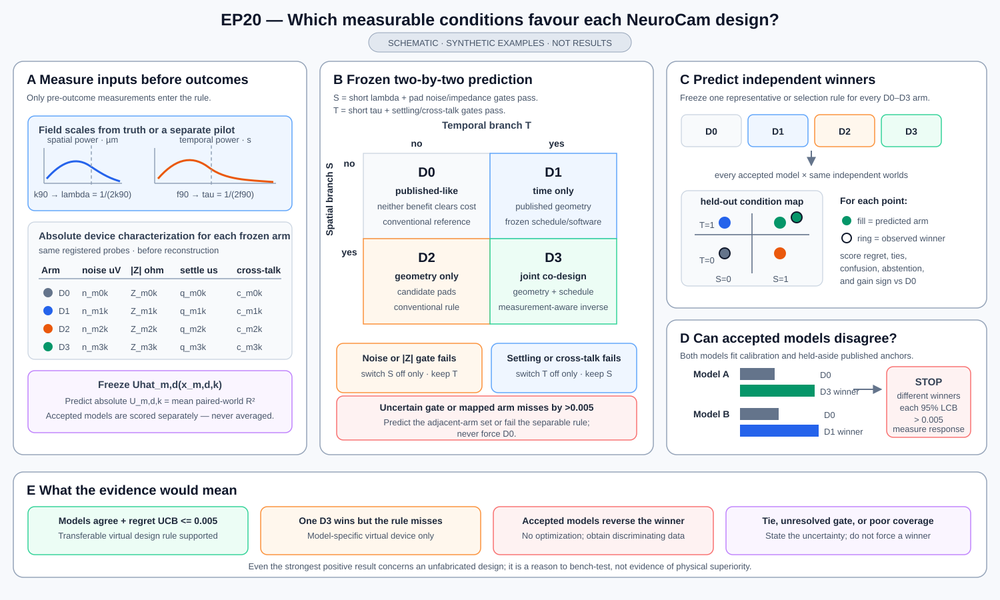

# Can a constrained NeuroCam redesign recover cortical voltage fields better?

NeuroCam uses a 64 × 64 multiplexed electrode array to observe voltage on the
cortical surface. Its architecture creates a basic trade-off. Reading more
pixels expands spatial coverage, while revisiting fewer rows or source groups
improves temporal resolution. Electrode size adds another trade-off between
spatial averaging and sensitivity to local events.

EP20 asks whether a legal change to **electrode geometry and scan allocation**,
paired with reconstruction software that knows the resulting measurement
pattern, can improve that trade-off. A proposed design must retain the
published 64 × 64 lattice, 150-micrometre pitch, approximately 9.6 × 9.6 mm
active area, one-TFT row-column topology, and no more than 64 gate plus 64
source lines. It cannot gain extra conversion work, latency, bitrate, modeled
power, or thermal capacity.

The comparison must distinguish true hardware-software complementarity from
four easier explanations. On the same cortical fields, device conditions,
masks, and resource budget, the co-designed candidate is compared with:

1. published NeuroCam hardware with conventional reconstruction;
2. published NeuroCam hardware with equally optimized reconstruction;
3. the candidate hardware with conventional reconstruction; and
4. simple geometry or scheduling rules with the same optimized software and
   tuning allowance.

Only after those comparisons does one selected candidate face an independent
final test using separately implemented cortical-field and electronics models.
Passing would justify fabrication or device testing of **one virtual design**.
It would not show that an unbuilt device outperforms fabricated NeuroCam,
works chronically in vivo, or is ready for manufacturing.

Like the EP12 concept figure, this mockup uses one synthetic cortical field to
make the scientific alternatives visible. It shows what dense slow scanning,
selective fast revisiting, and pad averaging each lose; makes clear that D0,
D1, and D4 are complete comparator sets; and plots the registered evidence as
the paired D3-minus-comparator 1–100 Hz ΔR² lower bound after subtracting that
comparison's margin. The least-favourable member and the worst field family
are decisive. The final strip keeps software sufficiency, hardware sufficiency,
simple-rule sufficiency, fragility, non-generalization, an untested question,
and uncertainty separate. None of the reconstructions, intervals, or outcomes
is an EP20 result; exact gates remain in the study text. An older
[conceptual mock-up](outputs/ep20_conceptual_main_figure.png) is retained only
as a secondary illustration.

## The question at a glance

| Question | EP20 design |
| --- | --- |
| What may change? | A legal uniform or two-scale pad pattern, a legal row/source acquisition schedule, and a capacity-capped measurement-aware reconstruction method |
| What stays fixed? | 64 × 64 lattice, 150-micrometre pitch, approximately 9.6 × 9.6 mm active area, one-TFT row-column topology, and at most 128 array gate-plus-source lines |
| What is reconstructed? | Cortical-surface voltage on a common dense grid in the primary 1–100 Hz band |
| What is the main score? | Paired change in field-reconstruction R² against every eligible published-hardware reference setting |
| What prevents an easy win? | Equal software capacity, training effort, data, seeds, conversions, latency, bitrate, and modeled physical-resource accounting |
| What tests generality? | Registered challenge tests and one independent final comparison using separately implemented signal and electronics models |
| What is the empirical check? | Separate development and final physical-signal or phantom checks for spectra, amplitudes, missingness, and catastrophic implausibility; these cannot validate an unbuilt geometry |
| What would success mean? | One virtual specification is worth fabricating or testing as a device |

## The published reference

The named reference is the NeuroCam article and supplement described in
[DATASETS.md](DATASETS.md). The published array has 4,096 pixels, a 64 × 64
lattice, 150-micrometre pitch, approximately 9.6 × 9.6 mm active area, 70 ×
135 micrometre gold sensing pads, and 64 shared gate plus 64 shared source
lines.

Three reported dynamic settings anchor the virtual reference:

| Setting | Pixels acquired | Effective rate per pixel | Reported RMS noise |
| --- | ---: | ---: | ---: |
| 24 source × 16 gate | 384 | 1,000 samples/s | 8.8 ± 4.2 microvolts |
| 24 source × 64 gate | 1,536 | 250 samples/s | 12.6 ± 8.4 microvolts |
| 64 source × 64 gate | 4,096 | 250 samples/s | 63.6 ± 24.1 microvolts |

The paper also reports representative gain of 0.78 ± 0.12, channel bandwidth
above roughly 1 kHz, source-line neighbour crosstalk near −12.6 dB, gate-line
neighbour crosstalk near −37.2 dB, and more distant crosstalk near −45 dB.
These values constrain a **paper-derived NeuroCam model**; they do not define a
complete or transistor-accurate digital twin.

The 1-kHz channel bandwidth does not imply 1-kHz full-array imaging. With the
reported 62.5-microsecond row dwell, a 64-row scan takes about 4 ms and has a
nominal per-pixel Nyquist frequency near 125 Hz. The primary endpoint is
therefore limited to 1–100 Hz. A 100–400 Hz reduced-mode result is descriptive
and cannot rescue a failed primary result. “Focal transient” refers to a field
event, not a sorted single-neuron spike.

## The five matched comparisons

The plain-language comparisons receive short labels only for compact tables:

| Label | Hardware | Software | Question |
| --- | --- | --- | --- |
| **D0 — published/conventional** | Every eligible published NeuroCam setting | Conventional method | What does the paper-derived reference do with a standard analysis? |
| **D1 — published/optimized** | The same complete published-hardware frontier | Every registered optimized method with equal allowance | Is software alone sufficient? |
| **D2 — candidate/conventional** | One legal candidate design | Conventional method with a compatible adapter | Does the hardware change alone help? |
| **D3 — candidate/co-designed** | The same candidate design | One measurement-aware method chosen on the published hardware before candidate results | Does hardware-software co-design help? |
| **D4 — simple controls** | Every registered resource-matched geometry or schedule rule | The same optimized software family and allowance | Is a simple rule sufficient? |

The full published-hardware D0/D1 frontier is established before any D2–D4
result is used. The three optimized software families are a physics-informed
linear inverse, a structured state-space inverse, and a compact past-only
nonlinear inverse. One family is chosen using only D1 performance; all D1
settings remain comparators.

D1, D3, and D4 receive the same software capacity, optimizer, training steps,
data, seeds, and number of selection attempts. Every hardware measurement
operator is trained separately. Reusing favourable D3 weights for another arm
is prohibited.

## What a candidate may change

The physical design may use the published uniform pads, interleaved two-scale
pads, or tiled two-scale pads on the same lattice. At most three pad classes
are allowed. Exact alternative pad dimensions and clearances must be chosen
before scoring; continuous idealized shapes are not final candidates.

The readout may use the published uniform scan, fixed heterogeneous row dwell
and revisit, fixed source-bank precision allocation, or one bounded past-only
row-revisit rule. Legal dwell multipliers are 1, 2, and 4 times the 62.5-
microsecond base dwell; shorter dwell is not allowed. A row action addresses a
legal gate group, not an arbitrary pixel.

The design cannot add on-array memory or computation, arbitrary analog mixing,
local analog aggregation, a new ADC or front end, hierarchical routing, a new
material or transistor process, a changed active area or pitch, or more than
128 array lines.

Before a design is scored, a common design-legality and resource check applies
fabrication rounding and accounts for:

- active area and gate/source lines;
- reference, ground, guard, and supply cost;
- active front-end and ADC channels;
- raw conversions and effective pixel samples per second;
- output bitrate, latency, and scan skew;
- gate switching, modeled power, and thermal burden;
- routing area and electrical loading; and
- yield, dead-pixel, and dead-line burden.

Unknown cost is never treated as zero.

## How the comparison is run

1. Use published measurements to fit a NeuroCam reference model, while keeping
   at least one operating setting or curve aside for a pre-candidate check.
2. Set the finite hardware choices, design rules, resource accounting,
   software allowance, field and device models, endpoints, margins, and random
   draws before candidate results.
3. Evaluate every D0 and D1 setting and choose the optimized software family
   without candidate-hardware results.
4. Complete a 16-arm coverage panel: one D0, three D1, four D2, four D3, and
   four D4 arms.
5. Explore legal follow-up designs on development models while reserving at
   least 40% of post-coverage trials for challenge tests, ablations, and
   direct replications.
6. Choose exactly one candidate only if it passes every development comparison,
   secondary endpoint, resource check, and required challenge test.
7. Compare that candidate once with the complete reference and controls under
   independently implemented cortical-field and electronics models. No new
   design may be chosen from that result.

The study uses one global hardware specification. A resource budget may select
a pre-set operating recipe, but the hardware cannot change after seeing a
signal family or device condition.

## Primary and secondary measurements

The primary endpoint is cortical-surface field reconstruction R² in the
1–100 Hz band on one common space-time mask. Every comparison is paired on the
same field realization, source-to-surface model, device and process draw,
nuisance draw, mask, and resource budget.

Results are first averaged within a signal-by-device condition. Device
conditions receive equal weight within each signal family, and signal families
receive equal weight. Pixels and time points are not treated as independent
replicates.

The candidate must beat every eligible D0 and D1 reference setting. The primary
summary is the least favourable paired gain across that complete frontier.
One-sided simultaneous 95% intervals determine whether each margin is met; the
study never chooses a different reference for each scene after seeing results.

Required secondary outcomes are:

- focal-event localization error;
- propagation direction and speed;
- transient-detection proper log-score utility;
- uncertainty coverage, sharpness, and calibration;
- worst signal-family and device-condition gain;
- performance after fabrication rounding;
- latency, conversions, bitrate, modeled power, thermal, routing, and yield;
  and
- transfer to one pre-set downstream probe.

Transient AUROC, latent-source recovery, 100–400 Hz performance, and a
descriptive interaction score cannot promote a candidate or rescue failure of
the field endpoint.

## What counts as a positive virtual result

| Comparison or safeguard | Required margin |
| --- | ---: |
| D3 versus every eligible D0/D1 reference setting | R² lower bound at least 0.010 |
| D3 versus its matched D1 software-only comparator | R² lower bound at least 0.005 |
| D3 versus its matched D2 hardware-only comparator | R² lower bound at least 0.005 |
| D3 versus every eligible D4 simple control | R² lower bound at least 0.005 |
| Every signal/device/reference condition | R² lower bound at least −0.005 |
| Localization-error noninferiority | 0.15 mm |
| Wave-direction-error noninferiority | 5 degrees |
| Wave-speed-relative-error noninferiority | 0.05 |
| Transient log-score-utility noninferiority | 0.01 |
| Uncertainty calibration-error noninferiority | 0.01 |
| Downstream normalized-utility noninferiority | 0.01 |

All margins require outcome-blind calibration on synthetic examples and
scientist approval before candidate scoring. Hardware and resource constraints
must pass again after discrete rounding.

If several designs pass every development requirement, choose the one with the
best worst-condition paired gain. Designs within 0.005 are tied; prefer lower
modeled conversion energy, then lower scan latency, then the earliest
preassigned design name. Exactly one design proceeds.

## Results the study can distinguish

| Evidence pattern | Scientific reading |
| --- | --- |
| Co-design beats the full frontier and all matched controls twice | One virtual design is justified for fabrication or device testing |
| Published hardware with optimized software matches D3 | Better reconstruction is sufficient; hardware redesign is not supported |
| Candidate hardware with conventional software matches D3 | The hardware change may help, but special co-designed reconstruction is not supported |
| A simple geometry or schedule matches D3 | The complex search did not beat the registered simple rule |
| Main comparisons pass but a condition, secondary endpoint, rounding, or plausibility check fails | The gain is too fragile to advance |
| Development passes but the independent model test fails | The result does not generalize beyond the development models |
| The complete finite candidate space cannot beat the full reference frontier | No legal design in this search space improves the registered virtual comparison |
| Evidence remains too uncertain | Report what remains unresolved rather than selecting a design |

If the published measurements cannot support a credible reference model, or
if every legal branch fails physical or resource rules, the co-design question
was not tested. Neither case is evidence that the published architecture is
scientifically optimal.

## Required challenge tests

- sweep the complete D0/D1 published-hardware frontier;
- shift spatial spectrum, correlation length, propagation speed, direction,
  curvature, and broad/local mixtures;
- place focal events in previously silent or unexpected regions;
- change the source-to-surface operator;
- jointly vary noise, crosstalk, line RC, settling, drift, saturation, contact
  gaps, and dead pixels;
- match software capacity, training steps, seeds, and selection allowance;
- train D1, D3, and D4 separately;
- compare random and simple geometry or schedule controls;
- reverse large- and small-pad assignments;
- remove geometry, schedule, optimized software, and uncertainty modeling one
  at a time;
- verify one application of pad averaging, past-only scheduling, voltage
  reference, fabrication rounding, and post-rounding resource use;
- repeat the current best design and comparator on common random draws;
- test spectra, amplitude, missingness, and software stability on separate
  physical-signal or phantom data; and
- leave out each signal family and device condition in turn.

These tests are required evidence, not optional follow-up figures.

## Development budget and stopping

The search requires **32–64 valid trials**. It begins with the exact 16-arm
coverage panel and must contain at least **two genuine follow-up cycles**, at
least **two recorded choices between the current best design and a new
proposal**, and at least **40% challenge tests, ablations, influence checks, or
direct replications** after coverage. Patience is 12 eligible co-design
opportunities after all minimum evidence is complete.

Up to 12 repairable engineering failures are allowed; the next one ends the
study as a technical failure. Resource limits are **4,000 CPU core-hours**,
**960 GPU-hours**, **336 wall-clock hours**, at most **8 GPUs** and **128 CPU
cores**, **512 GB total memory**, **128 GB per trial**, and **4,096 GB scratch**.
Reaching a resource limit is not a positive or negative scientific result.

Patience resets after either a 0.010 improvement in the worst-condition paired
gain or a new feasible trade-off point. One positive or negative trial never
ends a branch by itself.

## Independent final model test

The final comparison changes more than random seeds. It uses separately
implemented cortical-field mechanisms, a source-to-surface operator absent
from development, a separately implemented electronics scaling or coupling
law, altered spatial spectra, nonstationary sources, and unseen combinations
of noise, crosstalk, settling, drift, gaps, saturation, and dead pixels.

Planning requires at least three hidden signal mechanisms, four device-shift
conditions per mechanism, and 64 paired field realizations per condition. The
exact number may increase after outcome-blind interval-width and resource
calibration.

The complete D0 and D1 frontier, matched D2 arm, selected D3 candidate, and all
eligible D4 controls run together on identical paired worlds. No method,
margin, aggregation rule, hardware design, operating recipe, or runner-up may
replace the pre-set choice afterward.

A separate physical-signal or phantom check may reject catastrophic spectra,
amplitudes, missingness, or software behaviour. It cannot compare unbuilt pad
geometries or establish physical superiority.

## Claim boundary

The strongest permitted positive statement is:

> Under the paper-derived NeuroCam model, registered cortical-field and device
> conditions, matched software allowance, and modeled resource constraints,
> one virtual hardware-software design outperformed every eligible published-
> hardware reference setting and registered simple control, including under an
> independently implemented final model test.

That statement must immediately add that the design is unfabricated. EP20
cannot claim physical superiority, manufacturing readiness, chronic safety,
biocompatibility, reliability, lifetime, or in-vivo performance.

## Current status

EP20 is specified but not ready to run. The article and aggregate published
measurements are identified, but source-use approval, the calibration-versus-
held-aside split, the paper-derived reference model, legal pad catalogue,
development field and device models, resource rules, independent final models,
and physical-signal or phantom data do not yet exist as episode inputs.

Raw NeuroCam traces, exact reduced-mode channel maps, marker meanings, a PDK,
compact transistor model, netlist, layout, DAQ code, and operating-mode power
traces remain unavailable. Their absence narrows EP20 to a paper-derived
virtual study; it does not permit guessed parameters or zero cost for unknowns.

Source details are in [DATASETS.md](DATASETS.md). Compact methods and budgets
are in [SEARCH_POLICY.yaml](SEARCH_POLICY.yaml). The proposed paper story is in
[outputs/paper_plan.md](outputs/paper_plan.md).
