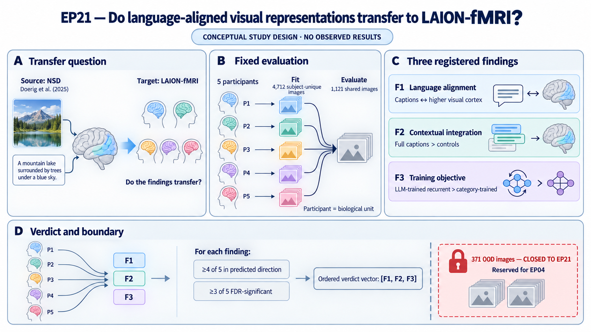

# Do language-aligned visual representations transfer to LAION-fMRI?

Doerig et al. (2025) reported that representations from a large language model
align with higher-level visual representations in human cortex. EP21 asks
whether three directional findings from that study transfer from the Natural
Scenes Dataset (NSD) to five LAION-fMRI participants viewing regular natural
images. The source paper is [*High-level visual representations in the human
brain are aligned with large language
models*](https://doi.org/10.1038/s42256-025-01072-0).

This is a fixed, adapted transfer reproduction. It can show whether the
prespecified patterns keep their direction after the participants, stimuli,
preprocessing, regions of interest (ROIs), category metadata, and inference
change together. It is not an exact reproduction, an adaptive search, a fresh
audit, or an independent confirmation of EP04. Those differences are part of
the question and remain visible in every report.

The episode reports the three findings separately. It does not search for a
replacement claim when a finding does not meet its prespecified transfer rule.

## At a glance

| Question | EP21 design |
| --- | --- |
| What is being tested? | Whether three prespecified Doerig et al. findings retain their direction on regular LAION-fMRI images. |
| What fits the models? | Each participant's 4,712 regular subject-unique images. Training performance is not scientific evidence. |
| What evaluates transfer? | The 1,121 regular images shared by all five participants. |
| What is the biological observation? | The participant; images, pairwise RDM entries, voxels, sessions, repetitions, networks, and folds are not participants. |
| What counts as a replicated directional subclaim? | All five participants evaluable, at least four with the predicted direction, and at least three with corrected significance in that direction. |
| Is the evidence fresh? | No. The shared regular-image outcomes were previously opened in the EP04 lineage, so this is retrospective and correlated evidence. |
| What remains closed? | The complete 371-image out-of-distribution (OOD) payload: raw images, derived features, neural responses, predictions, scores, and candidate-comparison summaries. |
| What is the final answer? | An ordered three-finding verdict vector, not one episode-wide pass/fail label. |

## First-round figure concept

The main figure makes the transfer design visible in one place: the source
finding, participant-specific fitting set, common evaluation set, three
prespecified findings, participant-count rule, and closed OOD boundary.

The mockup below is a design aid. It contains no observed EP21 result.

The final empirical figure must preserve the same separation between fitting,
regular shared-image evaluation, and the OOD pool reserved for EP04. Its three
finding-level verdicts remain separate rather than being collapsed into one
episode-wide label.

## The three findings

1. **Caption geometry, encoding, and decoding.** Human-caption MPNet geometry
   should align with higher-level visual-cortex geometry and support held-out
   encoding and caption-embedding decoding.
2. **Contextual integration.** Full contextualized-caption embeddings should
   align better than word, noun, verb, and object-inventory controls. Shuffled
   captions are an adapted secondary negative control, not an original primary
   comparison.
3. **LLM-trained recurrent visual networks.** Released visual recurrent
   networks trained to predict caption-MPNet representations should align
   better than the prespecified category-trained and alternative-model
   comparators, subject to the source paper's ROI exceptions.

Each prespecified directional subclaim receives exactly one of four labels:
`replicated`, `partial`, `not_replicated`, or `not_evaluable`. The fixed
cross-dataset transfer test, rather than discovery of a new claim, is the
primary contribution.

## Evidence roles and EP04 boundary

| Evidence | Role in EP21 |
| --- | --- |
| Release identifiers, trial/image joins, captions, feature manifests, ROI masks, split definitions, synthetic fixtures, and permuted data | Qualification and implementation only. |
| 4,712 regular subject-unique images per participant | Fit the prespecified encoding and decoding maps; training performance is not evidence. |
| 1,121 regular images shared by all five participants | Fixed retrospective transfer evaluation. |
| 371 shared OOD images and every payload derived from them | Closed to EP21; only published category-level documentation may be cited. |
| Live or mutable EP04 outputs, candidate rankings, and runtime state | Forbidden inputs. |

EP04 conditionally reserves the OOD pool for a one-shot boundary audit. EP21
uses a role-filtered reference to the common upstream release, never the EP04
episode directory or legacy EP04 Scratch. Its results may be cited by EP04
only as historical reproduction context; they must never score, rank, prune,
promote, or audit EP04 candidates. EP04 and EP21 are correlated analyses of
shared evidence and cannot confirm one another.

## How the fixed transfer test works

1. **Qualify the source without outcomes.** Verify release identity, joins,
   roles, assets, and structural coverage through the redacted handoffs.
2. **Fix the complete method.** Resolve every shared field and every field for
   a runnable module, or mark the affected module or subclaim
   `not_evaluable`, before any neural score is seen.
3. **Fit on subject-unique images.** Estimate the prespecified predictive maps
   and learned transforms from each participant's regular subject-unique rows.
4. **Evaluate unchanged on shared images.** Apply the fixed procedure to the
   regular shared pool without using its outcomes for model selection, except
   for the narrow nested-tuning rules in the prespecified robustness splits.
5. **Report each finding.** Use within-participant inference and the fixed
   participant-count rule, then report all three verdicts side by side.

### Protocol lock

`PROTOCOL_TABLE.yaml` holds the outcome-independent design. Before any EP21
neural score is computed, `pipeline_conformance` resolves every shared field
and every field for each runnable module and writes
`outputs/protocol_lock.yaml`. If a module cannot be specified, it is marked
`not_evaluable` before any neural result is seen; unrelated fully specified
modules may still run. Every scored ASTRA analysis must use the resulting
lock.

The protocol lock records:

1. the LAION-fMRI release and beta/trial/image identity joins;
2. the authentication requirements for the authors' `visuo_llm` code and
   released RCNN weights, plus either their exact identities or a locked
   Finding 3 `not_evaluable` status;
3. all-mpnet-base-v2 version, tokenizer, caption aggregation, normalization,
   noun/verb parsing, object-inventory construction, and missingness rules;
4. the retinotopic early visual cortex (EVC) and LAION ventral, lateral, and
   dorsal ROI crosswalk,
   voxel eligibility, noise-ceiling use, and ROI aggregation;
5. the official `tau` and `cluster_k5` split rows, repetition grouping,
   near-neighbour policy, seeds, and train-only transforms;
6. the complete endpoint, expected-direction, exception, multiplicity, null,
   interval, and verdict tables; and
7. the decoder caption dictionary and tie/rank convention.

The lock resolver may receive only outcome-blind structural QC: identifiers,
roles, shapes, dtypes, finite/NaN masks, coverage, missingness, and provenance.
It may not receive subject-unique or regular-shared neural values, derived
neural summaries, model--brain scores, predictions, or any OOD neural
derivative. A separate scorer may use the locked regular-image handoff only
after the protocol lock exists.

The caption specification includes immutable model, weight, tokenizer, and
parser revisions; pooling, truncation, special-token, text/output
normalization, word weighting and out-of-vocabulary handling, delimiter,
order, duplicate, and empty-case rules. Post-lock feature manifests must
conform exactly. The voxel specification fixes the anatomical intersection,
reliability estimator and cutoff, finite/coverage and zero-variance filters,
missingness, participant/common-mask policy, and paired-model common-voxel
rule. Voxel identities derived from fitting responses are materialized only
after lock and are never returned to the resolver.

All five participants are included under outcome-blind eligibility rules.
Regular rows are selected before any response-derived statistic. GLMsingle
betas are z-scored within participant, session, and voxel using all and only
regular trials in that session, then averaged across repetitions by image.
This is a prespecified transductive response-normalization exception to the
train-only transform rule; it never includes an OOD trial. Noise-ceiling or
reliability maps are usable only when their stimulus universe is verified as
regular-only; otherwise they must be recomputed from regular rows or the
affected corrected endpoint is not evaluable. The primary RSA uses separately
embedded human captions averaged by image: five captions for shared images and
three for subject-unique images. Analyses remain in participant native space;
any fsaverage projection is for display only.

Except for the explicitly prespecified regular-only response normalization,
every learned transform—including feature scaling, principal component
analysis (PCA), regularization, voxel filtering, and variance-partitioning
nuisance fit—is estimated on its prespecified training rows only. No
outcome-dependent caption editing, ROI choice, comparator deletion,
hyperparameter expansion, stopping, or threshold change is allowed.

Before scoring, the lock must also fix the entire fractional-ridge solver
contract: fraction grid, image-grouped inner folds, tuning loss and its
aggregation, shared-versus-target-specific hyperparameters, centering,
scaling, intercept, coefficient convention, and deterministic tie handling.

## Finding 1 — caption geometry, encoding, and decoding

### Primary components

- **ROI representational similarity analysis (RSA):** Pearson correlation
  between model and neural representational dissimilarity matrices (RDMs),
  both constructed with correlation distance, in the prespecified higher-level
  sector ROIs. EVC is a specificity control, not a primary ROI that can rescue
  a high-level result.
- **Encoding:** participant-specific fractional ridge fit only on regular
  subject-unique images and evaluated unchanged on regular shared images.
  Voxelwise predicted-observed Pearson correlations and the prespecified ROI
  summaries are reported.
- **Primary decoding:** fractional ridge fit only on regular subject-unique
  images predicts the 768-dimensional MPNet embedding from the combined
  prespecified visual sectors and is evaluated unchanged on regular shared
  images. The primary endpoint is the prespecified per-image
  embedding-correlation summary.
- **Caption lookup:** nearest-caption lookup against the authenticated original
  dictionary is qualitative. Correct-caption retrieval rank is an adapted
  quantitative LAION endpoint and runs only if a target-containing candidate
  set can be fixed in advance. Failure of this adapted rank does not invalidate
  embedding decoding.

Before decoding is scored, the protocol must hash the original and adapted
dictionaries separately, map every evaluation image to its eligible correct
entries, specify what happens when the target is absent, deduplicate the
native-space voxel union, and fix similarity, rank direction, ties,
aggregation, exact chance expectation, and separate nulls for embedding
correlation and retrieval. The retrieval effect is centered on its chance
expectation and oriented so positive is better. That same effect feeds its
probability, interval, sign gate, and adjudication.

Because MPNet dimensions can have a nonzero shuffled-correlation baseline,
embedding correlation is likewise centered by a prespecified function of its
permutation null. The observed, permuted, and bootstrap statistics all use
that same center and orientation, and the centered effect is used consistently
for probability, interval, sign, and adjudication. Synthetic calibration must
cover the estimated-center procedure.

Searchlight maps, regional-selectivity displays, and novel-sentence maps are
secondary. They cannot rescue a failed prespecified ROI, encoding, or decoding
subclaim.

## Finding 2 — contextual integration controls

Repeat noise-ceiling-corrected ROI RSA with:

- full contextualized captions;
- separately embedded and averaged words;
- concatenated nouns;
- concatenated verbs;
- detected-object inventories; and
- caption-to-image shuffled features as an adapted secondary negative control.

Full-caption comparisons with word, noun, and verb controls are transfer
reproductions. The LAION segmentation-noun approximation to COCO categories
is an adapted comparison and is labeled as such. The prespecified
expected-direction table preserves the original paper's exceptions rather than
silently requiring every ROI-control cell to be positive.

The lock must authenticate the original ROI-RDM noise-ceiling correction or
mark the affected corrected subclaim not evaluable. A provider voxelwise
noise-ceiling map is not a substitute. The lock fixes the participant/ROI
RDM ceiling estimator, formula, nonpositive/undefined-ceiling action, and
whether the ceiling is recomputed inside every permutation and bootstrap. The
bootstrap uses the identical sampled-image multiplicity vector for the target
and all other participants, applies a prespecified common-image/missingness
rule, and recomputes the other-participant mean RDM and ceiling each replicate.
The shuffle control separately fixes its number of shuffles, derangement and
self-match rule, image universe, seeds, aggregation, and multiplicity family;
it cannot change the primary Finding 2 verdict.

## Finding 3 — LLM-trained recurrent visual networks

Apply the released LLM-trained and category-trained recurrent convolutional
neural networks (RCNNs) using the authenticated original preprocessing, final
layer, and final time step. The working plan computes model--brain RSA
separately for each of the ten instances and then averages correlations, but
the lock must authenticate the implemented aggregation order and scale from
the source code before any score because source descriptions may not be
equivalent. Any different code-implemented rule is fixed and disclosed without
neural outcomes rather than chosen from neural results. Preserve
comparator-specific ROI exceptions after source verification. Compare the
LLM-trained RCNN with caption MPNet, the category-trained RCNN, and the
authenticated original alternative-model panel.

Finding 3 separately fixes its model and brain RDM definitions, association
statistic, any noise-ceiling correction, and full resampling behavior; none is
inherited implicitly from Finding 1 or 2.

Missing weights, an unresolved image data-use agreement (DUA), an unavailable
comparator, or an unverifiable layer/time definition yields `not_evaluable`
for the affected subclaim. It does not permit substitute weights, silent
comparator removal, or reuse of a different layer.

## Inference and adjudication

Participants are the biological observations. Images, RDM edges, voxels,
sessions, repetitions, networks, and folds are not independent participants.
Inference is within participant; no pooled group test is added.

- Core above-chance tests use 10,000 image-identity permutations, or exact
  enumeration when smaller, while preserving repetitions and folds and
  recomputing the complete statistic.
- Every endpoint fixes a null-center function and orientation so zero is its
  null and positive is its prespecified direction. Permutation probabilities are
  two-sided and use the absolute centered, oriented statistic. Monte Carlo
  tests use the plus-one correction; complete exact enumeration uses the exact
  tail fraction. The same centered effect is recomputed in bootstrap intervals
  and calibrated synthetically. Corrected significance counts toward
  replication only when the observed effect also has the prespecified sign.
- Each endpoint fixes which correspondence is permuted and which fitted
  objects are rebuilt. Encoding permutes evaluation-image correspondence
  between fixed predictions and observed responses; RSA permutes model-image
  correspondence and rebuilds the RDM statistic. Cross-modal joint and
  component contrasts require their own dependence-preserving, null-centered,
  full-refit method with simulated Type I calibration or are locked as
  `not_evaluable`.
- Paired model contrasts use only a pre-score method shown by simulation to
  control Type I error for the exact statistic. Independently swapping model
  labels by image to create hybrid representations is forbidden. If no valid
  method is available, the affected contrast subclaim is locked
  `not_evaluable` for replication; a descriptive interval may still be
  reported but cannot earn corrected significance or another verdict. RDM
  edges are never treated as independent samples.
- Ninety-five-percent intervals use a prespecified image-cluster bootstrap that
  resamples image identities and reconstructs all dependent quantities. ROI
  RSA resamples regular-shared identities and rebuilds both RDMs; predictive
  endpoints independently resample subject-unique fitting and regular-shared
  evaluation identities and refit the complete model. The lock specifies the
  exact z-score and missingness replay, and conformance simulations reproduce
  the session, repetition, and missingness structure.
  The lock also fixes the admissible permutation group, identity inclusion,
  Monte Carlo replacement/duplicate and seed rules, plus the bootstrap interval
  type, quantile convention, degenerate-replicate action, minimum valid count,
  and seeds.
- Benjamini-Hochberg false discovery rate (FDR) control at 0.05 is applied
  separately within participant and within each prespecified finding family.
- Every participant's effect, interval, raw and corrected probability, and
  null distribution is reported.

## The four subclaim answers

| Verdict | Evidence required |
| --- | --- |
| **`replicated`** | All five participants are evaluable, at least four have the predicted direction, and at least three have corrected significance in that direction. |
| **`partial`** | Exactly three participants have the predicted direction, or at least four have that direction but fewer than three have corrected significance. |
| **`not_replicated`** | At most two participants have the predicted direction. |
| **`not_evaluable`** | Fewer than five valid participant results exist, or a required endpoint is invalid or unavailable. |

A zero effect does not count in the predicted direction. Each finding is
adjudicated from the primary subclaim table fixed in the protocol lock.
Secondary analyses cannot compensate for a failed primary subclaim. Without a
prespecified equivalence margin, failure to replicate does not establish
absence of an effect.

The final scientific outcome is the ordered vector of the three finding
verdicts, not one scalar episode-wide label. Operational completion, technical
failure, and policy violation are reported separately from that vector.

## Secondary checks and extensions

These analyses test robustness or extend the comparison; none can rescue a
failed primary subclaim. Method 3 is listed only to preserve the source study's
numbering and make the OOD boundary explicit.

1. **Method 1 (`tau`):** use the official shared regular-image 80/20 split for
   encoding and decoding and run RSA separately on the two partitions.
2. **Method 2 (`cluster_k5`):** rotate through all five shared regular-image
   clusters, fit on four and evaluate on the fifth, and report every fold plus
   the fixed unweighted Fisher-z mean for correlation outcomes. Parameter-free
   RSA is computed on each held-out cluster; any scaling, PCA, voxel filter,
   or other learned transform is fit on the other four clusters only. Fold
   inference is descriptive and cannot alter a core verdict. Findings 1 and 2
   have priority.
   Nested tuning within the prespecified Method 1 or Method 2 training rows is
   the only shared-outcome fitting exception and cannot change the global
   method, core fit, primary verdict, or another fold.
3. **Method 3 OOD:** deferred and non-executable in EP21 because the relations,
   unusual, cropped, shape, and Gabor neural-response pool is reserved by
   EP04. Published stimulus-category documentation may be cited, but EP21 may
   not access raw OOD images, OOD-derived features, or OOD neural data.
4. **Cross-modal extension:** compare caption MPNet with released DINOv2,
   OpenCLIP, PEcore, and SigLIP2 embeddings using both ROI RSA and the same
   subject-unique-to-shared fractional-ridge encoding design. Train-fold PCA
   reduces every block to a common rank of at most 256 without outcome-based
   rank selection. Single-block ROI RSA, multiple-model RSA, encoding, and
   regularized variance partitioning form one separate secondary family. The
   lock must specify the joint and reduced models, component formulas,
   regularization and nesting, treatment of negative commonality estimates,
   and two participant-level ROI contrasts: EVC vision-unique minus the mean
   of the three higher-level sectors, and the higher-level-sector mean shared
   component minus EVC. Both contrasts are predicted positive. Each feature
   block's model/checkpoint revision, layer, pooling, input preprocessing, and
   output normalization is locked, and the analysis begins with a manifest
   conformance gate; a mismatch makes the extension not evaluable.
5. **Regular-pool sensitivities:** repeat the prespecified applicable analyses
   after excluding the 240 NSD-origin shared images. For Findings 1 and 2,
   also report all ten fixed three-of-five shared-caption subsets and their
   unweighted mean to match the three-caption subject-unique reliability.
   These sensitivities cannot replace the full regular pool or change a
   primary verdict. The common sensitivity report owns Findings 1 and 2;
   Finding 3 and the cross-modal extension report their own exclusion results
   because they require their respective visual-feature inputs.

## Completion and stopping

### Current status

The scientist's 2026-09-28 instruction authorized creation and editorial
review of this separate episode contract only. Empirical access or execution
requires a later explicit instruction. The contract does not authorize
canonical Brain Researcher actions, use of live EP04 outputs, or access to the
371-image OOD payload. Source qualification and the protocol lock remain
incomplete, so neural scoring is not authorized.

The fixed program can end only after source qualification, method conformance,
and the protocol lock are complete. Each downstream finding, robustness,
sensitivity, and extension module must then be completed or explicitly marked
`not_evaluable` before the integrated report. There is no adaptive trial
minimum, patience rule, incumbent, challenger, candidate lock, or
result-dependent continuation.

Exact reruns are allowed only after a demonstrated technical failure and with
the scientific configuration unchanged. Before the first neural score, a
consequential change to an estimand, data role, model family, comparator set,
ROI, multiplicity family, verdict rule, or OOD access boundary requires an
explicit scientist amendment and a regenerated lock. After any neural score,
such a change terminates EP21 and requires a new episode; it cannot authorize
further EP21 scoring.

## Claim boundary

The strongest positive wording is **directional transfer of the prespecified
Doerig et al. patterns to regular LAION-fMRI images in these five participants
and proxy ROIs**. It does not establish exact quantitative reproduction, a
fresh independent confirmation, population generalization, OOD robustness,
cortical-coordinate or computational identity, a universal modality-general
space, the Platonic Representation Hypothesis, or scale-dependent convergence.
