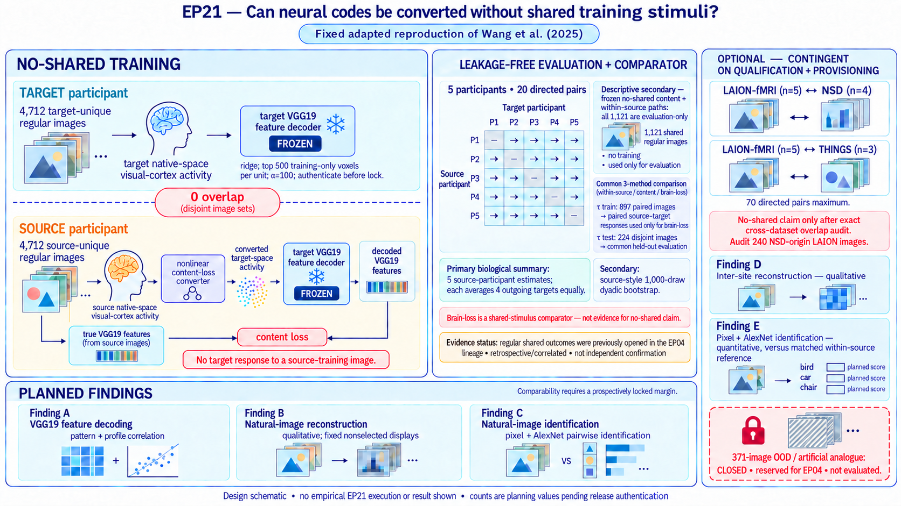

# Can neural codes be converted across people and imaging sites without shared stimuli?

Wang et al. (2025) introduced a content-loss neural code converter that maps
functional MRI activity from a source participant into a target participant's
neural space without requiring the two participants to view the same training
images. The converted activity is passed through a fixed target decoder, and
the converter is trained to recover the source stimulus's deep-network feature
representation. EP21 asks whether the principal inter-individual and
inter-site results from [*Inter-individual and inter-site neural code
conversion without shared
stimuli*](https://doi.org/10.1038/s43588-025-00826-5) reproduce in an adapted
LAION-fMRI analysis.

This is a fixed, adapted reproduction, not an exact rerun of the source study.
The primary within-LAION analysis uses five LAION-fMRI participants, GLMsingle
single-trial betas, native-space visual-cortex masks, and all 20 directed
source-to-target participant pairs. A separate inter-site branch may add
LAION-to-NSD, NSD-to-LAION, LAION-to-THINGS, and THINGS-to-LAION conversions
only after those external datasets and their native decoders are independently
qualified and provisioned.

The defining no-shared-stimulus test is preserved in the training roles. For
each directed LAION pair, the target VGG19 decoder is trained on the target
participant's 4,712 subject-unique regular images. The content-loss converter
is then trained on the source participant's different 4,712 subject-unique
regular images, using the fixed target decoder and the true VGG19 features of
the source images. The source and target training image sets must have zero
image-ID overlap. Only the brain-loss comparator may use paired source and
target responses to shared images, and it is trained on the authenticated
shared `tau` training split and evaluated only on the disjoint `tau` test
split.

## At a glance

| Question | EP21 design |
| --- | --- |
| What is being reproduced? | Wang et al.'s content-loss conversion, VGG19 feature decoding, natural-image reconstruction, and AlexNet identification results. |
| What is the primary new setting? | Five LAION-fMRI participants and all 20 directed inter-individual pairs. |
| How is the target decoder trained? | On the target participant's 4,712 subject-unique regular images only. |
| How is the no-shared content-loss converter trained? | On the source participant's 4,712 subject-unique regular images only, with zero overlap with the target decoder's training images. |
| Where may paired source-target training responses be used? | Only by the brain-loss comparator, on the fixed shared `tau` training split. |
| What is the common held-out comparison set? | The disjoint regular-image `tau` test split for the three-way within/content/brain comparison; the full 1,121 shared regular images may support a separate descriptive no-shared evaluation only. |
| What is the primary biological reporting unit? | The source participant, averaging equally over that source's four outgoing targets; all 20 directed dyads remain visible, and source-style dyadic resampling is secondary. |
| What is separate from the LAION analysis? | A provisioning-contingent 70-directed-pair LAION↔NSD/THINGS inter-site branch. |
| What remains closed? | The entire 371-image LAION-fMRI OOD payload and every derivative, because it is reserved for EP04. |
| What has been executed? | Nothing. EP21 is at contract-authoring stage only. |

## Conceptual figure

The planned main design figure will show the source response, nonlinear
content-loss converter, target neural space, fixed target VGG19 decoder, and
feature-space loss, alongside the shared-stimulus brain-loss comparator and
the separate inter-site branch. It will also show that the artificial-image
analogue is closed under the current EP04 boundary.

The figure is a design schematic and must never display or imply an observed
EP21 result before execution.

## Corrected source and implementation anchor

The reproduction target is the official source repository's `V1.0.0` tag at
commit `edbff02edd6a08d3c6c829af45a957fd14bdc460`, together with the
paper-linked Zenodo archive at
[10.5281/zenodo.14910040](https://doi.org/10.5281/zenodo.14910040). The moving
default branch is not a reproduction identity. Qualification must verify the
archive inventory and checksum and pin every external model asset before the
protocol lock.

The paper and tagged implementation are not interchangeable specifications.
At minimum, qualification must resolve the paper's ReLU description against
the tagged converter's LeakyReLU behavior, authenticate feature-map sampling
and weighting in the content loss, and reconcile the paper's eight-layer
reconstruction description with the tagged configuration that appears to
request all 19 VGG19 layers. These are pre-score fidelity decisions; EP21 may
not choose between them after seeing neural outcomes.

## Fixed training and evaluation design

### Target decoder

For each participant used as a target, fit the participant's VGG19 feature
decoders on that target's own subject-unique regular images. The planning count
for LAION-fMRI is 4,712 images per participant. Each decoder is a ridge model
using the source-paper feature hierarchy and the prespecified 500-voxel
selection procedure. The exact voxel-selection unit, regularization rule,
feature normalization, VGG19 implementation, and layer list must be resolved
and tested before a protocol lock is issued.

The target decoder is frozen before converter fitting. Target neural responses
to the source participant's subject-unique images do not exist and are not
imputed or synthesized.

### Content-loss converter

For a directed pair `source -> target`, fit the nonlinear converter on the
source participant's 4,712 subject-unique regular images. For each source
training image, the converter maps source activity into the target neural
space; the frozen target decoder maps that converted activity into VGG19
features; and the loss compares those decoded features with the true VGG19
features of the source stimulus.

This branch must satisfy all of the following:

- the source converter-training images and target decoder-training images have
  zero exact image-ID overlap;
- neither training set contains a shared `tau` test image;
- no target response to a source training image enters the loss;
- converter architecture, initialization, optimizer, stopping, and seeds are
  fixed without inspecting evaluation outcomes; and
- every learned transform is fitted within the declared training role.

The phrase *without shared stimuli* refers to converter and decoder training.
Using common held-out images to compare source, converted, and within-person
test responses does not turn those images into training data.

### Brain-loss comparator

The brain-loss comparator is a regularized linear mapping from source to target
activity and necessarily requires paired responses to the same images. It is
therefore a shared-stimulus baseline, not evidence for the no-shared claim.

For every directed LAION pair, brain-loss fitting is confined to the
authenticated regular shared-image `tau` training split. It is evaluated only
on the disjoint `tau` test split. Group all repetitions of an image on the same
side of the split. No `tau` test response, reconstruction, feature score, or
derived statistic may tune the brain-loss model.

A separately labeled sample-matched sensitivity may fit a content-loss model
using only the source responses and image features from the same 897 `tau`
training images. It may not use target responses, replace the 4,712-image
primary model, or support the no-shared-stimulus claim. A second outcome-blind
897-image subset of source-unique training data may be used to distinguish
sample-count from shared-image effects if locked before scoring.

### Common evaluation

The locked `tau` test image IDs form the common comparison support for the
within-individual, content-loss, and brain-loss conditions. This permits paired
method contrasts without weakening the no-shared training claim. Planning
counts inherited from the LAION-fMRI documentation are 897 regular shared
training images and 224 regular shared test images; they are not facts for
execution until verified against an authenticated release manifest.

Separately, the frozen no-shared content-loss and within-individual paths may
be described on all 1,121 authenticated shared regular images because none of
those images trained either path. That larger descriptive evaluation cannot be
used for a head-to-head claim involving brain loss, whose fit consumes the 897
`tau` training images. The confirmatory three-method comparison remains on the
224 `tau` test images only.

## The five source-paper findings

### Finding A — VGG19 feature decoding

For each eligible directed LAION pair and each prespecified VGG19 layer,
measure:

- pattern correlation across feature units for each held-out image;
- profile correlation across held-out images for each feature unit; and
- the locked summaries for within-individual, content-loss, and brain-loss
  conditions.

The source-paper pattern is that content-loss conversion is stronger than the
brain-loss comparator and close to within-individual decoding. The first is a
directional method contrast. The second is a comparability claim and requires
a prospectively locked non-inferiority or equivalence margin. Without a valid
margin, EP21 reports the estimate and interval but does not infer comparability
from overlapping confidence intervals or a nonsignificant difference.

### Finding B — natural-image reconstruction

Reconstruct regular natural images from within-individual, content-loss, and
brain-loss decoded VGG19 features using the authenticated source pipeline:
multi-layer feature optimization, the declared deep-generator prior, and the
declared DISTS structure/texture objective.

Finding B is qualitative. EP21 will display fixed, nonselected examples and
the complete reconstruction manifest, but it will not call visual similarity
"replicated" unless a blinded or quantitative rule is prospectively added to
the protocol lock before any reconstruction is inspected. Quantitative
identification belongs to Finding C.

### Finding C — natural-image identification

Score the Finding B reconstructions by pairwise identification using the fixed
AlexNet feature hierarchy, eligible candidate universe, similarity rule, and
tie handling. Report every prescribed layer and the dyad-level summaries for
within-individual, content-loss, and brain-loss conditions. Claims that a
converted condition is comparable to within-individual reconstruction require
the same prospectively locked margin principle as Finding A.

### Finding D — inter-site reconstruction

If the external branch qualifies, fit content-loss converters between
LAION-fMRI and the declared NSD and THINGS participants without shared
training images, always decoding with the target participant's own VGG19
decoder. With five LAION, four NSD, and three THINGS participants, the planned
bidirectional design contains 70 directed LAION↔external pairs:
`2 × (5 × 4 + 5 × 3)`.

This pair count is contingent on all 12 planned participants, their native
training/test roles, masks, and decoder inputs qualifying. NSD↔THINGS pairs are
not part of this adapted branch. Finding D is qualitative under the same rules
as Finding B.

### Finding E — inter-site identification

Apply the locked AlexNet pairwise-identification procedure to the Finding D
reconstructions, separately by conversion direction, target dataset, and
feature layer. This is the quantitative inter-site endpoint. Any comparability
claim relative to a within-dataset reference requires a locked margin and
matched test support; otherwise EP21 reports descriptive differences and
uncertainty only.

## Artificial-image analogue and the EP04 boundary

The proposal identifies LAION-fMRI abstract-shape or illusion images as an
adapted analogue of the source study's artificial shape/color test. Those
images are part of the 371-image OOD pool conditionally reserved for EP04.
Under the current boundary, the artificial analogue is not executable in EP21.

EP21 may not access or receive:

- any OOD raw image or pixel-derived feature;
- any OOD neural response, reliability estimate, or normalization statistic;
- any OOD prediction, reconstruction, score, null summary, or comparison; or
- live EP04 outputs, rankings, runtime state, or legacy Scratch content.

The ASTRA program records an `artificial_analogue_disposition`, but no OOD
payload interface exists. The disposition remains
`blocked_by_ep04_reservation` or `not_evaluable_under_current_contract`. A
future executable artificial branch would require an explicit cross-episode
scientific decision, a new role-isolated handoff, and a regenerated protocol
lock before any access. Regular-image findings cannot support an OOD claim.

The regular shared-image outcomes also overlap evidence previously opened in
the EP04 lineage. LAION test results are therefore retrospective and correlated
with EP04, not a fresh independent confirmation. EP21 outputs must never score,
rank, prune, promote, or audit an EP04 candidate.

## Inter-site branch

The inter-site analysis is a separate, provisioning-contingent extension. It
does not block the 20-pair within-LAION analysis. Before it can run, EP21 must
qualify the exact NSD and THINGS releases, participant IDs, native-space masks,
training and held-out image roles, response preprocessing, decoder inputs,
licenses, and source-paper compatibility. Each target decoder is trained only
on its target participant's native training images; each content-loss converter
is trained only on its source participant's native training images. The two
training universes must have zero exact image-ID overlap for a no-shared claim;
any overlap is removed by a fixed outcome-blind rule before fitting.

LAION-fMRI documentation indicates that 240 regular images may originate from
NSD. Before any LAION↔NSD no-shared claim, qualification must identify those
images and either prove they do not cross the relevant decoder/converter
training roles or apply a locked exclusion and sensitivity rule. Semantic
similarity is not a substitute for an exact identity audit.

No shared-stimulus brain-loss comparator is manufactured for inter-site pairs.
If the required external data or authentic decoder inputs are unavailable, the
inter-site branch is `not_evaluable`; the within-LAION branch may still finish.

## Inference and adjudication

The 20 directed LAION dyads are not 20 independent biological samples. Each
participant recurs as a source and as a target. The primary biological summary
first averages each source participant equally across its four outgoing
targets and then gives the five source-level estimates equal weight. Report all
five source estimates and the complete 5-by-5 directed matrix with the diagonal
blank. This is a bounded summary of these five participants, not population
inference.

For source fidelity, report the paper's dyadic bootstrap as a secondary
descriptive analysis: 1,000 resamples of source and target identities
separately, excluding invalid same-participant pairs and rebuilding the full
summary on each resample. It may not replace the source-participant primary or
turn 20 dependent edges into independent biological replicates. Any inter-site
resampling, if run, must also preserve dataset and direction strata.

Any added within-versus-converted permutation test must have its exchangeable
unit, repeated-target handling, layer family, sidedness, and multiplicity
correction fixed and calibrated on synthetic or permuted fixtures. Images,
feature units, voxels, and bootstrap draws are not promoted to independent
participants or dyads.

Quantitative Findings A, C, and E each receive a result or an explicit
`not_evaluable` disposition. Qualitative Findings B and D receive a complete,
nonselected display record and a descriptive disposition; they do not inherit
a quantitative success label from Findings C or E. No single episode-wide
pass/fail label averages across A–E.

## Protocol lock and execution boundary

Before any neural score, source qualification and synthetic pipeline
conformance must resolve the data roles, image overlaps, exact directed-pair
table, preprocessing, ROIs, decoder and converter specifications, model asset
identities, reconstruction pipeline, metrics, inference, comparability margins,
and missing-data rules. Unavailable branches are frozen as `not_evaluable`
without substituting a convenient method after outcomes are visible.

The lock resolver may receive structural metadata and synthetic or permuted
fixtures, but no neural values, reconstructions, predictions, or model scores.
A valid lock is necessary but does not itself authorize empirical execution.

## Completion and stopping

EP21 is complete only when every qualified quantitative branch has a report,
every qualitative branch has its fixed display record or a documented
`not_evaluable` disposition, the artificial analogue remains explicitly
disposed, and the final report states all deviations and evidence dependencies.

Stop or narrow the relevant branch when:

- source/target image-role separation cannot be verified;
- the `tau` train/test split is not authenticated or is contaminated;
- the required upstream code, VGG19/AlexNet weights, generator, DISTS model,
  ROI, or decoder specification cannot be authenticated;
- external data or native decoder inputs are unavailable;
- no valid margin exists for a requested comparability claim; or
- the EP04 OOD boundary cannot be enforced physically.

A technical repair may replay the smallest affected stage with the scientific
configuration unchanged. A consequential change after any neural outcome is
seen ends this episode rather than opening an adaptive search inside it.

## Current status — 2026-09-28

The scientist corrected the proposal identity before any EP21 empirical
attempt. This document authorizes contract writing only. No role-filtered input
has been provisioned, no neural value or reconstruction has been inspected, no
protocol lock exists, and no local process or Slurm job has run. Canonical
Brain Researcher review, reward, confirmation, and Landscape transitions are
outside this authorization.

## Claim boundary

At most, EP21 can support a fixed adapted reproduction of Wang et al.'s
inter-individual neural-code-conversion pattern in these five LAION-fMRI
participants and, if separately qualified, an inter-site extension involving
the declared NSD and THINGS participants. It cannot establish exact
quantitative reproduction, population generalization, formal equivalence
without locked margins, successful artificial-image transfer, OOD robustness,
scanner invariance in general, or a fresh independent confirmation of EP04.
